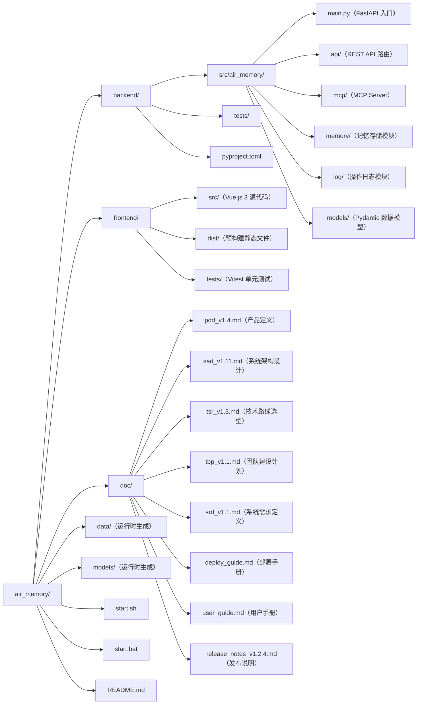

# AIR Memory
Memory System for AI Agent

**当前版本**: v1.2.5

## 重要说明

所有 AI 在执行本项目任务之前必须阅读并遵守 /ai_rules/README.md

## 团队建设计划

所有 AI 在执行本项目任务之前必须阅读 /doc/tbp_v1.1.md, 以了解团队架构和职责分配, 确保能明确知道应该与谁合作.

---

## 快速开始

### 获取发布包

前往 [GitHub Releases 页面](https://github.com/SevenLv/air_memory/releases/latest)，下载最新版本的发布包并解压。

### 环境前提

- Python 3.11 或更高版本

### 启动服务

**macOS / Linux**:

```bash
bash start.sh
```

**Windows**:

```cmd
start.bat
```

首次启动时脚本将自动创建虚拟环境、安装依赖并下载 Embedding 模型（约 90 MB），约需 3~8 分钟，请耐心等待。

启动成功后访问 `http://localhost:8080` 即可使用 Web 管理界面。

详细部署说明请参阅 `doc/deploy_guide.md`，使用说明请参阅 `doc/user_guide.md`。

---

## 目录结构



### 目录说明

| 目录/文件 | 说明 |
| --- | --- |
| `backend/src/air_memory/` | 后端 Python 源代码，所有后端业务逻辑在此目录下开发 |
| `backend/tests/` | 后端单元测试，使用 pytest + pytest-asyncio + httpx |
| `frontend/src/` | 前端 Vue.js 3 源代码，所有前端业务逻辑在此目录下开发 |
| `frontend/dist/` | 预构建前端静态文件，随仓库分发，部署时无需安装 Node.js |
| `frontend/tests/` | 前端单元测试，使用 Vitest + Vue Test Utils |
| `data/` | 运行时数据目录（ChromaDB 冷层数据和 SQLite 日志），进程重启不丢失 |
| `models/` | Embedding 模型缓存目录（首次启动时自动下载） |
| `doc/` | 项目所有文档，包括产品定义、架构设计、部署手册和用户手册 |
