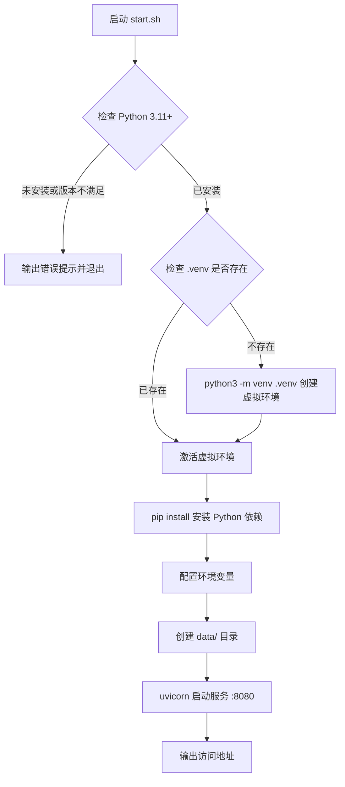
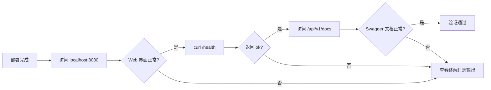

# AIR_Memory 部署手册

## 变更记录

| 版本号 | 变更时间 | 变更内容 |
| --- | --- | --- |
| 1.0 | 2026-4-10 | 初稿，覆盖 macOS 和 Windows 完整部署步骤（基于 Docker） |
| 1.1 | 2026-4-10 | 重写：放弃 Docker，改为 Python 本机直接运行；FastAPI 统一承载 API 和前端静态文件；更新部署步骤、环境前提、自启动说明和常见问题排查 |
| 1.2 | 2026-4-14 | 更新 Windows 启动成功 Banner 示例，补充"后端 API 文档"行 |
| 1.3 | 2026-4-14 | 更新获取方式：改为从 GitHub Releases 下载发布包，不再需要通过 Git 克隆源代码；新增版本升级说明 |

---

## 1. 概述

本手册面向部署人员，提供在 macOS 和 Windows 操作系统上完成 AIR_Memory 系统部署的完整步骤说明。AIR_Memory 采用 Python 本机直接运行方案，用户仅需安装 **Python 3.11+** 即可完成部署，无需 Docker 或其他容器运行时。

> **获取方式**：请从 [GitHub Releases 页面](https://github.com/SevenLv/air_memory/releases/latest)下载最新发布包（可执行程序），无需通过 Git 克隆源代码。

系统架构概览：

- 单进程部署：FastAPI 应用（uvicorn）同时提供后端 API、MCP 服务和前端 Web 界面
- 对外端口：`http://localhost:8080`
- 数据持久化：存储于项目目录下的 `./data/` 目录，进程重启不丢失

---

## 2. 运行环境前提

### 2.1 硬件要求

| 资源 | 最低要求 | 推荐配置 |
| --- | --- | --- |
| CPU | 4 核 | 8 核及以上 |
| 内存 | 8 GB | 16 GB |
| 磁盘空间 | 50 GB 可用空间 | 100 GB 及以上 |
| 网络 | 可访问 HuggingFace Hub（首次启动需下载模型） | 宽带 |

> **注意**：系统热层内存预算默认为 6 GB，冷层磁盘预算默认为 40 GB，请确保宿主机资源满足要求。

### 2.2 软件要求

| 软件 | 版本要求 | 说明 |
| --- | --- | --- |
| 操作系统 | macOS 13+ 或 Windows 10/11 | - |
| Python | **3.11 及以上** | 必须，用于运行后端服务 |

#### macOS 安装 Python 3.11+

推荐通过 [Homebrew](https://brew.sh) 安装：

```bash
brew install python@3.11
```

或访问 [https://www.python.org/downloads/](https://www.python.org/downloads/) 下载官方安装包。

安装完成后验证版本：

```bash
python3 --version
# 应输出 Python 3.11.x 或更高版本
```

#### Windows 安装 Python 3.11+

访问 [https://www.python.org/downloads/](https://www.python.org/downloads/) 下载 Python 3.11 或更高版本的 Windows 安装包。

安装时务必勾选 **"Add Python to PATH"** 选项，确保命令行可直接使用 `python` 命令。

安装完成后在命令提示符（CMD）验证版本：

```cmd
python --version
REM 应输出 Python 3.11.x 或更高版本
```

### 2.3 网络要求

首次启动时，后端服务将从 HuggingFace Hub 自动下载 Embedding 模型（`all-MiniLM-L6-v2`，约 90 MB）并缓存至 `./models/` 目录。请确保部署机器在首次启动期间可以访问以下地址：

- `https://huggingface.co`
- `https://cdn-lfs.huggingface.co`（模型文件 CDN）

模型下载完成后将缓存在本地，后续重启无需再次联网。

---

## 3. 部署步骤

### 3.1 下载发布包

前往 [GitHub Releases 页面](https://github.com/SevenLv/air_memory/releases/latest)，下载最新版本的发布包（例如 `air_memory-v1.2.6.zip`）。

**macOS / Linux**：

```bash
unzip air_memory-v1.2.6.zip
cd air_memory-v1.2.6
```

**Windows**：

右键单击下载的 `.zip` 文件，选择"全部解压缩"，完成后进入解压后的目录。

> **说明**：发布包为完整的可执行程序，已包含预构建的前端静态文件，无需安装 Node.js 或执行前端构建步骤。

### 3.2 macOS 部署步骤

#### 步骤一：确认 Python 版本

```bash
python3 --version
# 确认输出 Python 3.11.x 或更高版本
```

#### 步骤二：运行一键启动脚本

在项目根目录下打开终端，执行：

```bash
bash start.sh
```

脚本将依次执行以下操作：



首次启动时，pip 安装依赖约需 2～5 分钟，模型下载约需 1～3 分钟（取决于网络速度），请耐心等待。

#### 步骤三：确认启动成功

脚本输出以下内容时表示部署成功：

```
==========================================
 AIR_Memory 启动成功！
==========================================
 Web 管理界面：http://localhost:8080
 后端 API 文档：http://localhost:8080/api/v1/docs
 停止服务：按 Ctrl+C
==========================================
```

> **提示**：首次运行时终端将保持前台运行，关闭终端将停止服务。如需后台持久运行，请参阅第 5 节"自启动配置"。

### 3.3 Windows 部署步骤

#### 步骤一：确认 Python 版本

在命令提示符（CMD）中执行：

```cmd
python --version
REM 确认输出 Python 3.11.x 或更高版本
```

#### 步骤二：运行一键启动脚本

在项目根目录下，双击 `start.bat` 文件，或在命令提示符（CMD）中执行：

```cmd
start.bat
```

脚本将自动完成 Python 环境检查、虚拟环境创建、依赖安装和服务启动，过程与 macOS 版本一致。

首次启动约需 3～8 分钟，完成后命令行窗口将显示访问地址。

#### 步骤三：确认启动成功

脚本输出以下内容时表示部署成功：

```
==========================================
 AIR_Memory 启动成功！
==========================================
 Web 管理界面：http://localhost:8080
 后端 API 文档：http://localhost:8080/api/v1/docs
 停止服务：关闭此窗口或按 Ctrl+C
==========================================
```

---

## 4. 部署后验证

### 4.1 验证 Web 界面可访问

在浏览器中访问 `http://localhost:8080`，应看到 AIR_Memory Web 管理界面正常加载。

### 4.2 验证后端健康状态

执行以下命令检查后端服务健康状态：

```bash
curl http://localhost:8080/health
```

预期响应：

```json
{"status": "ok"}
```

### 4.3 验证 API 文档可访问

在浏览器中访问 `http://localhost:8080/api/v1/docs`，应看到 FastAPI 自动生成的 Swagger API 文档页面。

### 4.4 部署验证流程总览



---

## 5. 自启动配置

系统默认以前台模式运行。如需操作系统重启后自动恢复运行，请按以下说明配置自启动。

### 5.1 macOS — 使用 LaunchAgent

执行以下命令安装 macOS 自启动服务：

```bash
bash start.sh --install
```

脚本将自动生成 `~/Library/LaunchAgents/com.air-memory.plist` 并通过 `launchctl` 注册。系统重启后 AIR_Memory 将自动在后台启动。

卸载自启动：

```bash
bash start.sh --uninstall
```

手动管理服务：

```bash
# 启动
launchctl load ~/Library/LaunchAgents/com.air-memory.plist

# 停止
launchctl unload ~/Library/LaunchAgents/com.air-memory.plist

# 查看状态
launchctl list | grep air-memory
```

### 5.2 Windows — 使用 Task Scheduler

在管理员权限的命令提示符（CMD）中执行：

```cmd
start.bat /install
```

脚本将通过 `schtasks` 创建一个"用户登录时触发"的计划任务，确保用户登录后 AIR_Memory 自动在后台启动。

卸载自启动：

```cmd
start.bat /uninstall
```

手动管理服务：

```cmd
REM 启动任务
schtasks /run /tn "AIR_Memory"

REM 停止进程
taskkill /f /im python.exe /fi "WINDOWTITLE eq AIR_Memory*"

REM 查看任务状态
schtasks /query /tn "AIR_Memory" /fo LIST
```

---

## 6. 服务管理

### 6.1 常用操作

| 操作 | macOS/Linux | Windows |
| --- | --- | --- |
| 启动服务 | `bash start.sh` | `start.bat` |
| 停止服务 | `Ctrl+C`（前台）或 `kill <PID>` | 关闭窗口或 `Ctrl+C` |
| 查看日志 | 终端标准输出 | 命令行窗口输出 |
| 更新依赖 | `bash start.sh`（自动重装） | `start.bat`（自动重装） |
| 重置虚拟环境 | `rm -rf .venv && bash start.sh` | `rmdir /s /q .venv && start.bat` |

### 6.2 数据持久化说明

系统数据存储在项目根目录的 `./data/` 目录中：

| 内容 | 路径 | 说明 |
| --- | --- | --- |
| 冷层 ChromaDB 向量数据 | `./data/chroma_cold/` | 所有记忆的持久化向量存储 |
| SQLite 日志数据库 | `./data/logs.db` | 操作日志、Feedback 日志、价值评分 |

> **警告**：删除 `./data/` 目录将永久丢失所有记忆数据和日志，请定期备份。

---

## 7. 环境变量配置

所有性能阈值和路径配置均通过环境变量暴露。在 macOS/Linux 下可在运行 `start.sh` 前设置环境变量；在 Windows 下可在系统环境变量中设置，或在 `start.bat` 中修改默认值。

### 7.1 快速参考

| 变量名 | 默认值 | 说明 |
| --- | --- | --- |
| `PORT` | `8080` | 服务监听端口 |
| `CHROMA_COLD_PATH` | `./data/chroma_cold` | 冷层 ChromaDB 数据目录 |
| `DB_PATH` | `./data/logs.db` | SQLite 数据库文件路径 |
| `STATIC_DIR` | `./frontend/dist` | 前端静态文件目录 |
| `HF_HOME` | `./models` | Embedding 模型缓存目录 |
| `HOT_MEMORY_BUDGET_MB` | `6144` | 热层内存预算（MB） |
| `DISK_MAX_GB` | `40` | 磁盘使用硬上限（GB） |
| `STORE_RESPONSE_LIMIT_MS` | `100` | 存储响应时间告警阈值（毫秒） |
| `QUERY_RESPONSE_LIMIT_MS` | `100` | 查询响应时间告警阈值（毫秒） |
| `MEMORY_PROTECT_HOURS` | `168` | 新记忆保护时长（小时，默认 7 天） |

### 7.2 修改配置方式

**macOS/Linux**：在运行 `start.sh` 前导出环境变量：

```bash
export HOT_MEMORY_BUDGET_MB=4096
export PORT=9090
bash start.sh
```

**Windows**：在命令提示符中设置后运行：

```cmd
set HOT_MEMORY_BUDGET_MB=4096
set PORT=9090
start.bat
```

完整的配置项说明请参阅 `doc/env_config.md`。

---

## 8. 常见问题排查

### 8.1 Python 版本不满足要求

**现象**：执行 `start.sh` 或 `start.bat` 时提示"Python 版本不满足要求，请安装 Python 3.11+"。

**解决**：按第 2.2 节说明安装 Python 3.11 或更高版本后重试。

### 8.2 首次启动模型下载失败

**现象**：启动过程中下载 `all-MiniLM-L6-v2` 模型失败，提示网络错误。

**解决**：检查网络连接，确认可以访问 `https://huggingface.co`，然后重新执行启动脚本。模型将自动续下。

### 8.3 端口 8080 被占用

**现象**：启动后无法访问 `http://localhost:8080`，或启动时提示"Address already in use"。

**解决**：
- macOS/Linux：`lsof -i :8080` 查找占用进程，终止后重试；或设置 `PORT=9090` 使用其他端口
- Windows：`netstat -ano | findstr :8080` 查找占用进程 PID 后终止

### 8.4 pip 安装依赖失败

**现象**：启动时 pip 安装报错（如编译 chromadb 失败、网络超时等）。

**解决**：
- 确认 Python 版本 ≥ 3.11
- macOS 用户如遇编译错误，安装 Xcode Command Line Tools：`xcode-select --install`
- 重新执行启动脚本，pip 会继续安装

### 8.5 服务启动后内存不足

**现象**：启动后系统极度缓慢，或服务因内存不足崩溃。

**解决**：降低热层内存预算：

```bash
export HOT_MEMORY_BUDGET_MB=2048
bash start.sh
```

---

## 9. 版本升级

### 9.1 升级步骤

1. 前往 [GitHub Releases 页面](https://github.com/SevenLv/air_memory/releases/latest)，下载新版本发布包。
2. 停止当前运行的服务：
   - macOS/Linux：按 `Ctrl+C`，或执行 `bash start.sh --uninstall`（已安装自启动时）
   - Windows：关闭命令行窗口，或执行 `start.bat /uninstall`（已安装自启动时）
3. 将新版本发布包解压到**新目录**（不要覆盖旧目录）。
4. 将旧版本的 `data/` 目录完整复制到新版本目录下，以保留历史数据。
5. 在新版本目录下执行启动脚本：
   - macOS/Linux：`bash start.sh`
   - Windows：`start.bat`

### 9.2 数据保留说明

升级时只需保留 `data/` 目录，其他目录和文件均可由新版本发布包提供。

| 目录 | 是否需要保留 | 说明 |
| --- | --- | --- |
| `data/` | **是** | 包含所有记忆数据和日志，必须保留 |
| `models/` | 可选 | Embedding 模型缓存，保留可避免重新下载 |
| `.venv/` | 否 | 新版本将自动重建 |
