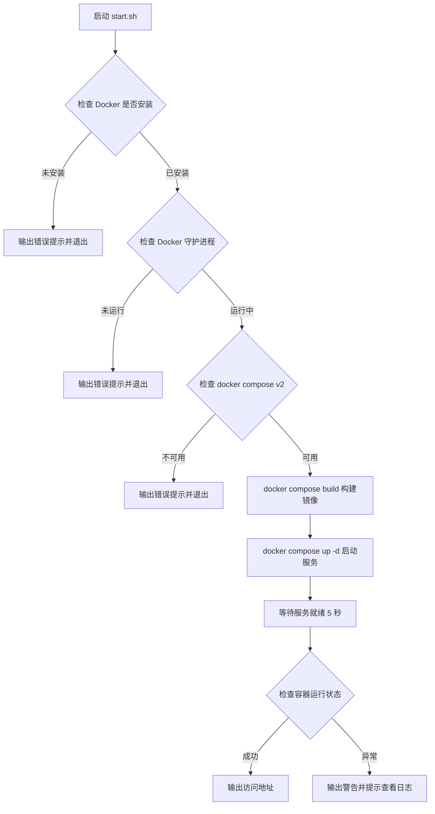
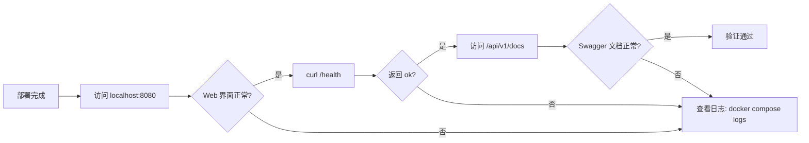

# AIR_Memory 部署手册

## 变更记录

| 版本号 | 变更时间 | 变更内容 |
| --- | --- | --- |
| 1.0 | 2026-4-10 | 初稿，覆盖 macOS 和 Windows 完整部署步骤 |
| 1.1 | 2026-4-10 | Windows 部署章节新增行尾格式注意事项（v1.0.1 Hotfix 说明） |

---

## 1. 概述

本手册面向部署人员，提供在 macOS 和 Windows 操作系统上完成 AIR_Memory 系统部署的完整步骤说明。AIR_Memory 采用 Docker Compose 容器化方案，部署过程统一为一键执行，无需手动配置运行时环境。

---

## 2. 运行环境前提

### 2.1 硬件要求

| 资源 | 最低要求 | 推荐配置 |
| --- | --- | --- |
| CPU | 4 核 | 8 核及以上 |
| 内存 | 8 GB | 16 GB |
| 磁盘空间 | 50 GB 可用空间 | 100 GB 及以上 |
| 网络 | 可访问 HuggingFace Hub | 宽带（首次构建需下载模型） |

> **注意**：系统热层内存预算默认为 6 GB，冷层磁盘预算默认为 40 GB，请确保宿主机资源满足要求。

### 2.2 软件要求

| 软件 | 版本要求 | 说明 |
| --- | --- | --- |
| Docker Engine / Docker Desktop | **27.0 及以上** | 必须包含 Docker Compose v2 插件 |
| 操作系统 | macOS 13+ 或 Windows 10/11 | Windows 需安装 Docker Desktop（含虚拟化支持） |

#### macOS 安装 Docker Desktop

访问 [https://docs.docker.com/desktop/install/mac-install/](https://docs.docker.com/desktop/install/mac-install/) 下载并安装 Docker Desktop for Mac（版本 27+）。安装完成后启动 Docker Desktop，等待状态栏图标变为稳定状态即可。

#### Windows 安装 Docker Desktop

访问 [https://www.docker.com/products/docker-desktop/](https://www.docker.com/products/docker-desktop/) 下载并安装 Docker Desktop for Windows（版本 27+）。

安装前置条件：

- 已在 BIOS 中启用虚拟化（Intel VT-x 或 AMD-V）

安装完成后启动 Docker Desktop，等待任务栏图标显示"Docker Desktop is running"。

### 2.3 网络要求

首次构建 Docker 镜像时，backend 服务将从 HuggingFace Hub 自动下载 Embedding 模型（`all-MiniLM-L6-v2`，约 90 MB）。请确保部署机器在首次构建期间可以访问以下地址：

- `https://huggingface.co`
- `https://cdn-lfs.huggingface.co`（模型文件 CDN）

模型下载完成后将打包进 Docker 镜像，后续重启无需再次联网下载。

---

## 3. 部署步骤

### 3.1 获取项目代码

通过 Git 克隆项目仓库到本地：

```bash
git clone <仓库地址>
cd air_memory
```

### 3.2 macOS 部署步骤

#### 步骤一：确认 Docker 已启动

打开 Docker Desktop，确认菜单栏图标显示 Docker 正在运行。

#### 步骤二：运行一键启动脚本

在项目根目录下打开终端，执行：

```bash
bash start.sh
```

脚本将依次执行以下操作：



首次构建约需 5 至 15 分钟（取决于网络速度和机器性能），请耐心等待。

#### 步骤三：确认启动成功

脚本输出以下内容时表示部署成功：

```
==========================================
 启动成功！
==========================================
 Web 管理界面：http://localhost:8080
 后端 API 文档：http://localhost:8080/api/v1/docs (通过 Nginx 代理)
 停止服务：docker compose stop
 查看日志：docker compose logs -f
==========================================
```

### 3.3 Windows 部署步骤

#### 步骤一：确认 Docker Desktop 已启动

启动 Docker Desktop，等待任务栏图标显示"Docker Desktop is running"。

#### 步骤二：确认 Git 行尾设置

> **注意（v1.0.1 新增）**：`start.bat` 脚本必须保持 CRLF 行尾才能在 Windows 中文系统（GBK/CP936 代码页）下正确执行。项目根目录的 `.gitattributes` 文件已配置 `.bat` 文件强制使用 CRLF 行尾，Git 会在 checkout 时自动处理，**无需手动操作**。
>
> 如在 clone 或 pull 后遇到启动失败，可执行以下命令重新检出脚本以恢复正确行尾：
>
> ```bat
> git checkout start.bat
> ```

#### 步骤三：运行一键启动脚本

在项目根目录下，双击 `start.bat` 文件，或在命令提示符（CMD）中执行：

```bat
start.bat
```

脚本将自动完成 Docker 环境检查、镜像构建和服务启动，过程与 macOS 版本一致。

首次构建约需 5 至 15 分钟，完成后命令行窗口将显示访问地址并等待按键继续。

#### 步骤四：确认启动成功

脚本输出以下内容时表示部署成功：

```
==========================================
 启动成功！
==========================================
 Web 管理界面：http://localhost:8080
 停止服务：docker compose stop
 查看日志：docker compose logs -f
==========================================
```

---

## 4. 部署后验证

### 4.1 验证 Web 界面可访问

在浏览器中访问 `http://localhost:8080`，应看到 AIR_Memory Web 管理界面正常加载。

### 4.2 验证后端健康状态

执行以下命令检查后端服务健康状态：

```bash
curl http://localhost:8080/health
```

预期响应：

```json
{"status": "ok"}
```

### 4.3 验证 API 文档可访问

在浏览器中访问 `http://localhost:8080/api/v1/docs`，应看到 FastAPI 自动生成的 Swagger API 文档页面。

### 4.4 验证容器运行状态

```bash
docker compose ps
```

预期输出中两个容器均应处于 `running` 状态：

| 容器名称 | 状态 |
| --- | --- |
| air-memory-backend | running |
| air-memory-frontend | running |

### 4.5 部署验证流程总览



---

## 5. 服务管理

### 5.1 常用命令

| 操作 | 命令 |
| --- | --- |
| 查看服务状态 | `docker compose ps` |
| 查看实时日志 | `docker compose logs -f` |
| 查看指定服务日志 | `docker compose logs -f backend` |
| 停止服务 | `docker compose stop` |
| 启动已停止的服务 | `docker compose start` |
| 重启服务 | `docker compose restart` |
| 停止并移除容器 | `docker compose down` |
| 重新构建并启动 | `docker compose build && docker compose up -d` |

### 5.2 数据持久化说明

系统数据存储在 Docker 命名 Volume `air_memory_air_memory_data` 中，执行 `docker compose down` 不会删除数据。

> **警告**：执行 `docker compose down -v` 将删除所有持久化数据（ChromaDB 冷层数据和 SQLite 日志），请谨慎操作。

---

## 6. 环境变量配置

所有性能阈值和路径配置均通过环境变量暴露，可在不重新构建镜像的情况下调整。详细配置说明请参阅 `doc/env_config.md`。

### 6.1 快速参考

| 变量名 | 默认值 | 说明 |
| --- | --- | --- |
| `HOT_MEMORY_BUDGET_MB` | `6144` | 热层内存预算（MB） |
| `DISK_MAX_GB` | `40` | 磁盘使用硬上限（GB） |
| `STORE_RESPONSE_LIMIT_MS` | `100` | 存储响应时间告警阈值（毫秒） |
| `QUERY_RESPONSE_LIMIT_MS` | `100` | 查询响应时间告警阈值（毫秒） |
| `MEMORY_PROTECT_HOURS` | `168` | 新记忆保护时长（小时，默认 7 天） |

### 6.2 修改配置方式

在 `docker-compose.yml` 的 `backend.environment` 节中修改对应变量值，然后执行：

```bash
docker compose up -d
```

无需重新构建镜像，修改即刻生效。

完整的 18 个配置项说明请参阅 `doc/env_config.md`。

---

## 7. 常见问题排查

### 7.1 Docker 未运行

**现象**：执行 `start.sh` 或 `start.bat` 时提示"Docker 守护进程未运行"。

**解决**：启动 Docker Desktop，等待图标变为稳定状态后重试。

### 7.2 首次构建失败（模型下载超时）

**现象**：构建过程中下载 `all-MiniLM-L6-v2` 模型失败，提示网络错误。

**解决**：检查网络连接，确认可以访问 `https://huggingface.co`，然后重新执行启动脚本。

### 7.3 端口 8080 被占用

**现象**：启动后无法访问 `http://localhost:8080`，或启动时提示端口冲突。

**解决**：查找并终止占用 8080 端口的进程，或在 `docker-compose.yml` 中将 `"8080:80"` 修改为其他宿主机端口（如 `"9090:80"`），然后重新启动。

### 7.4 backend 容器反复重启

**现象**：`docker compose ps` 显示 backend 容器状态异常或 Restarting。

**解决**：执行 `docker compose logs backend` 查看详细日志，常见原因包括内存不足（可降低 `HOT_MEMORY_BUDGET_MB`）或磁盘空间不足。

### 7.5 Windows 中文系统下 start.bat 启动失败（v1.0.0 已知问题）

**现象**：在 Windows 中文系统（GBK/CP936 代码页）下执行 `start.bat`，脚本报错，注释内容或 URL 被当作命令执行。

**解决**：升级至 v1.0.1 即可解决。执行以下命令更新代码后重新运行：

```bat
git pull
start.bat
```

> 详情参见 `doc/release_notes_v1.0.1.md`。
