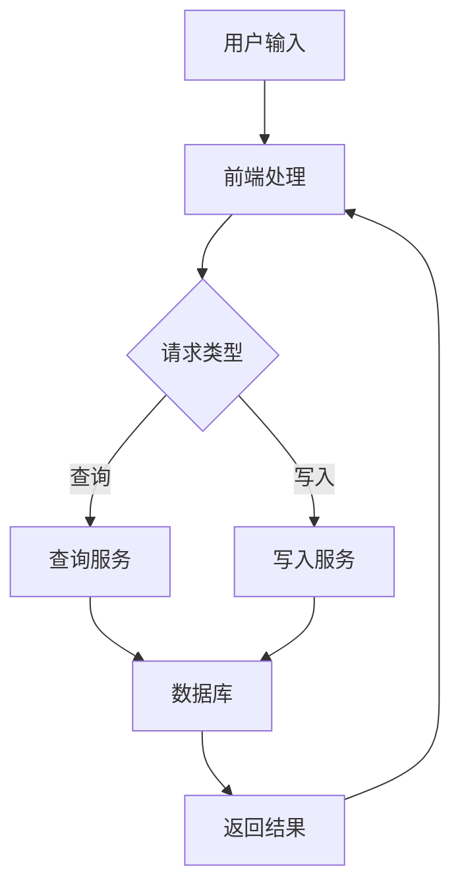
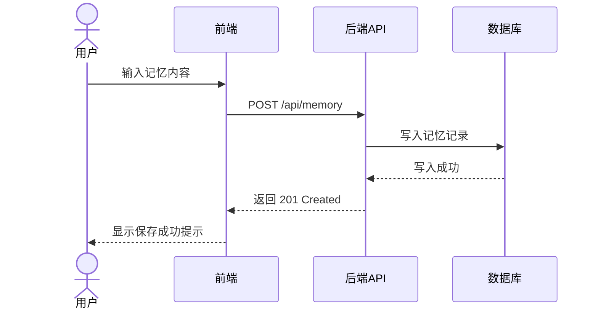
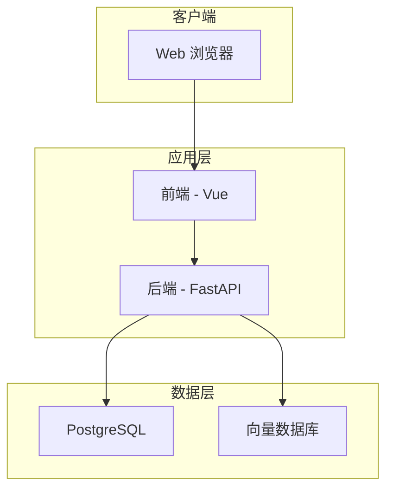
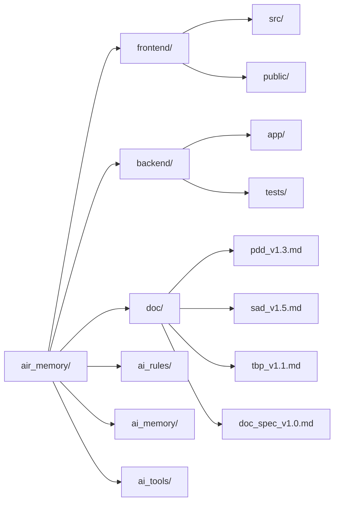

# AIR_Memory 项目文档规范

## 变更记录

| 版本号 | 变更时间 | 变更内容 |
| --- | --- | --- |
| 1.0 | 2026-4-9 | 初稿 |

---

## 1. 文档命名规范

### 1.1 版本号格式

所有项目文档文件名须包含版本号后缀，格式为 `<文档标识>_v<主版本号>.<次版本号>.md`。

示例：`sad_v1.0.md`、`pdd_v1.2.md`、`doc_spec_v1.0.md`

### 1.2 版本更新方式

**禁止直接修改已有版本文件。** 版本更新须按以下步骤操作：

1. 将现有版本文件的全部内容复制到新版本号对应的新文件中（例如从 `xxx_v1.0.md` 复制到 `xxx_v1.1.md`）；
2. 在新文件中完成所有修改；
3. 在新文件的变更记录表中追加本次变更的记录行（版本号、变更时间、变更内容）；
4. 原版本文件保持不变，作为历史存档。

### 1.3 变更记录表

每份文档的文件头部须包含变更记录表，格式如下：

```markdown
## 变更记录

| 版本号 | 变更时间 | 变更内容 |
| --- | --- | --- |
| 1.0 | YYYY-M-D | 初稿 |
| 1.1 | YYYY-M-D | 变更说明 |
```

---

## 2. 图表规范

### 2.1 基本原则

**禁止在 Markdown 文档中使用 ASCII 字符画绘制任何图表。**

以下字符组合用于手工绘图，在项目文档中均被禁止：

- 竖线与横线组合：`|`、`+--`、`---`（用于表格边框除外）
- Unicode 框线字符：`│`、`─`、`┌`、`┐`、`└`、`┘`、`├`、`┤`、`┬`、`┴`、`┼`
- 树形结构字符：`├──`、`└──`、`│   `、`    `（缩进树）

**所有图表须优先使用 Mermaid 图表语法**，利用代码围栏 ` ```mermaid ` 嵌入文档，由渲染器自动生成可视化图形。

### 2.2 各类图表的适用场景与示例

#### 2.2.1 flowchart — 数据流图与组件图

**适用场景**：数据处理流程、组件间依赖关系、模块架构分层图。



#### 2.2.2 sequenceDiagram — 交互序列图

**适用场景**：描述多个角色或模块之间按时间顺序发生的交互过程，如 API 调用链、用户操作流程。



#### 2.2.3 graph — 架构总览图

**适用场景**：系统整体架构概览、模块关系全景图、技术栈层次图。



---

## 3. 目录结构展示规范

### 3.1 基本原则

在文档中展示项目目录结构时，**禁止使用 ASCII 树形字符**（如 `├──`、`└──`、`│` 等）手工绘制目录树。

**须优先使用 Mermaid `graph LR` 图**来展示目录层级关系，以获得更清晰、更一致的可视化效果。

### 3.2 示例

以下示例展示如何用 Mermaid 图替代 ASCII 树形结构来描述项目目录：



### 3.3 补充说明

- 当目录层级超过 3 层且节点数量较多时，可按模块分拆为多张子图，避免单张图过于密集；
- 对于仅作简单文字说明（无需可视化）的场景，可改用 Markdown 无序列表描述各目录用途，但不得使用字符绘制树形缩进结构。
