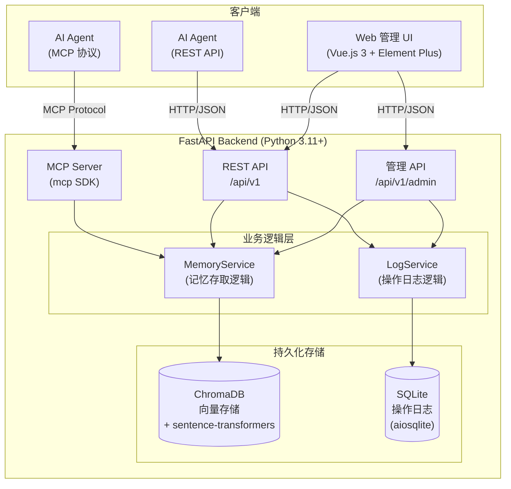

# AIR_Memory 系统架构设计说明书

## 变更记录

| 版本号 | 变更时间 | 变更内容 |
| --- | --- | --- |
| 1.0 | 2026-4-9 | 初稿 |
| 1.1 | 2026-4-9 | 将架构图替换为 Mermaid 图；新增性能指标对运行环境要求分析 |

---

## 1. 概述

### 1.1 文档目的

本文档描述 AIR_Memory 系统的整体架构设计，包括系统组件划分、模块职责、数据流设计、接口规范及部署方案，供研发工程师（Neo、Mia）和测试工程师（Sparrow）在研发过程中参考。

### 1.2 系统背景

AIR_Memory 是一个为 AI Agent 设计的本地部署记忆系统。AI Agent 可通过 AIR_Memory 高效地存储记忆和查询相关记忆，满足 100ms 以内的存储/查询响应要求，并向人类提供 Web 管理界面进行记忆查询、删除和日志查看。

### 1.3 术语定义

| 术语 | 说明 |
| --- | --- |
| AI Agent | 使用本系统进行记忆存储/查询的 AI 客户端 |
| Memory | AI Agent 存储的记忆条目，以自然语言文本形式存在 |
| Embedding | 将文本转换为高维向量的过程，用于语义相似度计算 |
| MCP | Model Context Protocol，Anthropic 推出的 AI Agent 工具调用标准协议 |
| REST API | 基于 HTTP/JSON 的通用接口协议 |
| ChromaDB | 嵌入式向量数据库，用于存储和检索记忆向量 |
| ANN | Approximate Nearest Neighbor，近似最近邻搜索 |

---

## 2. 技术栈

根据 `/doc/tsr_v1.1.md` 确认的技术路线（方案一：Python 生态全栈方案），最终技术栈如下：

| 组件 | 技术选型 | 版本要求 |
| --- | --- | --- |
| 后端框架 | Python + FastAPI | Python 3.11+，FastAPI 0.115+ |
| 记忆存储 | ChromaDB（嵌入式向量数据库） | 0.6+ |
| Embedding | sentence-transformers（all-MiniLM-L6-v2，本地运行） | 3.x |
| AI Agent 接口 | MCP Server（mcp Python SDK）+ REST API | mcp 1.x |
| 前端框架 | Vue.js 3 + TypeScript + Element Plus | Vue 3.4+，Element Plus 2.x |
| 状态管理 | Pinia | 2.x |
| 路由 | Vue Router | 4.x |
| HTTP 客户端 | Axios | 1.x |
| 部署方式 | Docker + docker-compose | Docker 27+，docker-compose v2.x |
| 自启动 | Docker restart policy always | - |
| 日志存储 | SQLite + aiosqlite | aiosqlite 0.20+ |
| 后端测试 | pytest + pytest-asyncio + httpx | pytest 8.0+ |
| 前端测试 | Vitest + Vue Test Utils + @testing-library/vue | Vitest 3.x |

---

## 3. 系统架构总览

### 3.1 架构图



### 3.2 组件职责

| 组件 | 职责 |
| --- | --- |
| FastAPI Backend | 后端服务入口，提供 REST API 和 MCP 协议接口，协调各业务模块 |
| MCP Server | 实现 MCP 协议，向 AI Agent 暴露记忆存储和查询工具 |
| REST API | 提供标准 HTTP 接口，兼容所有 AI Agent 和管理 UI |
| MemoryService | 记忆存储和查询的核心业务逻辑，调用 ChromaDB 进行向量操作 |
| LogService | 记录 AI Agent 的存储和查询操作日志，写入 SQLite |
| ChromaDB | 嵌入式向量数据库，持久化存储记忆向量及元数据 |
| SQLite | 关系型数据库，存储操作日志 |
| Vue.js 3 UI | 供人类使用的 Web 管理界面，通过 REST API 与后端通信 |

---

## 4. 目录结构

```
air_memory/                       # 仓库根目录
├── backend/                      # 后端服务（Python + FastAPI）
│   ├── src/
│   │   └── air_memory/           # 主 Python 包
│   │       ├── __init__.py
│   │       ├── main.py           # FastAPI 应用入口
│   │       ├── api/              # REST API 路由模块
│   │       │   ├── __init__.py
│   │       │   └── router.py     # 路由注册
│   │       ├── mcp/              # MCP Server 模块
│   │       │   └── __init__.py
│   │       ├── memory/           # 记忆存储模块（ChromaDB）
│   │       │   └── __init__.py
│   │       ├── log/              # 操作日志模块（SQLite + aiosqlite）
│   │       │   └── __init__.py
│   │       └── models/           # Pydantic 数据模型
│   │           └── __init__.py
│   ├── tests/                    # 后端单元测试
│   │   ├── __init__.py
│   │   └── test_main.py
│   ├── pyproject.toml            # Python 项目配置
│   └── requirements.txt          # 运行时依赖
├── frontend/                     # 前端应用（Vue.js 3 + TypeScript）
│   ├── src/
│   │   ├── api/                  # HTTP 请求模块（Axios）
│   │   │   └── index.ts
│   │   ├── components/           # 公共 Vue 组件
│   │   ├── router/               # Vue Router 路由配置
│   │   │   └── index.ts
│   │   ├── stores/               # Pinia 状态管理
│   │   │   └── index.ts
│   │   ├── views/                # 页面视图组件
│   │   │   └── HomeView.vue
│   │   ├── App.vue               # 根组件
│   │   └── main.ts               # 应用入口
│   ├── tests/                    # 前端单元测试
│   │   └── HomeView.spec.ts
│   ├── index.html
│   ├── package.json
│   ├── tsconfig.json
│   └── vite.config.ts
├── README.md                     # 项目说明和目录规划
└── doc/                          # 项目文档
    ├── pdd_v1.0.md               # 产品定义文档
    ├── tsr_v1.1.md               # 技术路线选型报告
    ├── tbp_v1.1.md               # 团队建设计划
    └── sad_v1.1.md               # 系统架构设计说明书（本文档）
```

---

## 5. 模块设计

### 5.1 后端模块划分

#### 5.1.1 `main.py` - 应用入口

- 创建 FastAPI 应用实例
- 注册所有路由（REST API router）
- 配置 CORS、异常处理、中间件
- 应用启动/关闭生命周期事件（预热 Embedding 模型）

#### 5.1.2 `api/` - REST API 层

- **`router.py`**：统一注册所有 API 子路由，路由前缀 `/api/v1`
- **`memory.py`**（待实现）：记忆相关接口
  - `POST /api/v1/memories` - 存储记忆
  - `GET /api/v1/memories` - 查询记忆
  - `DELETE /api/v1/memories/{id}` - 删除指定记忆
- **`logs.py`**（待实现）：日志查询接口
  - `GET /api/v1/logs/save` - 查看存储操作日志
  - `GET /api/v1/logs/query` - 查看查询操作日志

#### 5.1.3 `mcp/` - MCP Server 层

- **`server.py`**（待实现）：实现 MCP Server
  - Tool: `save_memory(content: str)` - 存储记忆
  - Tool: `query_memory(query: str, top_k: int)` - 查询记忆

#### 5.1.4 `memory/` - 记忆存储层

- **`service.py`**（待实现）：MemoryService 类
  - 初始化 ChromaDB 客户端和 Embedding 模型
  - `save(content: str) -> str`：生成 Embedding 并存储到 ChromaDB，返回记忆 ID
  - `query(query: str, top_k: int) -> list[Memory]`：生成查询 Embedding，执行 ANN 搜索

#### 5.1.5 `log/` - 操作日志层

- **`service.py`**（待实现）：LogService 类
  - 初始化 SQLite 连接（aiosqlite）
  - `log_save(content: str, memory_id: str)`：记录存储操作
  - `log_query(query: str, results: list)`：记录查询操作
  - `get_save_logs() -> list`：查询存储日志
  - `get_query_logs() -> list`：查询查询日志

#### 5.1.6 `models/` - 数据模型层

- **`memory.py`**（待实现）：记忆相关 Pydantic 模型
  - `MemorySaveRequest`、`MemorySaveResponse`
  - `MemoryQueryRequest`、`MemoryQueryResponse`、`Memory`
- **`log.py`**（待实现）：日志相关 Pydantic 模型
  - `SaveLog`、`QueryLog`

### 5.2 前端模块划分

#### 5.2.1 `main.ts` - 应用入口

- 创建 Vue 应用，注册 Element Plus、Pinia、Vue Router

#### 5.2.2 `router/` - 路由层

| 路由 | 组件 | 说明 |
| --- | --- | --- |
| `/` | `HomeView` | 记忆查询页面 |
| `/memories` | `MemoriesView`（待实现） | 记忆管理页面 |
| `/logs` | `LogsView`（待实现） | 操作日志页面 |

#### 5.2.3 `stores/` - 状态管理层

- `useMemoryStore`（待实现）：管理记忆列表、查询状态
- `useLogStore`（待实现）：管理日志数据

#### 5.2.4 `api/` - 接口调用层

- 封装 Axios 实例，统一设置 `baseURL = /api/v1`
- `memoryApi`（待实现）：记忆相关接口调用
- `logApi`（待实现）：日志相关接口调用

#### 5.2.5 `views/` - 视图层

- `HomeView.vue`：首页（记忆查询功能）
- `MemoriesView.vue`（待实现）：记忆列表和删除功能
- `LogsView.vue`（待实现）：操作日志查看功能

#### 5.2.6 `components/` - 公共组件层

- `MemoryCard.vue`（待实现）：记忆条目展示组件
- `LogTable.vue`（待实现）：日志表格组件

---

## 6. 数据流设计

### 6.1 记忆存储流程

```
AI Agent
  |
  |  (1) MCP Tool Call: save_memory(content)
  |      或 POST /api/v1/memories {"content": "..."}
  v
FastAPI Backend
  |
  +-- (2) MemoryService.save(content)
  |       |
  |       +-- (3) sentence-transformers 生成 Embedding 向量
  |       +-- (4) 将文本+向量存入 ChromaDB，获得 memory_id
  |
  +-- (5) asyncio.create_task: LogService.log_save(content, memory_id)
              |
              +-- (6) 异步写入 SQLite 操作日志
  |
  |  返回 {"memory_id": "...", "message": "ok"}
  v
AI Agent
```

### 6.2 记忆查询流程

```
AI Agent
  |
  |  (1) MCP Tool Call: query_memory(query, top_k)
  |      或 GET /api/v1/memories?query=...&top_k=5
  v
FastAPI Backend
  |
  +-- (2) MemoryService.query(query, top_k)
  |       |
  |       +-- (3) sentence-transformers 生成查询 Embedding 向量
  |       +-- (4) ChromaDB HNSW ANN 搜索，返回 top_k 条记忆
  |
  +-- (5) asyncio.create_task: LogService.log_query(query, results)
              |
              +-- (6) 异步写入 SQLite 查询日志
  |
  |  返回 {"memories": [...], "count": N}
  v
AI Agent
```

### 6.3 管理 UI 操作流程

```
人类（浏览器）
  |
  |  Vue.js 3 UI + Axios
  v
GET /api/v1/memories?query=...   查询记忆
DELETE /api/v1/memories/{id}     删除记忆
GET /api/v1/logs/save            查看存储日志
GET /api/v1/logs/query           查看查询日志
  |
  v
FastAPI REST API -> MemoryService / LogService
```

---

## 7. 接口规范

### 7.1 REST API 规范

**基础 URL**：`/api/v1`

**通用成功响应**：

```json
{
  "data": {},
  "message": "ok"
}
```

**错误响应**：

```json
{
  "detail": "错误描述"
}
```

#### 7.1.1 记忆接口

| 方法 | 路径 | 说明 | 请求体 | 响应 |
| --- | --- | --- | --- | --- |
| POST | `/memories` | 存储记忆 | `{"content": "string"}` | `{"memory_id": "string", "message": "ok"}` |
| GET | `/memories` | 查询记忆 | Query: `query`, `top_k=5` | `{"memories": [...], "count": N}` |
| DELETE | `/memories/{id}` | 删除记忆 | - | `{"message": "ok"}` |

#### 7.1.2 日志接口

| 方法 | 路径 | 说明 | 响应 |
| --- | --- | --- | --- |
| GET | `/logs/save` | 查询存储操作日志 | `{"logs": [...], "count": N}` |
| GET | `/logs/query` | 查询查询操作日志 | `{"logs": [...], "count": N}` |

#### 7.1.3 系统接口

| 方法 | 路径 | 说明 | 响应 |
| --- | --- | --- | --- |
| GET | `/health` | 健康检查 | `{"status": "ok"}` |

### 7.2 MCP 工具规范

| Tool 名称 | 参数 | 说明 |
| --- | --- | --- |
| `save_memory` | `content: str` | 存储一条记忆，返回 memory_id |
| `query_memory` | `query: str`, `top_k: int = 5` | 查询相关记忆，返回最相关的 top_k 条 |

---

## 8. 数据模型设计

### 8.1 记忆数据（ChromaDB）

| 字段 | 类型 | 说明 |
| --- | --- | --- |
| `id` | string | 记忆唯一 ID（UUID4） |
| `document` | string | 记忆原始文本内容 |
| `embedding` | float[] | 384 维向量（all-MiniLM-L6-v2） |
| `metadata.created_at` | string | 创建时间（ISO 8601） |

### 8.2 操作日志（SQLite）

#### 存储操作日志表 `save_logs`

| 字段 | 类型 | 说明 |
| --- | --- | --- |
| `id` | INTEGER PRIMARY KEY | 自增 ID |
| `memory_id` | TEXT | 关联的记忆 ID |
| `content` | TEXT | 存储的原始内容 |
| `created_at` | TEXT | 存储时间（ISO 8601） |

#### 查询操作日志表 `query_logs`

| 字段 | 类型 | 说明 |
| --- | --- | --- |
| `id` | INTEGER PRIMARY KEY | 自增 ID |
| `query` | TEXT | 查询条件 |
| `results` | TEXT | 查询结果（JSON 序列化） |
| `created_at` | TEXT | 查询时间（ISO 8601） |

---

## 9. 部署架构

### 9.1 容器架构

```
docker-compose
  |
  +-- backend  (Python + FastAPI)
  |   +-- 端口: 8000
  |   +-- Volume: ./data/chroma -> /app/data/chroma（ChromaDB 持久化）
  |   +-- Volume: ./data/logs.db -> /app/data/logs.db（SQLite 日志持久化）
  |   +-- restart: always
  |
  +-- frontend  (Nginx + Vue.js 3 静态文件)
      +-- 端口: 80
      +-- 反向代理: /api/* -> backend:8000
      +-- restart: always
```

### 9.2 端口规划

| 服务 | 容器端口 | 宿主机端口 | 说明 |
| --- | --- | --- | --- |
| frontend | 80 | 8080 | Web UI 访问入口 |
| backend | 8000 | 8000 | REST API / MCP 服务端口 |

### 9.3 持久化存储

| 数据类型 | 宿主机路径 | 说明 |
| --- | --- | --- |
| 记忆向量 | `./data/chroma/` | ChromaDB 数据目录 |
| 操作日志 | `./data/logs.db` | SQLite 数据库文件 |

---

## 10. 性能设计

### 10.1 性能目标

| 操作 | 目标响应时间 |
| --- | --- |
| 记忆存储 | ≤ 100ms |
| 记忆查询 | ≤ 100ms |

### 10.2 性能保障措施

| 措施 | 说明 |
| --- | --- |
| 模型预热 | FastAPI 启动时（lifespan）预加载 all-MiniLM-L6-v2 模型，避免首次请求冷启动延迟 |
| HNSW 索引 | ChromaDB 默认使用 HNSW 近似最近邻索引，百万级数据查询可在 10ms 以内完成 |
| 异步 I/O | FastAPI 全程使用 async/await，SQLite 使用 aiosqlite 异步操作，避免 I/O 阻塞 |
| 日志异步写入 | 操作日志写入使用 asyncio.create_task 异步执行，不占用主业务响应时间 |
| 向量维度控制 | 使用 384 维向量（all-MiniLM-L6-v2），在精度和性能之间取得平衡 |

### 10.3 性能指标对运行环境的要求分析

本节分析在满足 **100ms 响应时间**目标约束下，各关键技术组件对宿主机运行环境的最低要求。

#### 10.3.1 响应时间预算分解

单次存储/查询请求的响应时间主要由以下步骤消耗（以 CPU 推理为基准）：

| 步骤 | 组件 | 典型耗时（参考值） | 说明 |
| --- | --- | --- | --- |
| 文本 Embedding 推理 | sentence-transformers (all-MiniLM-L6-v2) | 15 ~ 60ms | 受 CPU 核心数和型号影响最大；模型已预热 |
| ChromaDB HNSW 向量检索 | ChromaDB | 1 ~ 10ms | 取决于记忆条目数量；百万级以内 ≤ 10ms |
| FastAPI 路由 + 序列化 | FastAPI + Pydantic v2 | 1 ~ 5ms | 极低开销 |
| 网络传输（本地 Docker） | Docker bridge 网络 | < 1ms | 容器内通信，可忽略 |
| **合计（最坏情况）** | | **~ 76ms** | 留有约 24ms 安全裕量 |

> **关键结论**：sentence-transformers 推理是响应时间的主要瓶颈，约占全链路时间的 70%～80%。CPU 性能直接决定是否能满足 100ms 目标。

#### 10.3.2 CPU 要求

| 项目 | 最低要求 | 推荐配置 | 说明 |
| --- | --- | --- | --- |
| CPU 架构 | x86_64 / ARM64 | x86_64 | sentence-transformers / PyTorch 支持两种架构 |
| CPU 核心数 | 2 核 | 4 核及以上 | 推理运算占用 1 核，系统及 FastAPI 占用其余核心 |
| CPU 型号性能参考 | Intel Core i5-8250U 同等级及以上 | Intel Core i5-10代+ / AMD Ryzen 5 3600+ | all-MiniLM-L6-v2 单条推理在此类 CPU 上约 15～40ms |
| CPU 频率 | 2.0GHz+ | 3.0GHz+ | 频率影响单线程推理性能 |

> **注意**：若宿主机配备 NVIDIA GPU 并正确安装 CUDA（≥ 11.8）和 cuDNN，sentence-transformers 可自动切换至 GPU 推理，单条推理时间降至 2～5ms，响应时间裕量大幅提升。此时 CPU 性能要求可降低至 2 核 / 1.5GHz。

#### 10.3.3 内存（RAM）要求

| 组件 | 占用内存（参考值） | 说明 |
| --- | --- | --- |
| Python 运行时 + FastAPI 服务 | ~200MB | 基础运行时开销 |
| sentence-transformers (all-MiniLM-L6-v2 模型) | ~90MB | 模型文件大小 |
| PyTorch CPU 推理运行时 | ~400MB | PyTorch 底层库内存占用 |
| ChromaDB 进程 + HNSW 索引 | ~200MB（基础）+ ~0.5MB / 千条记忆 | 随数据量线性增长 |
| SQLite + aiosqlite | < 10MB | 极低开销 |
| Docker 容器运行时开销 | ~100MB | Docker engine 本身 |
| **合计（最小工作集）** | **~1,000MB** | 仅含基础组件，不含数据 |

**内存配置建议**：

| 场景 | 最低 RAM | 推荐 RAM |
| --- | --- | --- |
| 开发 / 测试环境 | 2GB | 4GB |
| 生产环境（记忆条目 ≤ 10 万条） | 2GB | 4GB |
| 生产环境（记忆条目 10 万 ~ 100 万条） | 4GB | 8GB |

#### 10.3.4 磁盘存储要求

| 内容 | 空间占用（参考值） | 说明 |
| --- | --- | --- |
| Docker 镜像（backend） | ~3.5GB | Python 3.11 + FastAPI + PyTorch CPU + sentence-transformers |
| Docker 镜像（frontend） | ~200MB | Nginx + Vue.js 3 静态文件 |
| sentence-transformers 模型缓存 | ~90MB | all-MiniLM-L6-v2 模型文件（首次启动自动下载） |
| ChromaDB 数据（每千条记忆） | ~2MB | 向量（384 维 × 4 bytes）+ 原文 + 元数据 |
| SQLite 操作日志 | ~1MB / 万条记录 | 取决于日志内容长度 |
| **合计（初始部署）** | **~4GB** | 不含业务数据 |

**磁盘配置建议**：

| 场景 | 最低可用空间 |
| --- | --- |
| 开发 / 测试环境 | 10GB |
| 生产环境 | 20GB（含数据增长余量） |

> **提示**：模型文件在首次启动时从 HuggingFace Hub 下载，建议确保网络可达或提前将模型文件打包到镜像中（离线部署场景）。

#### 10.3.5 运行环境最低配置汇总

| 资源 | 最低配置 | 推荐配置 |
| --- | --- | --- |
| CPU | 2 核 / 2.0GHz（x86_64 或 ARM64） | 4 核 / 3.0GHz x86_64 |
| RAM | 2GB | 4GB |
| 磁盘（可用） | 10GB | 20GB |
| 操作系统 | Linux（64 位）/ macOS 12+ / Windows 10+ with WSL2 | Linux（64 位） |
| Docker | Docker Engine 27+ / Docker Desktop | Docker Engine 27+ |
| docker-compose | v2.x | v2.x |
| 网络 | 首次部署需能访问 Docker Hub 和 HuggingFace Hub | - |

---

## 11. 安全设计

| 安全措施 | 说明 |
| --- | --- |
| 本地部署 | 系统默认仅监听本地端口，不向公网暴露 |
| 输入校验 | 所有 API 输入通过 Pydantic v2 严格校验 |
| CORS 配置 | 仅允许来自前端域名的跨域请求 |
| 数据持久化 | 数据文件存储在宿主机 volume，容器删除不丢失数据 |

---

## 12. 后续研发计划

| 阶段 | 工作内容 | 负责人 |
| --- | --- | --- |
| 阶段一 | 实现 MemoryService（ChromaDB 存储/查询） | Neo |
| 阶段一 | 实现 LogService（SQLite 日志记录） | Neo |
| 阶段一 | 实现完整 REST API 接口 | Neo |
| 阶段一 | 实现 MCP Server | Neo |
| 阶段二 | 实现记忆管理页面（查询/删除） | Mia |
| 阶段二 | 实现操作日志页面 | Mia |
| 阶段三 | 完善单元测试覆盖率 >= 80% | Sparrow |
| 阶段四 | 编写部署手册和用户手册 | Nia |
| 阶段四 | 编写 docker-compose.yml 和 Dockerfile | Neo |
