# AIR_Memory 系统架构设计说明书

## 变更记录

| 版本号 | 变更时间 | 变更内容 |
| --- | --- | --- |
| 1.0 | 2026-4-9 | 初稿 |
| 1.1 | 2026-4-9 | 将架构图替换为 Mermaid 图；新增性能指标对运行环境要求分析 |
| 1.2 | 2026-4-9 | 补充 ChromaDB HNSW 索引内存增长机制及数据管理策略说明 |
| 1.3 | 2026-4-9 | 引入分级记忆存储架构（热层/冷层）；新增记忆价值反馈接口；新增快速/深度查询模式；更新数据模型、接口规范和性能设计以支持 8GB 内存上限约束 |
| 1.4 | 2026-4-9 | 新增 Feedback 日志及 Web 价值评分查询功能；新增磁盘容量管理策略（上限 40GB，自动淘汰低价值最旧数据）；更新数据模型、接口规范和研发计划 |
| 1.5 | 2026-4-9 | 磁盘淘汰新增 7×24h 保护规则（创建时间在 168 小时以内的记忆不得被淘汰）；所有 ASCII 数据流图和目录树替换为 Mermaid 图 |
| 1.6 | 2026-4-9 | 新增参考文档表；文档目的、系统背景及技术栈章节补充对 SRD v1.0 的引用；技术栈参考版本更新为 tsr_v1.3.md；新增第 13 章：需求分配 |
| 1.7 | 2026-4-9 | 重写第 12 章研发计划：细化各阶段工作内容，加入单元测试研发计划和系统确认计划，以里程碑形式定义重要节点，并明确每个里程碑的验收标准 |
| 1.8 | 2026-4-9 | 完善里程碑验收标准：新增记忆数据和日志内容的正确性验证；将所有性能阈值设计为可配置项并更新相关测试标准；新增各里程碑的报告文档输出节点与内容要求（研发执行报告、测试报告、系统确认报告） |
| 1.9 | 2026-4-10 | 修正新记忆初始层：新记忆存储时同时写入热层和冷层（初始 tier='hot'），确保新记忆可被快速查询；更新 Windows 部署要求，去除强制 WSL2 前置条件 |
| 1.10 | 2026-4-10 | 新记忆热层稳定性增强：将 INITIAL_VALUE_SCORE 从 0.5 提升至 0.6（= PROMOTE_THRESHOLD），确保重启恢复时新记忆被优先加载；restore_hot_tier 优先恢复 tier='hot' 的记忆；check_memory_budget 驱逐时优先驱逐有反馈的低价值记忆，保护新记忆不被率先清出热层 |

---

## 1. 概述

### 1.1 文档目的

本文档描述 AIR_Memory 系统的整体架构设计，包括系统组件划分、模块职责、数据流设计、接口规范及部署方案，供研发工程师（Neo、Mia）和测试工程师（Sparrow）在研发过程中参考。

### 1.2 参考文档

| 文档标识 | 文档名称 | 版本 |
| --- | --- | --- |
| PDD | AIR_Memory 产品定义文档 | v1.3 |
| SRD | AIR_Memory 系统需求文档 | v1.0 |
| TSR | AIR_Memory 技术路线选型报告 | v1.3 |

### 1.3 系统背景

AIR_Memory 是一个为 AI Agent 设计的本地部署记忆系统。AI Agent 可通过 AIR_Memory 高效地存储记忆、查询相关记忆，并能对查询结果的价值进行反馈评价。系统通过分级存储架构（热层/冷层），在 8GB 内存上限和 40GB 磁盘上限约束下最大化高价值记忆的快速查询性能；磁盘空间触及上限时自动淘汰低价值最旧数据（创建时间在 168 小时内的记忆受保护不得淘汰）；同时向人类提供 Web 管理界面进行记忆查询、删除、日志查看和价值评分查询。

### 1.4 术语定义

| 术语 | 说明 |
| --- | --- |
| AI Agent | 使用本系统进行记忆存储/查询的 AI 客户端 |
| Memory | AI Agent 存储的记忆条目，以自然语言文本形式存在 |
| Embedding | 将文本转换为高维向量的过程，用于语义相似度计算 |
| MCP | Model Context Protocol，Anthropic 推出的 AI Agent 工具调用标准协议 |
| REST API | 基于 HTTP/JSON 的通用接口协议 |
| ChromaDB | 嵌入式向量数据库，用于存储和检索记忆向量 |
| ANN | Approximate Nearest Neighbor，近似最近邻搜索 |
| 热层（Hot Tier） | 高价值记忆的内存存储层（ChromaDB EphemeralClient），支持快速 ANN 查询（≤ 100ms） |
| 冷层（Cold Tier） | 普通记忆的持久化存储层（ChromaDB PersistentClient），支持深度查询（无响应时间保证） |
| 价值分（Value Score） | 记忆的综合价值评分（0.0～1.0），由 AI Agent 通过反馈接口影响，决定记忆在热/冷层的分配 |
| 快速查询（Fast Query） | 仅检索热层，响应时间 ≤ 100ms |
| 深度查询（Deep Query） | 同时检索热层和冷层，返回更全面的结果，无响应时间保证 |
| Feedback 日志 | 记录每条记忆每次被 AI Agent 评价的历史（时间/评价结果） |
| 磁盘淘汰（Disk Eviction） | 磁盘占用接近 40GB 上限时，自动删除低价值记忆中创建时间最早的数据 |

---

## 2. 技术栈

根据 `/doc/tsr_v1.3.md` 确认的技术路线（方案一：Python 生态全栈方案），最终技术栈如下：

| 组件 | 技术选型 | 版本要求 |
| --- | --- | --- |
| 后端框架 | Python + FastAPI | Python 3.11+，FastAPI 0.115+ |
| 记忆存储 | ChromaDB（嵌入式向量数据库） | 0.6+ |
| Embedding | sentence-transformers（all-MiniLM-L6-v2，本地运行） | 3.x |
| AI Agent 接口 | MCP Server（mcp Python SDK）+ REST API | mcp 1.x |
| 前端框架 | Vue.js 3 + TypeScript + Element Plus | Vue 3.4+，Element Plus 2.x |
| 状态管理 | Pinia | 2.x |
| 路由 | Vue Router | 4.x |
| HTTP 客户端 | Axios | 1.x |
| 部署方式 | Docker + docker-compose | Docker 27+，docker-compose v2.x |
| 自启动 | Docker restart policy always | - |
| 日志存储 | SQLite + aiosqlite | aiosqlite 0.20+ |
| 后端测试 | pytest + pytest-asyncio + httpx | pytest 8.0+ |
| 前端测试 | Vitest + Vue Test Utils + @testing-library/vue | Vitest 3.x |

---

## 3. 系统架构总览

### 3.1 架构图

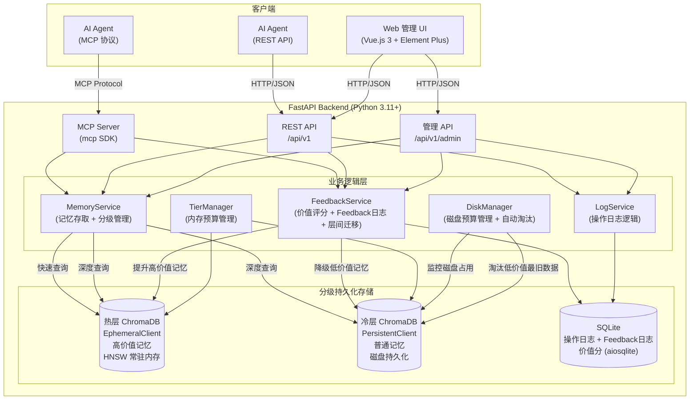

### 3.2 组件职责

| 组件 | 职责 |
| --- | --- |
| FastAPI Backend | 后端服务入口，提供 REST API 和 MCP 协议接口，协调各业务模块 |
| MCP Server | 实现 MCP 协议，向 AI Agent 暴露记忆存储、查询和价值反馈工具 |
| REST API | 提供标准 HTTP 接口，兼容所有 AI Agent 和管理 UI |
| MemoryService | 记忆存储和查询的核心业务逻辑；根据 `fast_only` 参数路由到热层或双层查询 |
| FeedbackService | 接收 AI Agent 的价值反馈，更新记忆 value_score；写入 Feedback 日志；驱动热层/冷层之间的记忆迁移 |
| TierManager | 管控热层内存预算（≤ 6GB），启动时优先恢复 tier='hot' 记忆、再补充冷层高价值记忆，预算超限时优先驱逐有反馈的低价值记忆（保护新记忆） |
| DiskManager | 监控冷层磁盘占用，接近 40GB 上限时自动淘汰低价值记忆中 created_at 最早的数据；**创建时间在 168 小时（7×24h）以内的记忆受保护，不参与淘汰** |
| LogService | 记录 AI Agent 的存储和查询操作日志，写入 SQLite |
| 热层 ChromaDB (EphemeralClient) | 纯内存向量索引，存储高价值记忆；HNSW 索引常驻 RAM，查询延迟 ≤ 10ms |
| 冷层 ChromaDB (PersistentClient) | 磁盘持久化向量索引，存储普通记忆；仅在深度查询时访问，查询延迟不保证 |
| SQLite | 存储操作日志、Feedback 日志及每条记忆的价值评分历史 |
| Vue.js 3 UI | 供人类使用的 Web 管理界面，通过 REST API 与后端通信；支持查看 Feedback 日志和价值评分 |

---

## 4. 目录结构

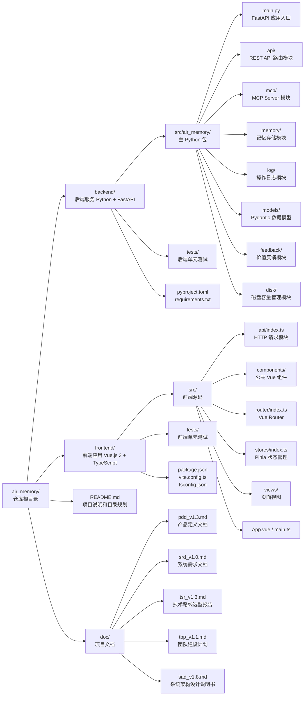

---

## 5. 模块设计

### 5.1 后端模块划分

#### 5.1.1 `main.py` - 应用入口

- 创建 FastAPI 应用实例
- 注册所有路由（REST API router）
- 配置 CORS、异常处理、中间件
- 应用启动/关闭生命周期事件：预热 Embedding 模型；初始化热层/冷层 ChromaDB；恢复热层记忆

#### 5.1.2 `api/` - REST API 层

- **`router.py`**：统一注册所有 API 子路由，路由前缀 `/api/v1`
- **`memory.py`**（待实现）：记忆相关接口
  - `POST /api/v1/memories` - 存储记忆
  - `GET /api/v1/memories` - 查询记忆（支持 `fast_only` 参数）
  - `DELETE /api/v1/memories/{id}` - 删除指定记忆
  - `POST /api/v1/memories/{id}/feedback` - 提交记忆价值反馈
- **`logs.py`**（待实现）：日志查询接口
  - `GET /api/v1/logs/save` - 查看存储操作日志
  - `GET /api/v1/logs/query` - 查看查询操作日志

#### 5.1.3 `mcp/` - MCP Server 层

- **`server.py`**（待实现）：实现 MCP Server
  - Tool: `save_memory(content: str)` - 存储记忆
  - Tool: `query_memory(query: str, top_k: int, fast_only: bool)` - 查询记忆，支持快速/深度模式
  - Tool: `feedback_memory(memory_id: str, valuable: bool)` - 提交记忆价值反馈

#### 5.1.4 `memory/` - 记忆存储层

- **`service.py`**（待实现）：MemoryService 类
  - 维护两个 ChromaDB 实例：`hot_client`（EphemeralClient，内存）和 `cold_client`（PersistentClient，磁盘）
  - `save(content: str) -> str`：生成 Embedding，初始同时存入热层和冷层（value_score = INITIAL_VALUE_SCORE，默认 0.6 = PROMOTE_THRESHOLD），返回 memory_id
  - `query(query: str, top_k: int, fast_only: bool) -> list[Memory]`：
    - `fast_only=True`：仅查询热层
    - `fast_only=False`：并发查询热层和冷层，合并结果去重
  - `_promote(memory_id: str)`：将记忆从冷层迁移到热层（value_score 超过阈值时触发）
  - `_demote(memory_id: str)`：将记忆从热层迁移回冷层（value_score 降低或热层容量不足时触发）
  - `_check_memory_budget()`：检查热层内存占用，超过预算上限（约 6GB）时驱逐记忆：优先驱逐有反馈（feedback_count > 0）且价值最低的记忆，保护从未被评价的新记忆不被率先清出

- **`tier_manager.py`**（待实现）：TierManager 类
  - 在服务启动时从 SQLite 读取 value_score，按分值排序，将 top-N 记忆加载至热层
  - 提供 `get_hot_capacity()` 方法：返回当前热层内存占用估算
  - 提供 `get_tier_stats()` 方法：返回热层/冷层记忆数量及内存占用

#### 5.1.5 `feedback/` - 价值反馈层（新增）

- **`service.py`**（待实现）：FeedbackService 类
  - `submit(memory_id: str, valuable: bool)`：
    - 更新 SQLite 中 `memory_values` 表的 value_score（valuable=True → +0.1，上限 1.0；valuable=False → -0.1，下限 0.0）
    - 向 `feedback_logs` 表写入本次反馈记录（memory_id, valuable, created_at）
  - 触发层间迁移：value_score ≥ 0.6 且在冷层 → 调用 `MemoryService._promote()`；value_score < 0.3 且在热层 → 调用 `MemoryService._demote()`
  - `get_feedback_logs(memory_id: str) -> list`：查询指定记忆的反馈历史
  - `get_memory_value_score(memory_id: str) -> float`：查询指定记忆当前综合价值评分

#### 5.1.6 `disk/` - 磁盘容量管理层（新增）

- **`manager.py`**（待实现）：DiskManager 类
  - `get_disk_usage() -> float`：计算冷层 ChromaDB 数据目录及 SQLite 文件的当前磁盘占用（GB）
  - `check_and_evict()`：检查磁盘占用，若超过 `DISK_BUDGET_GB`（默认 38GB，预留 2GB 安全裕量）：
    1. 从 SQLite 的 `memory_values` 表中，按 `value_score ASC, created_at ASC` 排序，取出最低价值且最旧的若干条记忆 ID
    2. 从冷层 ChromaDB 和 SQLite 相关表中删除这些记忆的全部数据
    3. 循环执行直到磁盘占用降至安全水位以下（`DISK_SAFE_GB`，默认 35GB）
  - 在 FastAPI 启动时注册每小时定期执行 `check_and_evict()`

#### 5.1.7 `log/` - 操作日志层

- **`service.py`**（待实现）：LogService 类
  - 初始化 SQLite 连接（aiosqlite）
  - `log_save(content: str, memory_id: str)`：记录存储操作
  - `log_query(query: str, results: list, fast_only: bool)`：记录查询操作（含查询模式）
  - `get_save_logs() -> list`：查询存储日志
  - `get_query_logs() -> list`：查询查询日志

#### 5.1.8 `models/` - 数据模型层

- **`memory.py`**（待实现）：记忆相关 Pydantic 模型
  - `MemorySaveRequest`、`MemorySaveResponse`
  - `MemoryQueryRequest`（含 `fast_only: bool = False`）、`MemoryQueryResponse`、`Memory`
  - `MemoryFeedbackRequest`（含 `valuable: bool`）、`MemoryFeedbackResponse`
- **`log.py`**（待实现）：日志相关 Pydantic 模型
  - `SaveLog`、`QueryLog`（含 `fast_only` 字段）
- **`feedback.py`**（待实现）：反馈相关 Pydantic 模型
  - `FeedbackLog`（含 `memory_id`、`valuable`、`created_at`）
  - `MemoryValueScore`（含 `memory_id`、`value_score`、`tier`、`feedback_count`）

### 5.2 前端模块划分

#### 5.2.1 `main.ts` - 应用入口

- 创建 Vue 应用，注册 Element Plus、Pinia、Vue Router

#### 5.2.2 `router/` - 路由层

| 路由 | 组件 | 说明 |
| --- | --- | --- |
| `/` | `HomeView` | 记忆查询页面 |
| `/memories` | `MemoriesView`（待实现） | 记忆管理页面 |
| `/logs` | `LogsView`（待实现） | 操作日志页面 |
| `/feedback` | `FeedbackView`（待实现） | 价值评分与 Feedback 日志页面 |

#### 5.2.3 `stores/` - 状态管理层

- `useMemoryStore`（待实现）：管理记忆列表、查询状态
- `useLogStore`（待实现）：管理日志数据

#### 5.2.4 `api/` - 接口调用层

- 封装 Axios 实例，统一设置 `baseURL = /api/v1`
- `memoryApi`（待实现）：记忆相关接口调用
- `logApi`（待实现）：日志相关接口调用

#### 5.2.5 `views/` - 视图层

- `HomeView.vue`：首页（记忆查询功能）
- `MemoriesView.vue`（待实现）：记忆列表和删除功能
- `LogsView.vue`（待实现）：操作日志查看功能
- `FeedbackView.vue`（待实现）：
  - 显示每个记忆的当前综合价值评分（value_score）和所在层（hot/cold）
  - 显示指定记忆的每次反馈记录列表（时间、有价值/无价值）

#### 5.2.6 `components/` - 公共组件层

- `MemoryCard.vue`（待实现）：记忆条目展示组件
- `LogTable.vue`（待实现）：日志表格组件

---

## 6. 数据流设计

### 6.1 记忆存储流程

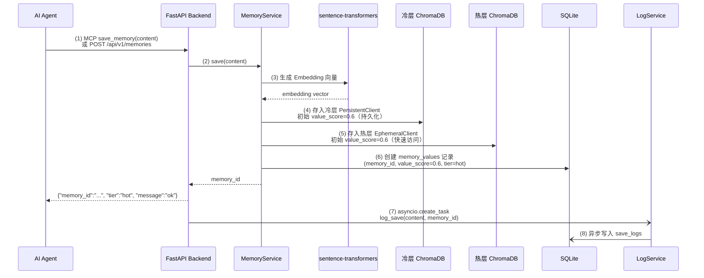

### 6.2 记忆查询流程

#### 6.2.1 快速查询（`fast_only=True`）

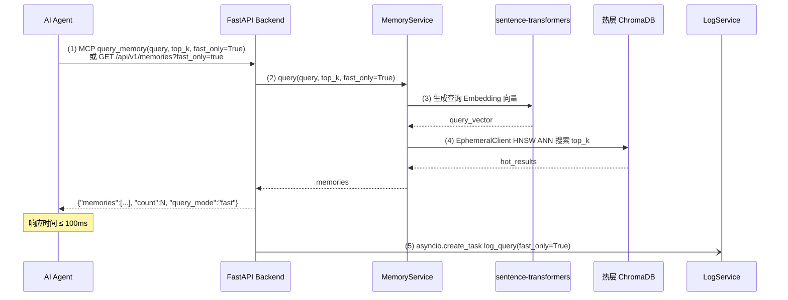

#### 6.2.2 深度查询（`fast_only=False`，默认）

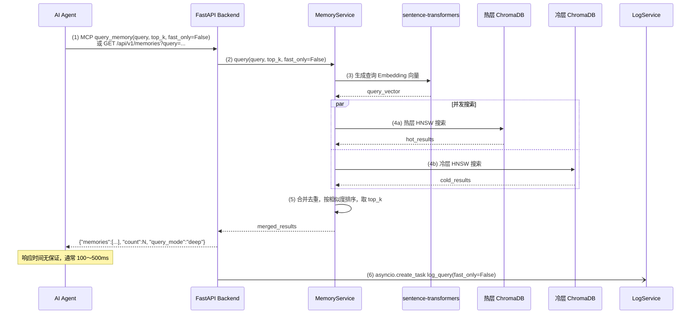

### 6.3 记忆价值反馈流程

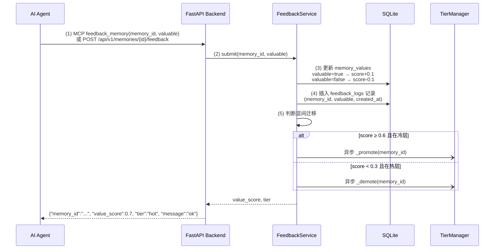

### 6.4 磁盘淘汰流程

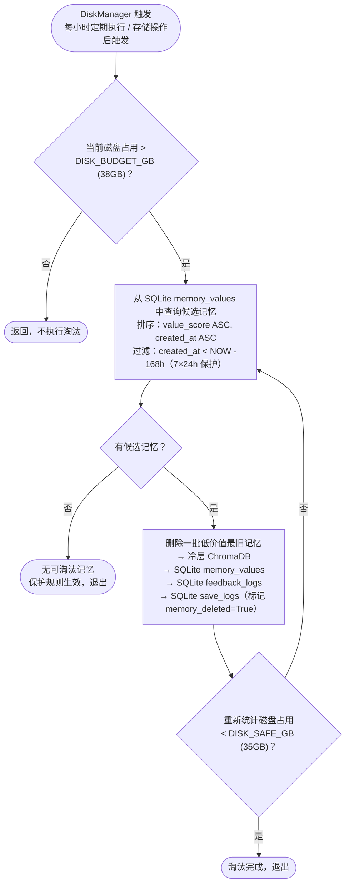

### 6.5 管理 UI 操作流程

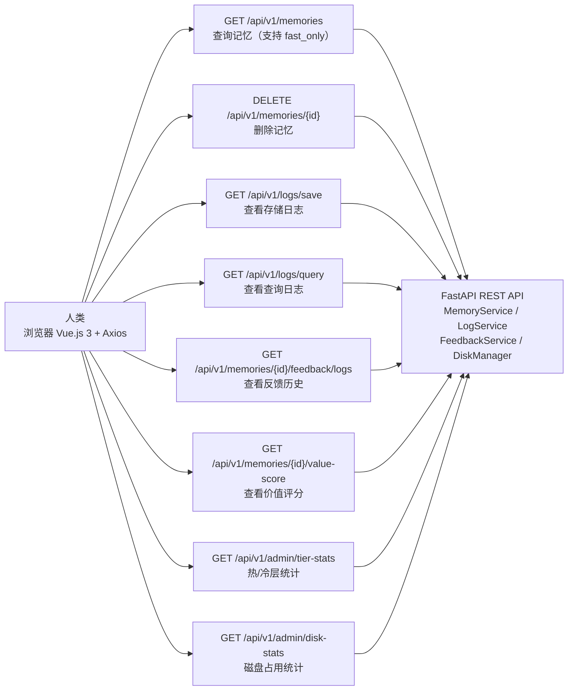

---

## 7. 接口规范

### 7.1 REST API 规范

**基础 URL**：`/api/v1`

**通用成功响应**：

```json
{
  "data": {},
  "message": "ok"
}
```

**错误响应**：

```json
{
  "detail": "错误描述"
}
```

#### 7.1.1 记忆接口

| 方法 | 路径 | 说明 | 请求体 / 查询参数 | 响应 |
| --- | --- | --- | --- | --- |
| POST | `/memories` | 存储记忆 | `{"content": "string"}` | `{"memory_id": "string", "tier": "cold", "message": "ok"}` |
| GET | `/memories` | 查询记忆 | Query: `query`, `top_k=5`, `fast_only=false` | `{"memories": [...], "count": N, "query_mode": "fast"\|"deep"}` |
| DELETE | `/memories/{id}` | 删除记忆 | - | `{"message": "ok"}` |
| POST | `/memories/{id}/feedback` | 提交记忆价值反馈 | `{"valuable": true\|false}` | `{"memory_id": "string", "value_score": 0.0-1.0, "tier": "hot"\|"cold", "message": "ok"}` |
| GET | `/memories/{id}/feedback/logs` | 查询指定记忆的反馈历史 | Query: `page=1`, `page_size=20` | `{"logs": [...], "count": N}` |
| GET | `/memories/{id}/value-score` | 查询指定记忆当前价值评分 | - | `{"memory_id": "string", "value_score": 0.0-1.0, "tier": "hot"\|"cold", "feedback_count": N}` |

**Memory 对象结构**（查询结果）：

```json
{
  "id": "uuid4",
  "content": "记忆原文",
  "similarity": 0.87,
  "value_score": 0.7,
  "tier": "hot",
  "created_at": "2026-04-09T10:00:00Z"
}
```

**FeedbackLog 对象结构**：

```json
{
  "id": 1,
  "memory_id": "uuid4",
  "valuable": true,
  "created_at": "2026-04-09T10:05:00Z"
}
```

#### 7.1.2 日志接口

| 方法 | 路径 | 说明 | 响应 |
| --- | --- | --- | --- |
| GET | `/logs/save` | 查询存储操作日志 | `{"logs": [...], "count": N}` |
| GET | `/logs/query` | 查询查询操作日志 | `{"logs": [...], "count": N}` |

#### 7.1.3 系统接口

| 方法 | 路径 | 说明 | 响应 |
| --- | --- | --- | --- |
| GET | `/health` | 健康检查 | `{"status": "ok"}` |
| GET | `/admin/tier-stats` | 分级存储统计 | `{"hot_count": N, "cold_count": N, "hot_memory_mb": N, "memory_budget_mb": 6144}` |
| GET | `/admin/disk-stats` | 磁盘占用统计 | `{"disk_used_gb": N, "disk_budget_gb": 40, "disk_safe_gb": 35}` |

### 7.2 MCP 工具规范

| Tool 名称 | 参数 | 说明 |
| --- | --- | --- |
| `save_memory` | `content: str` | 存储一条记忆，返回 memory_id |
| `query_memory` | `query: str`, `top_k: int = 5`, `fast_only: bool = False` | 查询相关记忆；`fast_only=True` 仅检索热层（≤ 100ms），`fast_only=False` 同时检索热/冷层 |
| `feedback_memory` | `memory_id: str`, `valuable: bool` | 对指定记忆提交价值反馈，影响其价值分及层分配 |

---

## 8. 数据模型设计

### 8.1 热层记忆数据（ChromaDB EphemeralClient）

| 字段 | 类型 | 说明 |
| --- | --- | --- |
| `id` | string | 记忆唯一 ID（UUID4），与冷层保持一致 |
| `document` | string | 记忆原始文本内容 |
| `embedding` | float[] | 384 维向量（all-MiniLM-L6-v2） |
| `metadata.created_at` | string | 创建时间（ISO 8601） |
| `metadata.value_score` | float | 当前价值分（0.0～1.0） |

### 8.2 冷层记忆数据（ChromaDB PersistentClient）

与热层结构相同，所有记忆均在冷层持久化存储。热层是冷层高价值记忆的内存副本。

> **设计原则**：冷层（PersistentClient）始终持有所有记忆的完整数据，热层（EphemeralClient）是冷层的高价值子集的内存缓存。服务重启时，从冷层按 value_score 排序重建热层。

### 8.3 操作日志（SQLite）

#### 存储操作日志表 `save_logs`

| 字段 | 类型 | 说明 |
| --- | --- | --- |
| `id` | INTEGER PRIMARY KEY | 自增 ID |
| `memory_id` | TEXT | 关联的记忆 ID |
| `content` | TEXT | 存储的原始内容 |
| `created_at` | TEXT | 存储时间（ISO 8601） |
| `memory_deleted` | INTEGER | 记忆是否已被删除（0=正常，1=已删除，用于磁盘淘汰标记）|

#### 查询操作日志表 `query_logs`

| 字段 | 类型 | 说明 |
| --- | --- | --- |
| `id` | INTEGER PRIMARY KEY | 自增 ID |
| `query` | TEXT | 查询条件 |
| `results` | TEXT | 查询结果（JSON 序列化） |
| `fast_only` | INTEGER | 查询模式：1=快速，0=深度 |
| `created_at` | TEXT | 查询时间（ISO 8601） |

### 8.4 记忆价值表（SQLite）

#### `memory_values`

| 字段 | 类型 | 说明 |
| --- | --- | --- |
| `memory_id` | TEXT PRIMARY KEY | 记忆唯一 ID（与 ChromaDB 一致） |
| `value_score` | REAL | 当前价值分（0.0～1.0，初始值 0.6 = PROMOTE_THRESHOLD） |
| `tier` | TEXT | 当前所在层：`hot` 或 `cold` |
| `feedback_count` | INTEGER | 累计收到的反馈次数 |
| `created_at` | TEXT | 记忆创建时间（ISO 8601，用于磁盘淘汰排序） |
| `updated_at` | TEXT | 最近一次价值更新时间（ISO 8601） |

### 8.5 Feedback 日志表（SQLite）

#### `feedback_logs`

| 字段 | 类型 | 说明 |
| --- | --- | --- |
| `id` | INTEGER PRIMARY KEY | 自增 ID |
| `memory_id` | TEXT | 关联的记忆 ID |
| `valuable` | INTEGER | 评价结果：1=有价值，0=无价值 |
| `created_at` | TEXT | 评价时间（ISO 8601） |

---

## 9. 部署架构

### 9.1 容器架构

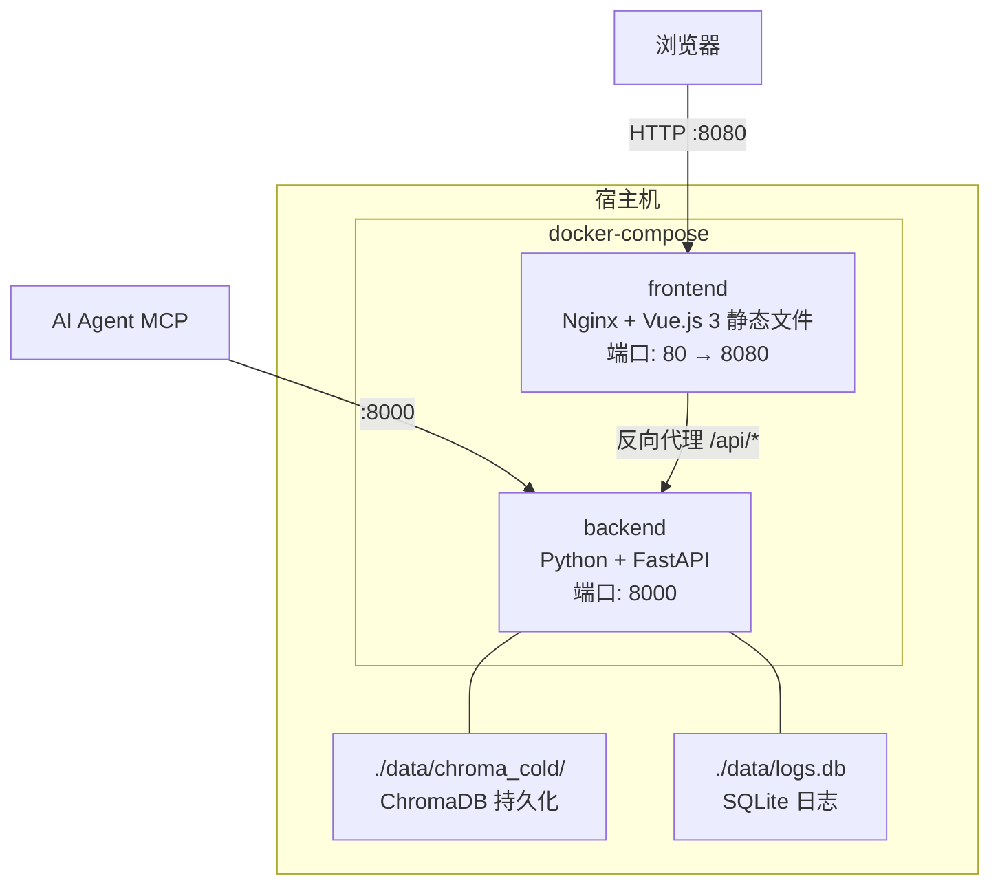

### 9.2 端口规划

| 服务 | 容器端口 | 宿主机端口 | 说明 |
| --- | --- | --- | --- |
| frontend | 80 | 8080 | Web UI 访问入口 |
| backend | 8000 | 8000 | REST API / MCP 服务端口 |

### 9.3 持久化存储

| 数据类型 | 宿主机路径 | 说明 |
| --- | --- | --- |
| 冷层记忆向量 | `./data/chroma_cold/` | ChromaDB PersistentClient 数据目录（所有记忆） |
| 操作日志 + 价值评分 | `./data/logs.db` | SQLite 数据库文件 |

> **注意**：热层（EphemeralClient）数据仅存在于内存中，服务重启后由 TierManager 从冷层重建。因此冷层（PersistentClient）是记忆数据的唯一持久化存储，必须挂载 Volume 保证容器删除后数据不丢失。

---

## 10. 性能设计

### 10.1 性能目标

| 操作 | 目标响应时间 | 适用条件 |
| --- | --- | --- |
| 记忆存储 | ≤ 100ms | - |
| 记忆查询（快速模式） | ≤ 100ms | `fast_only=True`，仅检索热层 |
| 记忆查询（深度模式） | 无硬性上限 | `fast_only=False`，同时检索热层和冷层 |
| 价值反馈 | ≤ 50ms | SQLite 更新 + Feedback 日志写入，层迁移异步执行 |
| 系统总内存占用 | ≤ 8GB | 热层 + 冷层（当前已加载部分）+ 基础运行时 |
| 系统磁盘占用 | ≤ 40GB | 冷层 ChromaDB 数据 + SQLite + Docker 镜像；触及上限前自动淘汰低价值最旧数据 |

### 10.2 性能保障措施

| 措施 | 说明 |
| --- | --- |
| 模型预热 | FastAPI 启动时（lifespan）预加载 all-MiniLM-L6-v2 模型，避免首次请求冷启动延迟 |
| 热层 HNSW 常驻内存 | 热层使用 ChromaDB EphemeralClient（纯内存），HNSW 索引无磁盘 I/O，查询延迟 ≤ 10ms |
| 冷层磁盘访问 | 冷层 PersistentClient 的 HNSW 索引在服务启动时初始化并加载到内存，深度查询直接在内存中搜索 |
| 异步 I/O | FastAPI 全程使用 async/await，SQLite 使用 aiosqlite 异步操作，避免 I/O 阻塞 |
| 日志异步写入 | 操作日志写入使用 asyncio.create_task 异步执行，不占用主业务响应时间 |
| 层迁移异步执行 | 记忆从冷层迁移到热层（或反向）的操作在后台异步执行，不影响反馈接口响应时间 |
| 向量维度控制 | 使用 384 维向量（all-MiniLM-L6-v2），在精度和性能之间取得平衡 |
| 磁盘淘汰后台执行 | DiskManager 在后台每小时异步检查，删除操作不占用 API 响应时间 |

### 10.3 分级存储内存预算设计

#### 10.3.1 系统总内存预算（8GB 上限）

| 组件 | 内存分配 | 说明 |
| --- | --- | --- |
| Python 运行时 + FastAPI 服务 | ~200MB | 基础运行时开销 |
| sentence-transformers 模型 + PyTorch | ~490MB | all-MiniLM-L6-v2 + PyTorch CPU 运行时 |
| 热层 ChromaDB HNSW | **最大 ~6,000MB** | 动态分配，由 TierManager 管控上限 |
| 冷层 ChromaDB HNSW（常驻内存） | ~200MB（基础）+ 数据增量 | 服务启动时加载，受冷层记忆数量影响 |
| SQLite + aiosqlite | < 10MB | 极低开销 |
| Docker 容器运行时 | ~100MB | Docker engine 本身 |
| **合计** | **≤ 8,000MB** | TierManager 动态平衡热/冷层分配 |

#### 10.3.2 热层容量与记忆条目数对应关系

热层每条记忆约占 2KB（见 sad_v1.2.md §10.3.3 详细分解），在 6GB 热层预算下：

| 热层内存分配 | 最大热层记忆数 | 说明 |
| --- | --- | --- |
| 1GB | ~500,000 条 | 轻量级场景 |
| 2GB | ~1,000,000 条 | 典型生产场景 |
| 4GB | ~2,000,000 条 | 数据密集场景 |
| 6GB（上限） | ~3,000,000 条 | 最大配置（8GB RAM 系统） |

> **典型 AI Agent 个人记忆系统**：记忆条目通常在数千至数万条，热层内存增量仅 10～200MB。即使将价值最高的 10 万条记忆全部放入热层，也仅占用约 200MB，远低于 6GB 上限，内存充裕。

#### 10.3.3 TierManager 内存预算执行策略

```
TierManager 在以下时机检查并调整层分配：
1. 服务启动时：从 SQLite 按 value_score DESC 排序，批量将高价值记忆加载至热层，
               直到热层 HNSW 预估内存达到预算上限（默认 6GB）。
2. 价值反馈触发迁移时：
   - 提升（冷→热）：先检查热层剩余预算；
                   若预算已满，先将热层中 value_score 最低的记忆降级至冷层，
                   再将目标记忆升级。
   - 降级（热→冷）：直接从热层删除，释放内存。
3. 每小时定期检查：重新计算热层实际内存占用，若超出预算则自动降级多余记忆。
```

### 10.4 磁盘容量管理设计

#### 10.4.1 磁盘预算分解（40GB 上限）

| 内容 | 空间占用（参考值） | 说明 |
| --- | --- | --- |
| Docker 镜像（backend + frontend） | ~3.7GB | 固定开销，不受数据量影响 |
| sentence-transformers 模型缓存 | ~90MB | 首次启动自动下载 |
| 冷层 ChromaDB 数据 | **动态增长**，~2MB / 千条 | 向量（384 维 × 4 bytes）+ 原文 + 元数据 |
| SQLite（日志 + 价值分 + Feedback 日志） | ~2MB / 万条记录 | 取决于日志和反馈数量 |
| **有效业务数据上限** | **~36GB** | 40GB 上限 - 基础开销 ~4GB |

> **在 36GB 业务数据上限内，冷层最多可存储约 1,800 万条记忆**（每千条 ~2MB）。对于 AI Agent 个人记忆系统，这已远超典型使用量，磁盘淘汰机制通常不会频繁触发。

#### 10.4.2 磁盘淘汰策略

```
淘汰目标：value_score 最低 且 created_at 最早 的冷层记忆

安全水位：DISK_SAFE_GB = 35GB（淘汰后目标磁盘占用，留 5GB 缓冲区间）
触发水位：DISK_BUDGET_GB = 38GB（开始淘汰的阈值，预留 2GB 应对突发写入）

【7×24h 保护规则】
  创建时间在 168 小时以内的记忆不得被淘汰，候选集 SQL：
    WHERE created_at < datetime('now', '-168 hours')
  目的：防止系统长期运行后低价值记忆数量极少时，最新记忆被误删。

淘汰顺序：
  ORDER BY value_score ASC, created_at ASC
  → 先删最无价值的记忆，同等价值下先删最旧的记忆
  → 168 小时以内的记忆不参与排序候选

淘汰范围：
  - 从冷层 ChromaDB PersistentClient 删除向量和文档
  - 从 SQLite memory_values 删除价值评分记录
  - 从 SQLite feedback_logs 删除相关反馈历史
  - 从 SQLite save_logs 中保留（仅标记 memory_deleted=True，保留日志记录完整性）
  
注意：热层中的记忆理论上不参与磁盘淘汰（热层数据不持久化到磁盘）。
     若热层记忆也需要从冷层永久删除，应先将其从热层降级，再执行磁盘淘汰。
```

### 10.5 性能指标对运行环境的要求分析

（详见 sad_v1.2.md §10.3，以下仅列出与分级存储相关的更新部分）

#### 10.5.1 响应时间预算更新

**快速查询（hot only）**：

| 步骤 | 组件 | 典型耗时 |
| --- | --- | --- |
| 文本 Embedding 推理 | sentence-transformers | 15 ~ 60ms |
| 热层 HNSW 向量检索 | ChromaDB EphemeralClient | 1 ~ 5ms |
| FastAPI 路由 + 序列化 | FastAPI + Pydantic v2 | 1 ~ 5ms |
| **合计（最坏情况）** | | **~70ms**（≤ 100ms ✅） |

**深度查询（hot + cold）**：

| 步骤 | 组件 | 典型耗时 |
| --- | --- | --- |
| 文本 Embedding 推理 | sentence-transformers | 15 ~ 60ms |
| 热层 HNSW 向量检索 | ChromaDB EphemeralClient | 1 ~ 5ms |
| 冷层 HNSW 向量检索（并发） | ChromaDB PersistentClient | 10 ~ 100ms |
| 结果合并 + 序列化 | Python + Pydantic v2 | 1 ~ 10ms |
| **合计（最坏情况）** | | **~175ms**（无硬性上限） |

#### 10.5.2 运行环境最低配置汇总（更新）

| 资源 | 最低配置 | 推荐配置 |
| --- | --- | --- |
| CPU | 2 核 / 2.0GHz（x86_64 或 ARM64） | 4 核 / 3.0GHz x86_64 |
| RAM | **8GB**（系统总内存上限） | 16GB（为操作系统和其他进程保留充足余量） |
| 磁盘（可用） | **40GB**（系统磁盘上限） | 50GB（留余量应对突发增长） |
| 操作系统 | Linux（64 位）/ macOS 12+ / Windows 10+ | Linux（64 位） |
| Docker | Docker Engine 27+ / Docker Desktop | Docker Engine 27+ |
| docker-compose | v2.x | v2.x |
| 网络 | 首次部署需能访问 Docker Hub 和 HuggingFace Hub | - |

> **重要说明**：系统以 8GB 为内存上限、40GB 为磁盘上限设计。在 8GB RAM 的宿主机上，AIR_Memory 容器内存上限配置为 8GB，其中 ~6GB 分配给热层 ChromaDB HNSW，~2GB 用于运行时基础组件。磁盘侧，DiskManager 在占用超过 38GB 时自动淘汰低价值最旧数据，始终保持在 40GB 以内。若宿主机还运行其他进程，建议配置 16GB RAM 和 50GB 可用磁盘空间以避免资源竞争。

---

## 11. 安全设计

| 安全措施 | 说明 |
| --- | --- |
| 本地部署 | 系统默认仅监听本地端口，不向公网暴露 |
| 输入校验 | 所有 API 输入通过 Pydantic v2 严格校验 |
| CORS 配置 | 仅允许来自前端域名的跨域请求 |
| 数据持久化 | 数据文件存储在宿主机 volume，容器删除不丢失数据 |

---

## 12. 研发计划

### 12.1 里程碑总览

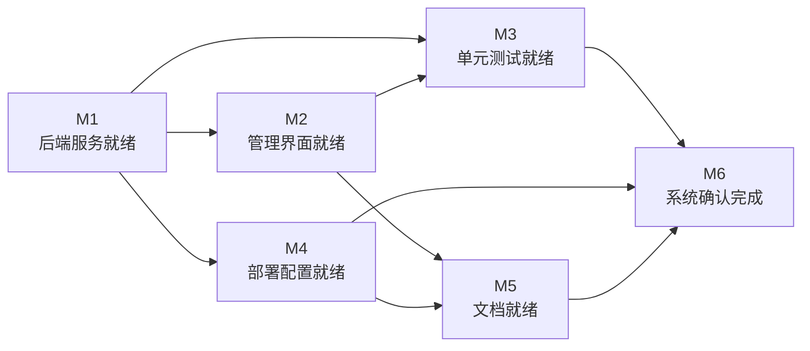

| 里程碑 | 名称 | 主要负责人 | 前置里程碑 |
| --- | --- | --- | --- |
| M1 | 后端服务就绪 | Neo | - |
| M2 | 管理界面就绪 | Mia | M1 |
| M3 | 单元测试就绪 | Sparrow | M1、M2 |
| M4 | 部署配置就绪 | Neo | M1 |
| M5 | 文档就绪 | Nia | M4 |
| M6 | 系统确认完成 | Wii | M3、M5 |

---

### 12.2 里程碑详情

#### 12.2.1 M1 — 后端服务就绪

**目标**：完成所有后端业务模块、REST API 和 MCP Server 的研发，使后端服务能够独立启动并通过接口调用验证。

**工作内容**

| 编号 | 工作内容 | 负责人 | 关联需求 |
| --- | --- | --- | --- |
| M1-01 | 实现 `MemoryService`：热层/冷层 ChromaDB 存储与查询、`fast_only` 路由、向量 Embedding | Neo | FR-API-002, FR-API-003, FR-API-004, FR-API-005, PR-001, PR-002 |
| M1-02 | 实现 `TierManager`：系统启动时按 value_score 批量加载热层、内存预算管控、超限降级 | Neo | PR-006, PR-007, PR-008 |
| M1-03 | 实现 `FeedbackService`：价值评分更新、Feedback 日志写入、层间迁移触发 | Neo | FR-API-006, FR-API-007 |
| M1-04 | 实现 `DiskManager`：磁盘占用监控、低价值最旧数据自动淘汰、168 小时保护规则 | Neo | PR-005, PR-009, PR-010, PR-011 |
| M1-05 | 实现 `LogService`：存储操作日志与查询操作日志写入 SQLite（aiosqlite） | Neo | FR-UI-003, FR-UI-004 |
| M1-06 | 实现完整 REST API（`/api/v1/memories`、`/api/v1/logs`、`/api/v1/admin`，含所有子路由） | Neo | FR-API-001, FR-UI-001~006 |
| M1-07 | 实现 MCP Server（`save_memory`、`query_memory`、`feedback_memory` 三个工具） | Neo | FR-API-001~007 |
| M1-08 | 将所有性能阈值设计为可配置项，通过环境变量或配置文件指定，默认值与 SRD v1.0 要求一致；可配置项包括：存储/查询响应时间上限（默认 100ms）、热层内存预算（默认 6GB）、磁盘触发水位（默认 38GB）、磁盘安全水位（默认 35GB）、磁盘上限（默认 40GB）、新记忆保护时长（默认 168 小时） | Neo | PR-001, PR-002, PR-004~011 |
| M1-09 | 在 M1 完成后输出《M1 阶段研发执行报告》，内容包含：各工作条目完成情况、验收标准达成情况、遗留问题清单及对后续里程碑的影响评估 | Neo | - |

**验收标准**

| 编号 | 验收标准 |
| --- | --- |
| M1-AC-01 | 后端服务能够正常启动，所有模块初始化无报错，Embedding 模型预热完成 |
| M1-AC-02 | `POST /api/v1/memories` 接口能正确接收记忆内容并返回 `memory_id`；端到端响应时间在预热后不超过配置的存储响应时间阈值（默认 100ms，满足 PR-001） |
| M1-AC-03 | `GET /api/v1/memories?fast_only=true` 仅查询热层，端到端响应时间不超过配置的查询响应时间阈值（默认 100ms，满足 PR-002） |
| M1-AC-04 | `GET /api/v1/memories?fast_only=false` 同时查询热层和冷层，结果合并去重（满足 FR-API-005） |
| M1-AC-05 | `POST /api/v1/memories/{id}/feedback` 能正确更新 value_score，并在满足阈值条件时触发异步层间迁移（满足 FR-API-006, FR-API-007） |
| M1-AC-06 | `DELETE /api/v1/memories/{id}` 能同时从热层、冷层 ChromaDB 及 SQLite 关联表中删除该记忆的所有数据（满足 FR-UI-002） |
| M1-AC-07 | MCP Server 正确暴露 `save_memory`、`query_memory`、`feedback_memory` 三个工具（满足 FR-API-001） |
| M1-AC-08 | DiskManager 在磁盘占用超过触发水位（38GB）时能正确触发淘汰，且不淘汰创建时间在 168 小时以内的记忆（满足 PR-009~011） |
| M1-AC-09 | 所有 API 请求输入均通过 Pydantic v2 严格校验，非法输入返回 422 状态码 |
| M1-AC-10 | 操作日志和 Feedback 日志正确写入 SQLite，可通过日志查询接口获取 |
| M1-AC-11 | 记忆数据正确性验证：存储一条记忆后，通过查询接口（快速模式和深度模式）检索该记忆，返回结果中 `content` 字段与存储时提交的原始文本完全一致 |
| M1-AC-12 | 日志内容正确性验证：存储日志中的 `memory_id`、原始内容、时间戳字段与实际操作数据一致；查询日志中的查询条件、`fast_only` 参数值和返回结果列表与实际操作一致；Feedback 日志中的 `memory_id`、`valuable` 字段和时间戳与提交的反馈数据一致 |
| M1-AC-13 | M1 阶段研发执行报告已输出，各工作条目均有明确的完成状态记录 |

---

#### 12.2.2 M2 — 管理界面就绪

**目标**：完成 Web 管理界面所有页面视图的研发，使人类用户能够通过浏览器访问并操作系统的全部管理功能。

**工作内容**

| 编号 | 工作内容 | 负责人 | 关联需求 |
| --- | --- | --- | --- |
| M2-01 | 实现 `MemoriesView`：记忆查询（支持 `fast_only` 模式切换）与指定记忆删除 | Mia | FR-UI-001, FR-UI-002 |
| M2-02 | 实现 `LogsView`：存储操作日志查看（时间、原始内容）与查询操作日志查看（时间、条件、模式、结果） | Mia | FR-UI-003, FR-UI-004 |
| M2-03 | 实现 `FeedbackView`：查看每个记忆的当前综合价值评分与历次反馈记录 | Mia | FR-UI-005, FR-UI-006 |
| M2-04 | 实现分级存储统计面板（热/冷层记忆数量、内存占用、磁盘占用） | Mia | PR-004, PR-005 |
| M2-05 | 实现 Pinia Store（`useMemoryStore`、`useLogStore`）和 Axios API 调用层 | Mia | - |
| M2-06 | 实现公共组件：`MemoryCard.vue`（记忆条目展示）、`LogTable.vue`（日志表格） | Mia | - |
| M2-07 | 在 M2 完成后输出《M2 阶段研发执行报告》，内容包含：各工作条目完成情况、验收标准达成情况、遗留问题清单及对后续里程碑的影响评估 | Mia | - |

**验收标准**

| 编号 | 验收标准 |
| --- | --- |
| M2-AC-01 | 浏览器可正常访问 Web 管理界面，路由导航正常（`/`、`/memories`、`/logs`、`/feedback`） |
| M2-AC-02 | 记忆查询页面能正确展示查询结果，支持切换快速模式/深度模式（满足 FR-UI-001） |
| M2-AC-03 | 点击删除按钮后，目标记忆从列表中消失，且后端已确认删除（满足 FR-UI-002） |
| M2-AC-04 | 存储操作日志页面和查询操作日志页面能正确展示各自的日志列表（满足 FR-UI-003, FR-UI-004） |
| M2-AC-05 | 反馈记录页面能正确展示指定记忆的 value_score、所在层及历次反馈历史（满足 FR-UI-005, FR-UI-006） |
| M2-AC-06 | 分级存储统计面板能正确展示热/冷层数量、内存占用和磁盘占用数据 |
| M2-AC-07 | 所有与后端的 API 调用均使用统一 Axios 实例，错误状态（4xx/5xx）有明确的界面提示 |
| M2-AC-08 | 界面数据正确性验证：记忆查询页面展示的 `content` 字段与后端存储的原始输入一致；存储/查询/反馈操作完成后，各日志页面新增的记录内容与操作参数一致 |
| M2-AC-09 | M2 阶段研发执行报告已输出，各工作条目均有明确的完成状态记录 |

---

#### 12.2.3 M3 — 单元测试就绪

**目标**：完成后端和前端的单元测试研发，覆盖所有核心业务逻辑和接口，确保各模块行为符合设计预期，测试覆盖率达到项目要求。

**工作内容**

| 编号 | 工作内容 | 负责人 | 技术工具 |
| --- | --- | --- | --- |
| M3-01 | 设计后端单元测试方案，明确测试模块清单和覆盖目标 | Sparrow | - |
| M3-02 | 实现 `MemoryService` 单元测试：存储、快速查询、深度查询、层间迁移 | Sparrow | pytest, pytest-asyncio, httpx |
| M3-03 | 实现 `TierManager` 单元测试：启动时热层加载、超限降级、容量统计 | Sparrow | pytest, pytest-asyncio |
| M3-04 | 实现 `FeedbackService` 单元测试：价值分更新边界（0.0~1.0）、Feedback 日志写入、迁移触发条件 | Sparrow | pytest, pytest-asyncio |
| M3-05 | 实现 `DiskManager` 单元测试：淘汰触发条件、168 小时保护规则、淘汰顺序验证 | Sparrow | pytest, pytest-asyncio |
| M3-06 | 实现 `LogService` 单元测试：存储日志写入和查询日志写入 | Sparrow | pytest, pytest-asyncio |
| M3-07 | 实现 REST API 接口集成测试：全部接口路径的正常场景和异常场景（含 Pydantic 校验） | Sparrow | pytest, httpx |
| M3-08 | 设计前端单元测试方案，明确测试组件清单和覆盖目标 | Sparrow | - |
| M3-09 | 实现前端组件单元测试：`MemoryCard.vue`、`LogTable.vue` 等公共组件 | Sparrow | Vitest, Vue Test Utils |
| M3-10 | 实现前端视图单元测试：`MemoriesView`、`LogsView`、`FeedbackView` 核心交互逻辑 | Sparrow | Vitest, @testing-library/vue |
| M3-11 | 生成并审核测试覆盖率报告（coverage.py + Vitest coverage） | Sparrow | coverage.py, Vitest |
| M3-12 | 在 M3 完成后输出《单元测试报告》，内容包含：测试模块清单与测试用例清单、各用例执行结果（通过/失败）、后端和前端覆盖率数据、发现的缺陷清单（含严重等级）及修复状态、测试结论（是否满足覆盖率要求） | Sparrow | - |

**验收标准**

| 编号 | 验收标准 |
| --- | --- |
| M3-AC-01 | 所有后端单元测试通过（`pytest` 执行结果无 FAILED / ERROR） |
| M3-AC-02 | 所有前端单元测试通过（`vitest run` 执行结果无 FAIL） |
| M3-AC-03 | 后端测试覆盖率（语句覆盖）不低于 80%（由 `coverage.py` 报告验证） |
| M3-AC-04 | 前端测试覆盖率（语句覆盖）不低于 80%（由 Vitest coverage 报告验证） |
| M3-AC-05 | `MemoryService` 的存储和快速查询路径有明确的响应时间断言，验证性能不超过配置的响应时间阈值；测试环境中可通过将配置阈值设置为更宽松的值（如 1000ms）以提高可行性，正式验收以默认配置值（100ms）为准 |
| M3-AC-06 | `DiskManager` 的 168 小时保护规则有专项测试用例，验证受保护记忆不被淘汰 |
| M3-AC-07 | `FeedbackService` 的 value_score 边界值（0.0 下限、1.0 上限）有专项测试用例 |
| M3-AC-08 | REST API 的非法输入场景（缺少必填参数、类型错误等）有测试用例，验证返回 422 状态码 |
| M3-AC-09 | 记忆数据正确性测试：`MemoryService` 存储和查询测试中包含内容正确性断言，验证查询返回的 `content` 字段与存储时的输入完全一致，快速查询和深度查询均覆盖 |
| M3-AC-10 | 日志内容正确性测试：`LogService` 和 `FeedbackService` 测试中验证各日志字段内容正确——存储日志的 memory_id、content、created_at；查询日志的 query、fast_only、results；Feedback 日志的 memory_id、valuable、created_at 均与操作输入一致 |
| M3-AC-11 | 单元测试报告已输出，包含测试模块清单、执行结果汇总、覆盖率数据和问题清单 |

---

#### 12.2.4 M4 — 部署配置就绪

**目标**：完成 Docker 容器化配置，使系统可以通过单条命令在 macOS 和 Windows 上完成一键部署，并支持操作系统重启后自动恢复运行。

**工作内容**

| 编号 | 工作内容 | 负责人 | 关联需求 |
| --- | --- | --- | --- |
| M4-01 | 编写 `backend/Dockerfile`：基于 Python 3.11 slim，安装依赖，预下载 Embedding 模型 | Neo | FR-DEP-001, FR-DEP-002 |
| M4-02 | 编写 `frontend/Dockerfile`：基于 Node.js 构建 Vue.js 3 静态文件，以 Nginx 提供服务 | Neo | FR-DEP-001, FR-DEP-002 |
| M4-03 | 编写 `docker-compose.yml`：定义 backend、frontend 两个服务，配置 `restart: always`，挂载持久化 Volume | Neo | FR-DEP-003, FR-DEP-004 |
| M4-04 | 编写一键启动脚本（macOS/Linux: `start.sh`；Windows: `start.bat`），提供单条命令完成部署 | Neo | FR-DEP-003 |
| M4-05 | 编写环境变量配置说明文档，列举所有可配置的性能阈值参数名、默认值和说明，使用户可在 `docker-compose.yml` 或 `.env` 文件中覆盖配置值 | Neo | PR-001, PR-002, PR-004~011 |
| M4-06 | 在 M4 完成后输出《M4 阶段研发执行报告》，内容包含：各工作条目完成情况、验收标准达成情况、遗留问题清单及对后续里程碑的影响评估 | Neo | - |

**验收标准**

| 编号 | 验收标准 |
| --- | --- |
| M4-AC-01 | 执行一键启动命令（`docker compose up -d`）后，backend 和 frontend 两个服务均正常启动，无容器退出异常 |
| M4-AC-02 | 浏览器访问 `http://localhost:8080` 可正常打开 Web 管理界面，API 请求正常（满足 FR-DEP-001, FR-DEP-002） |
| M4-AC-03 | 模拟操作系统重启（`docker compose restart`）后，两个服务自动恢复运行，数据不丢失（满足 FR-DEP-004） |
| M4-AC-04 | 容器删除并重新启动后（`docker compose down && docker compose up -d`），已存储的记忆数据和日志数据仍可正常访问（Volume 持久化验证） |
| M4-AC-05 | Docker 镜像构建过程无报错，backend 镜像包含预下载的 Embedding 模型（首次启动无需联网） |
| M4-AC-06 | `docker-compose.yml` 中各性能阈值（响应时间阈值、内存预算、磁盘水位、新记忆保护时长）通过环境变量暴露，可在不重新构建镜像的情况下直接调整配置值 |
| M4-AC-07 | M4 阶段研发执行报告已输出，各工作条目均有明确的完成状态记录 |

---

#### 12.2.5 M5 — 文档就绪

**目标**：完成面向人类用户的部署手册和用户手册，确保非技术人员能够按照手册完成系统部署和日常使用。

**工作内容**

| 编号 | 工作内容 | 负责人 | 关联需求 |
| --- | --- | --- | --- |
| M5-01 | 编写部署手册：环境前提（Docker 安装要求）、macOS 部署步骤、Windows 部署步骤、启动验证方法 | Nia | FR-DOC-001 |
| M5-02 | 编写用户手册：Web 管理界面使用说明（记忆查询/删除/日志查看/价值评分查看）；AI Agent 接口调用说明（MCP 和 REST API） | Nia | FR-DOC-002 |

**验收标准**

| 编号 | 验收标准 |
| --- | --- |
| M5-AC-01 | 部署手册覆盖 macOS 和 Windows 两个平台的完整部署步骤（满足 FR-DOC-001） |
| M5-AC-02 | 部署手册包含：运行环境前提（Docker 版本要求）、一键部署命令、部署后验证步骤 |
| M5-AC-03 | 用户手册覆盖 Web 管理界面全部功能的操作说明（满足 FR-DOC-002） |
| M5-AC-04 | 用户手册包含 AI Agent 接口的调用示例（含 MCP 工具列表和 REST API 示例请求） |
| M5-AC-05 | 文档内容与 M4 完成后的实际部署流程一致，不存在过期的命令或截图 |

---

#### 12.2.6 M6 — 系统确认完成

**目标**：对已完成的完整系统（后端 + 前端 + 部署 + 文档）执行全面的功能验证和性能验证，确认系统满足 SRD v1.0 所有需求，输出系统确认报告。

**工作内容**

| 编号 | 工作内容 | 负责人 |
| --- | --- | --- |
| M6-01 | 依据 SRD v1.0 和用户手册制定系统确认方案，明确每条需求的验证方法和通过标准 | Wii |
| M6-02 | 执行部署需求确认（FR-DEP-001~004）：在 macOS 和 Windows 上按部署手册完成部署并验证自启动 | Wii |
| M6-03 | 执行 AI Agent 接口需求确认（FR-API-001~007）：通过 REST API 验证记忆存储、查询、反馈、分级迁移功能 | Wii |
| M6-04 | 执行 Web UI 需求确认（FR-UI-001~006）：按用户手册操作所有管理界面功能并验证结果正确性 | Wii |
| M6-05 | 执行文档需求确认（FR-DOC-001~002）：验证部署手册和用户手册的完整性和准确性 | Wii |
| M6-06 | 执行性能需求确认：使用工具测量记忆存储和快速查询的端到端响应时间，验证不超过配置的响应时间阈值（默认 100ms，满足 PR-001, PR-002） | Wii |
| M6-07 | 执行资源占用确认：在容器运行时验证内存占用不超过配置的内存上限（默认 8GB，满足 PR-004）、磁盘占用不超过配置的磁盘上限（默认 40GB，满足 PR-005） | Wii |
| M6-08 | 执行记忆数据正确性确认：通过 AI Agent 接口存储若干记忆，验证快速查询和深度查询返回的 `content` 与存储时一致；重启系统后验证已存储记忆不丢失（满足 FR-API-002, FR-API-003） | Wii |
| M6-09 | 执行日志内容正确性确认：执行存储/查询/反馈操作后，通过 Web UI 验证各类日志的字段内容（时间戳、内容、参数值）与实际操作一致（满足 FR-UI-003, FR-UI-004, FR-UI-005） | Wii |
| M6-10 | 汇总所有验证结果，输出《系统确认报告》（验收报告），内容包含：需求验证矩阵（每条 SRD 需求的验证方法、实测结果和验证状态）、性能实测数据（响应时间、资源占用）、发现的缺陷清单（含严重等级）、最终验收结论（通过/有条件通过/不通过） | Wii |

**验收标准**

| 编号 | 验收标准 |
| --- | --- |
| M6-AC-01 | SRD v1.0 全部 28 条需求（FR-DEP-001~004、FR-API-001~007、FR-UI-001~006、FR-DOC-001~002、PR-001~011）均经过验证，无"未验证"状态的需求条目 |
| M6-AC-02 | 部署手册操作步骤可在 macOS 和 Windows 上完整执行，部署结果与手册描述一致（FR-DEP-001, FR-DEP-002） |
| M6-AC-03 | 系统重启后所有服务自动恢复运行，数据无丢失（FR-DEP-004） |
| M6-AC-04 | 记忆存储端到端响应时间实测不超过配置的响应时间阈值（默认 100ms，满足 PR-001） |
| M6-AC-05 | 快速查询端到端响应时间实测不超过配置的响应时间阈值（默认 100ms，满足 PR-002） |
| M6-AC-06 | 系统运行时内存占用实测不超过配置的内存上限（默认 8GB，满足 PR-004） |
| M6-AC-07 | 系统磁盘占用实测不超过配置的磁盘上限（默认 40GB），DiskManager 在超过触发水位时能正确触发淘汰（满足 PR-005, PR-009） |
| M6-AC-08 | Web 管理界面所有功能经验证均与用户手册描述一致（满足 FR-UI-001~006） |
| M6-AC-09 | 记忆数据正确性经验证：查询返回的 `content` 字段与原始存储内容一致（快速查询和深度查询均验证）；系统重启后已存储记忆不丢失 |
| M6-AC-10 | 日志内容正确性经验证：操作日志和 Feedback 日志的各字段内容（时间戳、记忆内容、查询参数、反馈结果）与实际操作一致，历史记录完整 |
| M6-AC-11 | 系统确认报告（验收报告）已输出，包含需求验证矩阵、性能实测数据、缺陷清单和最终验收结论；无严重（Critical）级别的未修复缺陷 |
| M6-AC-12 | 若有非严重缺陷，需记录在报告中并由项目经理决策是否放行 |

---

## 13. 需求分配

本章将系统需求文档（`/doc/srd_v1.0.md`）中的所有需求条目分配到具体的架构组件和实现模块，建立需求与架构之间的追踪关系。

### 13.1 功能需求分配

#### 13.1.1 部署与运行环境需求

| 需求编号 | 需求简述 | 负责架构组件 | 实现模块 |
| --- | --- | --- | --- |
| FR-DEP-001 | macOS 本地部署 | Docker + docker-compose | `docker-compose.yml`、`Dockerfile` |
| FR-DEP-002 | Windows 本地部署 | Docker + docker-compose | `docker-compose.yml`、`Dockerfile` |
| FR-DEP-003 | 一键部署 | Docker + docker-compose | `docker-compose.yml`、启动脚本 |
| FR-DEP-004 | 系统自启动 | Docker restart policy `always` | `docker-compose.yml`（`restart: always`）|

#### 13.1.2 AI Agent 接口需求

| 需求编号 | 需求简述 | 负责架构组件 | 实现模块 |
| --- | --- | --- | --- |
| FR-API-001 | AI Agent 接口 | MCP Server + REST API | `backend/src/air_memory/mcp/server.py`、`backend/src/air_memory/api/` |
| FR-API-002 | 记忆存储接口 | MemoryService + REST API / MCP | `memory/service.py`（`save()`）、`api/memory.py`（`POST /memories`）、`mcp/server.py`（`save_memory`）|
| FR-API-003 | 记忆查询接口 | MemoryService + REST API / MCP | `memory/service.py`（`query()`）、`api/memory.py`（`GET /memories`）、`mcp/server.py`（`query_memory`）|
| FR-API-004 | 快速查询模式 | MemoryService + 热层 ChromaDB | `memory/service.py`（`fast_only=True` 分支，仅检索热层 EphemeralClient）|
| FR-API-005 | 深度查询模式 | MemoryService + 热层/冷层 ChromaDB | `memory/service.py`（`fast_only=False` 分支，并发检索热层 + 冷层，合并去重）|
| FR-API-006 | 记忆价值反馈接口 | FeedbackService + REST API / MCP | `feedback/service.py`（`submit()`）、`api/memory.py`（`POST /memories/{id}/feedback`）、`mcp/server.py`（`feedback_memory`）|
| FR-API-007 | 价值评分驱动分级迁移 | FeedbackService + TierManager | `feedback/service.py`（触发迁移判断）、`memory/tier_manager.py`（`_promote()`、`_demote()`）|

#### 13.1.3 Web 管理界面需求

| 需求编号 | 需求简述 | 负责架构组件 | 实现模块 |
| --- | --- | --- | --- |
| FR-UI-001 | 记忆数据查询 | Vue.js 3 前端 + REST API | `frontend/src/views/MemoriesView.vue`、`GET /api/v1/memories` |
| FR-UI-002 | 记忆数据删除 | Vue.js 3 前端 + REST API | `frontend/src/views/MemoriesView.vue`、`DELETE /api/v1/memories/{id}` |
| FR-UI-003 | 存储操作日志查看 | Vue.js 3 前端 + LogService + REST API | `frontend/src/views/LogsView.vue`、`GET /api/v1/logs/save`、`log/service.py` |
| FR-UI-004 | 查询操作日志查看 | Vue.js 3 前端 + LogService + REST API | `frontend/src/views/LogsView.vue`、`GET /api/v1/logs/query`、`log/service.py` |
| FR-UI-005 | 价值反馈记录查看 | Vue.js 3 前端 + FeedbackService + REST API | `frontend/src/views/FeedbackView.vue`、`GET /api/v1/memories/{id}/feedback/logs`、`feedback/service.py`（`get_feedback_logs()`）|
| FR-UI-006 | 综合价值评分查看 | Vue.js 3 前端 + FeedbackService + REST API | `frontend/src/views/FeedbackView.vue`、`GET /api/v1/memories/{id}/value-score`、`feedback/service.py`（`get_memory_value_score()`）|

#### 13.1.4 文档需求

| 需求编号 | 需求简述 | 负责架构组件 | 负责人 |
| --- | --- | --- | --- |
| FR-DOC-001 | 部署手册 | 无（文档交付物） | Nia |
| FR-DOC-002 | 用户手册 | 无（文档交付物） | Nia |

---

### 13.2 性能需求分配

#### 13.2.1 响应时间需求

| 需求编号 | 需求简述 | 负责架构组件 | 关键设计决策 |
| --- | --- | --- | --- |
| PR-001 | 记忆存储响应时间 ≤ 100ms | MemoryService + sentence-transformers + 冷层 ChromaDB | 服务启动预热 Embedding 模型；日志写入异步执行（`asyncio.create_task`）；FastAPI 全程 async/await |
| PR-002 | 快速查询响应时间 ≤ 100ms | MemoryService + 热层 ChromaDB EphemeralClient | 热层 HNSW 常驻内存（≤ 5ms 检索）；Embedding 推理预热（≤ 60ms）；合计最坏情况 ~70ms |
| PR-003 | 深度查询响应时间无硬性限制 | MemoryService + 热层/冷层 ChromaDB | 热层 + 冷层并发检索（`asyncio.gather`）；结果合并去重；典型耗时 100～500ms |

#### 13.2.2 资源占用需求

| 需求编号 | 需求简述 | 负责架构组件 | 关键设计决策 |
| --- | --- | --- | --- |
| PR-004 | 系统内存占用 ≤ 8GB | TierManager | 热层预算上限 ~6GB；基础运行时 ~2GB；TierManager 动态监控并在超限时降级热层记忆 |
| PR-005 | 系统磁盘占用 ≤ 40GB | DiskManager | 触发水位 38GB；安全水位 35GB；超限时自动淘汰低价值最旧记忆 |

#### 13.2.3 分级存储需求

| 需求编号 | 需求简述 | 负责架构组件 | 关键设计决策 |
| --- | --- | --- | --- |
| PR-006 | 分级存储机制 | MemoryService + 热层/冷层 ChromaDB | 冷层（PersistentClient）持有所有记忆；热层（EphemeralClient）是高价值记忆的内存缓存 |
| PR-007 | 高速存储层加载策略 | TierManager | 服务启动时从 SQLite 按 value_score DESC 排序，批量加载高价值记忆至热层，至内存预算上限 |
| PR-008 | 高速存储层容量管理 | TierManager | 热层超预算时，将 value_score 最低的热层记忆降级至冷层（`_demote()`） |

#### 13.2.4 磁盘容量管理需求

| 需求编号 | 需求简述 | 负责架构组件 | 关键设计决策 |
| --- | --- | --- | --- |
| PR-009 | 磁盘淘汰触发条件 | DiskManager | 每小时定期执行 `check_and_evict()`；在磁盘占用超过 38GB 时触发淘汰 |
| PR-010 | 磁盘淘汰策略 | DiskManager | 候选集排序：`value_score ASC, created_at ASC`；循环删除直至磁盘占用降至 35GB 安全水位 |
| PR-011 | 168 小时新记忆保护 | DiskManager | 候选集过滤条件：`created_at < datetime('now', '-168 hours')`；168 小时内记忆不参与淘汰 |

---

### 13.3 需求覆盖度总览

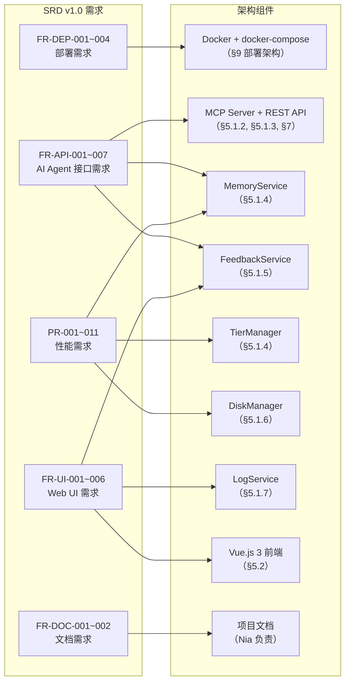
