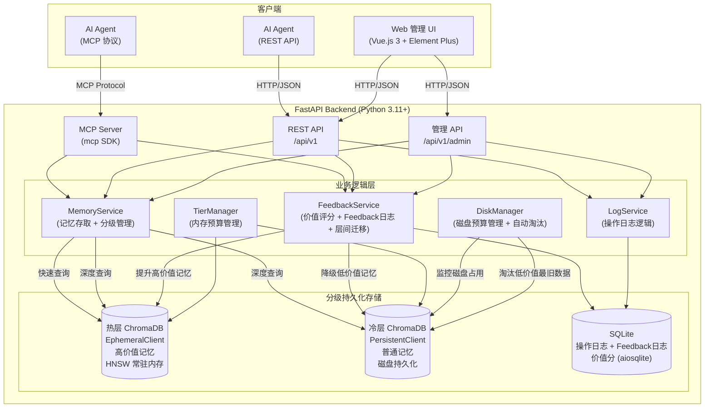
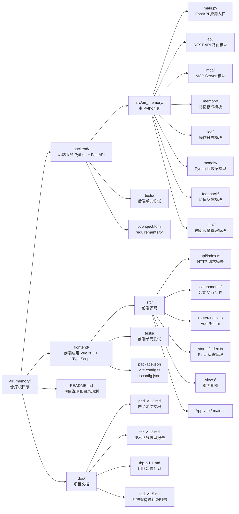
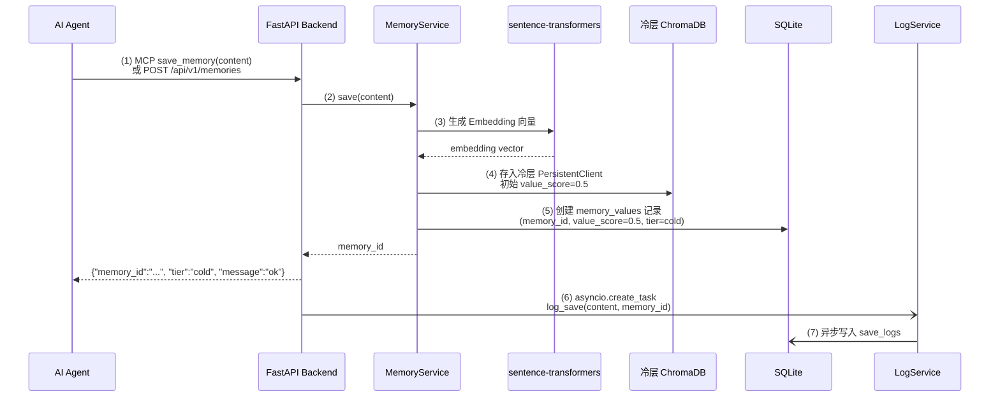
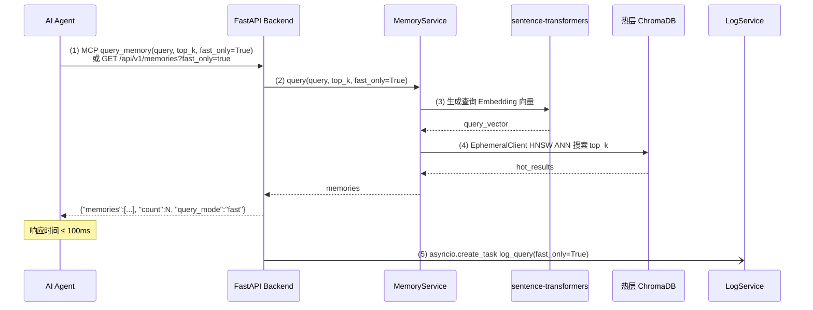
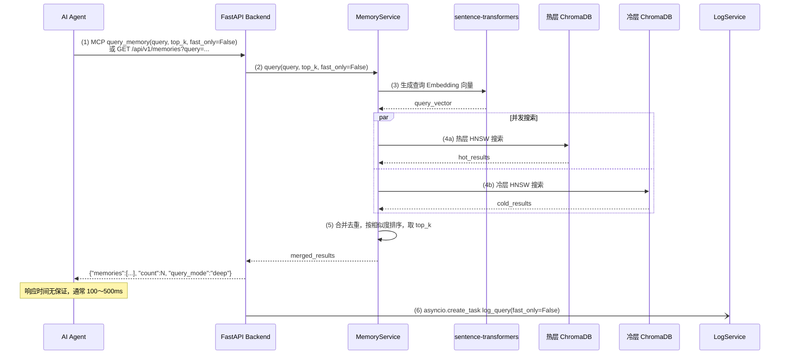
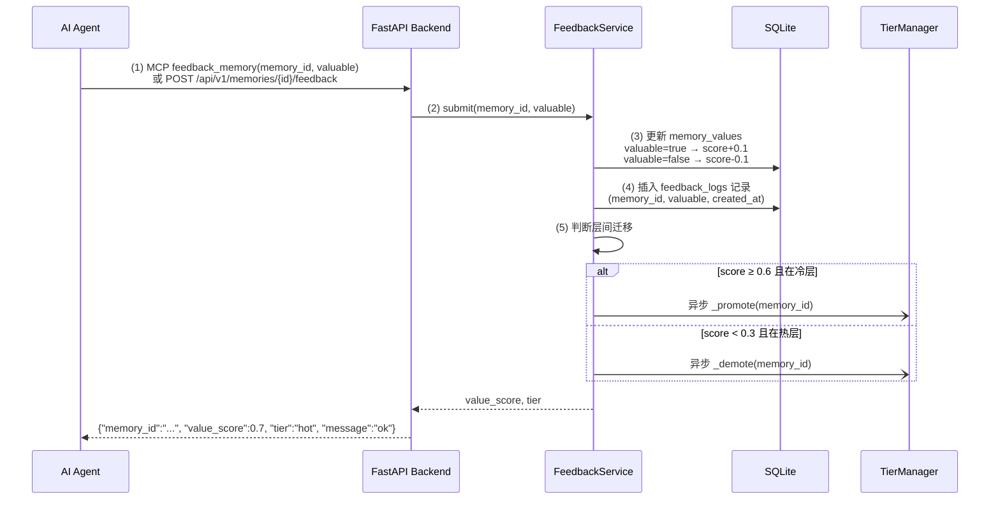
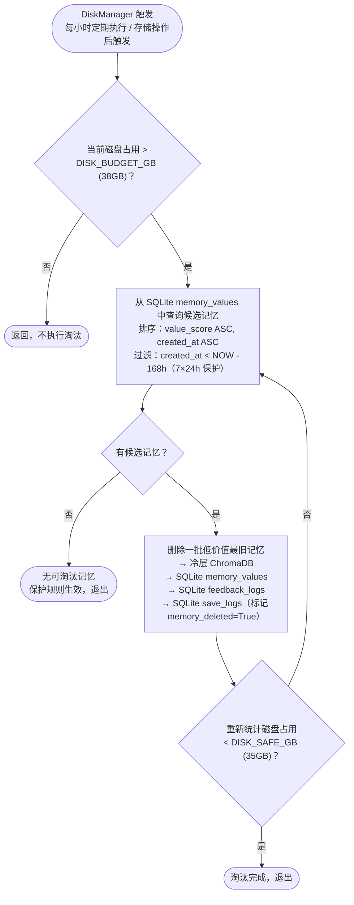
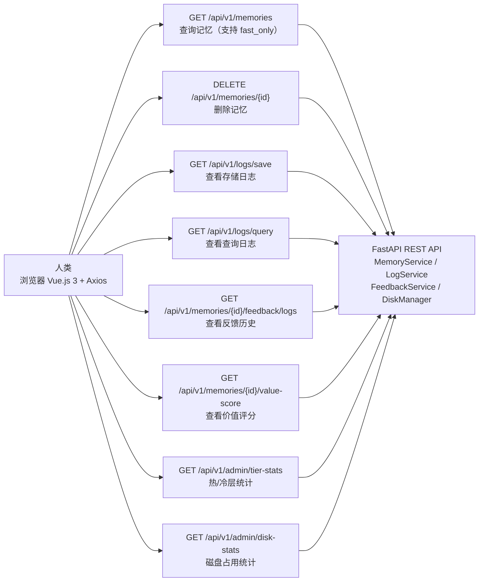
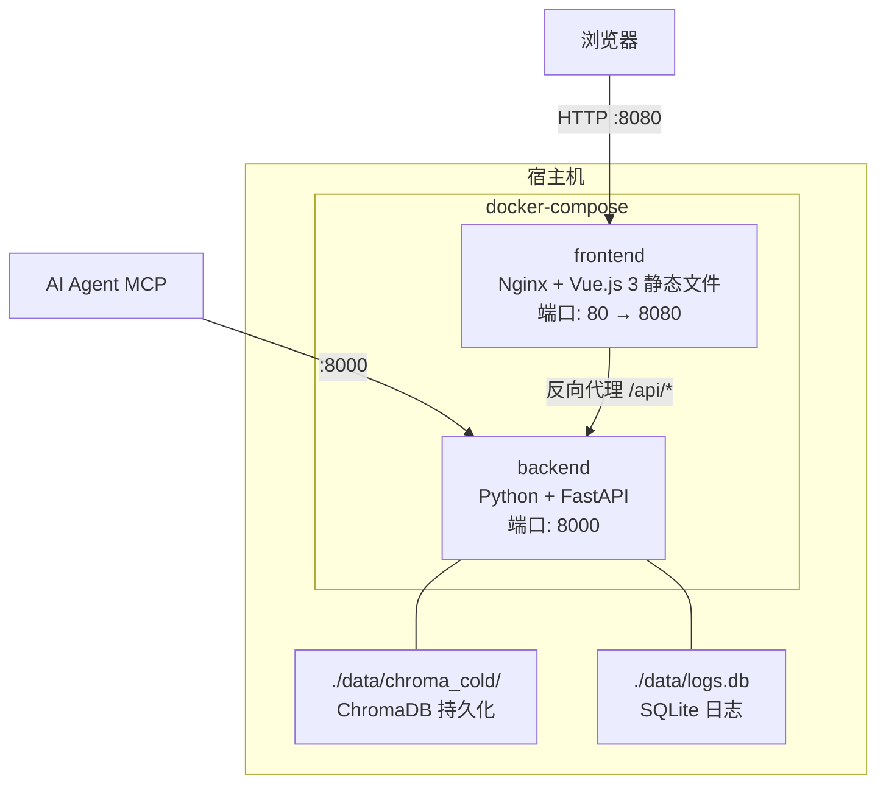

# AIR_Memory 系统架构设计说明书

## 变更记录

| 版本号 | 变更时间 | 变更内容 |
| --- | --- | --- |
| 1.0 | 2026-4-9 | 初稿 |
| 1.1 | 2026-4-9 | 将架构图替换为 Mermaid 图；新增性能指标对运行环境要求分析 |
| 1.2 | 2026-4-9 | 补充 ChromaDB HNSW 索引内存增长机制及数据管理策略说明 |
| 1.3 | 2026-4-9 | 引入分级记忆存储架构（热层/冷层）；新增记忆价值反馈接口；新增快速/深度查询模式；更新数据模型、接口规范和性能设计以支持 8GB 内存上限约束 |
| 1.4 | 2026-4-9 | 新增 Feedback 日志及 Web 价值评分查询功能；新增磁盘容量管理策略（上限 40GB，自动淘汰低价值最旧数据）；更新数据模型、接口规范和研发计划 |
| 1.5 | 2026-4-9 | 磁盘淘汰新增 7×24h 保护规则（创建时间在 168 小时以内的记忆不得被淘汰）；所有 ASCII 数据流图和目录树替换为 Mermaid 图 |

---

## 1. 概述

### 1.1 文档目的

本文档描述 AIR_Memory 系统的整体架构设计，包括系统组件划分、模块职责、数据流设计、接口规范及部署方案，供研发工程师（Neo、Mia）和测试工程师（Sparrow）在研发过程中参考。

### 1.2 系统背景

AIR_Memory 是一个为 AI Agent 设计的本地部署记忆系统。AI Agent 可通过 AIR_Memory 高效地存储记忆、查询相关记忆，并能对查询结果的价值进行反馈评价。系统通过分级存储架构（热层/冷层），在 8GB 内存上限和 40GB 磁盘上限约束下最大化高价值记忆的快速查询性能；磁盘空间触及上限时自动淘汰低价值最旧数据（创建时间在 168 小时内的记忆受保护不得淘汰）；同时向人类提供 Web 管理界面进行记忆查询、删除、日志查看和价值评分查询。

### 1.3 术语定义

| 术语 | 说明 |
| --- | --- |
| AI Agent | 使用本系统进行记忆存储/查询的 AI 客户端 |
| Memory | AI Agent 存储的记忆条目，以自然语言文本形式存在 |
| Embedding | 将文本转换为高维向量的过程，用于语义相似度计算 |
| MCP | Model Context Protocol，Anthropic 推出的 AI Agent 工具调用标准协议 |
| REST API | 基于 HTTP/JSON 的通用接口协议 |
| ChromaDB | 嵌入式向量数据库，用于存储和检索记忆向量 |
| ANN | Approximate Nearest Neighbor，近似最近邻搜索 |
| 热层（Hot Tier） | 高价值记忆的内存存储层（ChromaDB EphemeralClient），支持快速 ANN 查询（≤ 100ms） |
| 冷层（Cold Tier） | 普通记忆的持久化存储层（ChromaDB PersistentClient），支持深度查询（无响应时间保证） |
| 价值分（Value Score） | 记忆的综合价值评分（0.0～1.0），由 AI Agent 通过反馈接口影响，决定记忆在热/冷层的分配 |
| 快速查询（Fast Query） | 仅检索热层，响应时间 ≤ 100ms |
| 深度查询（Deep Query） | 同时检索热层和冷层，返回更全面的结果，无响应时间保证 |
| Feedback 日志 | 记录每条记忆每次被 AI Agent 评价的历史（时间/评价结果） |
| 磁盘淘汰（Disk Eviction） | 磁盘占用接近 40GB 上限时，自动删除低价值记忆中创建时间最早的数据 |

---

## 2. 技术栈

根据 `/doc/tsr_v1.1.md` 确认的技术路线（方案一：Python 生态全栈方案），最终技术栈如下：

| 组件 | 技术选型 | 版本要求 |
| --- | --- | --- |
| 后端框架 | Python + FastAPI | Python 3.11+，FastAPI 0.115+ |
| 记忆存储 | ChromaDB（嵌入式向量数据库） | 0.6+ |
| Embedding | sentence-transformers（all-MiniLM-L6-v2，本地运行） | 3.x |
| AI Agent 接口 | MCP Server（mcp Python SDK）+ REST API | mcp 1.x |
| 前端框架 | Vue.js 3 + TypeScript + Element Plus | Vue 3.4+，Element Plus 2.x |
| 状态管理 | Pinia | 2.x |
| 路由 | Vue Router | 4.x |
| HTTP 客户端 | Axios | 1.x |
| 部署方式 | Docker + docker-compose | Docker 27+，docker-compose v2.x |
| 自启动 | Docker restart policy always | - |
| 日志存储 | SQLite + aiosqlite | aiosqlite 0.20+ |
| 后端测试 | pytest + pytest-asyncio + httpx | pytest 8.0+ |
| 前端测试 | Vitest + Vue Test Utils + @testing-library/vue | Vitest 3.x |

---

## 3. 系统架构总览

### 3.1 架构图



### 3.2 组件职责

| 组件 | 职责 |
| --- | --- |
| FastAPI Backend | 后端服务入口，提供 REST API 和 MCP 协议接口，协调各业务模块 |
| MCP Server | 实现 MCP 协议，向 AI Agent 暴露记忆存储、查询和价值反馈工具 |
| REST API | 提供标准 HTTP 接口，兼容所有 AI Agent 和管理 UI |
| MemoryService | 记忆存储和查询的核心业务逻辑；根据 `fast_only` 参数路由到热层或双层查询 |
| FeedbackService | 接收 AI Agent 的价值反馈，更新记忆 value_score；写入 Feedback 日志；驱动热层/冷层之间的记忆迁移 |
| TierManager | 管控热层内存预算（≤ 6GB），启动时按 value_score 批量加载热层，触发迁移，定期校验 |
| DiskManager | 监控冷层磁盘占用，接近 40GB 上限时自动淘汰低价值记忆中 created_at 最早的数据；**创建时间在 168 小时（7×24h）以内的记忆受保护，不参与淘汰** |
| LogService | 记录 AI Agent 的存储和查询操作日志，写入 SQLite |
| 热层 ChromaDB (EphemeralClient) | 纯内存向量索引，存储高价值记忆；HNSW 索引常驻 RAM，查询延迟 ≤ 10ms |
| 冷层 ChromaDB (PersistentClient) | 磁盘持久化向量索引，存储普通记忆；仅在深度查询时访问，查询延迟不保证 |
| SQLite | 存储操作日志、Feedback 日志及每条记忆的价值评分历史 |
| Vue.js 3 UI | 供人类使用的 Web 管理界面，通过 REST API 与后端通信；支持查看 Feedback 日志和价值评分 |

---

## 4. 目录结构



---

## 5. 模块设计

### 5.1 后端模块划分

#### 5.1.1 `main.py` - 应用入口

- 创建 FastAPI 应用实例
- 注册所有路由（REST API router）
- 配置 CORS、异常处理、中间件
- 应用启动/关闭生命周期事件：预热 Embedding 模型；初始化热层/冷层 ChromaDB；恢复热层记忆

#### 5.1.2 `api/` - REST API 层

- **`router.py`**：统一注册所有 API 子路由，路由前缀 `/api/v1`
- **`memory.py`**（待实现）：记忆相关接口
  - `POST /api/v1/memories` - 存储记忆
  - `GET /api/v1/memories` - 查询记忆（支持 `fast_only` 参数）
  - `DELETE /api/v1/memories/{id}` - 删除指定记忆
  - `POST /api/v1/memories/{id}/feedback` - 提交记忆价值反馈
- **`logs.py`**（待实现）：日志查询接口
  - `GET /api/v1/logs/save` - 查看存储操作日志
  - `GET /api/v1/logs/query` - 查看查询操作日志

#### 5.1.3 `mcp/` - MCP Server 层

- **`server.py`**（待实现）：实现 MCP Server
  - Tool: `save_memory(content: str)` - 存储记忆
  - Tool: `query_memory(query: str, top_k: int, fast_only: bool)` - 查询记忆，支持快速/深度模式
  - Tool: `feedback_memory(memory_id: str, valuable: bool)` - 提交记忆价值反馈

#### 5.1.4 `memory/` - 记忆存储层

- **`service.py`**（待实现）：MemoryService 类
  - 维护两个 ChromaDB 实例：`hot_client`（EphemeralClient，内存）和 `cold_client`（PersistentClient，磁盘）
  - `save(content: str) -> str`：生成 Embedding，初始存入冷层（value_score = 0.5），返回 memory_id
  - `query(query: str, top_k: int, fast_only: bool) -> list[Memory]`：
    - `fast_only=True`：仅查询热层
    - `fast_only=False`：并发查询热层和冷层，合并结果去重
  - `_promote(memory_id: str)`：将记忆从冷层迁移到热层（value_score 超过阈值时触发）
  - `_demote(memory_id: str)`：将记忆从热层迁移回冷层（value_score 降低或热层容量不足时触发）
  - `_check_memory_budget()`：检查热层内存占用，超过预算上限（约 6GB）时将最低价值记忆降级至冷层

- **`tier_manager.py`**（待实现）：TierManager 类
  - 在服务启动时从 SQLite 读取 value_score，按分值排序，将 top-N 记忆加载至热层
  - 提供 `get_hot_capacity()` 方法：返回当前热层内存占用估算
  - 提供 `get_tier_stats()` 方法：返回热层/冷层记忆数量及内存占用

#### 5.1.5 `feedback/` - 价值反馈层（新增）

- **`service.py`**（待实现）：FeedbackService 类
  - `submit(memory_id: str, valuable: bool)`：
    - 更新 SQLite 中 `memory_values` 表的 value_score（valuable=True → +0.1，上限 1.0；valuable=False → -0.1，下限 0.0）
    - 向 `feedback_logs` 表写入本次反馈记录（memory_id, valuable, created_at）
  - 触发层间迁移：value_score ≥ 0.6 且在冷层 → 调用 `MemoryService._promote()`；value_score < 0.3 且在热层 → 调用 `MemoryService._demote()`
  - `get_feedback_logs(memory_id: str) -> list`：查询指定记忆的反馈历史
  - `get_memory_value_score(memory_id: str) -> float`：查询指定记忆当前综合价值评分

#### 5.1.6 `disk/` - 磁盘容量管理层（新增）

- **`manager.py`**（待实现）：DiskManager 类
  - `get_disk_usage() -> float`：计算冷层 ChromaDB 数据目录及 SQLite 文件的当前磁盘占用（GB）
  - `check_and_evict()`：检查磁盘占用，若超过 `DISK_BUDGET_GB`（默认 38GB，预留 2GB 安全裕量）：
    1. 从 SQLite 的 `memory_values` 表中，按 `value_score ASC, created_at ASC` 排序，取出最低价值且最旧的若干条记忆 ID
    2. 从冷层 ChromaDB 和 SQLite 相关表中删除这些记忆的全部数据
    3. 循环执行直到磁盘占用降至安全水位以下（`DISK_SAFE_GB`，默认 35GB）
  - 在 FastAPI 启动时注册每小时定期执行 `check_and_evict()`

#### 5.1.7 `log/` - 操作日志层

- **`service.py`**（待实现）：LogService 类
  - 初始化 SQLite 连接（aiosqlite）
  - `log_save(content: str, memory_id: str)`：记录存储操作
  - `log_query(query: str, results: list, fast_only: bool)`：记录查询操作（含查询模式）
  - `get_save_logs() -> list`：查询存储日志
  - `get_query_logs() -> list`：查询查询日志

#### 5.1.8 `models/` - 数据模型层

- **`memory.py`**（待实现）：记忆相关 Pydantic 模型
  - `MemorySaveRequest`、`MemorySaveResponse`
  - `MemoryQueryRequest`（含 `fast_only: bool = False`）、`MemoryQueryResponse`、`Memory`
  - `MemoryFeedbackRequest`（含 `valuable: bool`）、`MemoryFeedbackResponse`
- **`log.py`**（待实现）：日志相关 Pydantic 模型
  - `SaveLog`、`QueryLog`（含 `fast_only` 字段）
- **`feedback.py`**（待实现）：反馈相关 Pydantic 模型
  - `FeedbackLog`（含 `memory_id`、`valuable`、`created_at`）
  - `MemoryValueScore`（含 `memory_id`、`value_score`、`tier`、`feedback_count`）

### 5.2 前端模块划分

#### 5.2.1 `main.ts` - 应用入口

- 创建 Vue 应用，注册 Element Plus、Pinia、Vue Router

#### 5.2.2 `router/` - 路由层

| 路由 | 组件 | 说明 |
| --- | --- | --- |
| `/` | `HomeView` | 记忆查询页面 |
| `/memories` | `MemoriesView`（待实现） | 记忆管理页面 |
| `/logs` | `LogsView`（待实现） | 操作日志页面 |
| `/feedback` | `FeedbackView`（待实现） | 价值评分与 Feedback 日志页面 |

#### 5.2.3 `stores/` - 状态管理层

- `useMemoryStore`（待实现）：管理记忆列表、查询状态
- `useLogStore`（待实现）：管理日志数据

#### 5.2.4 `api/` - 接口调用层

- 封装 Axios 实例，统一设置 `baseURL = /api/v1`
- `memoryApi`（待实现）：记忆相关接口调用
- `logApi`（待实现）：日志相关接口调用

#### 5.2.5 `views/` - 视图层

- `HomeView.vue`：首页（记忆查询功能）
- `MemoriesView.vue`（待实现）：记忆列表和删除功能
- `LogsView.vue`（待实现）：操作日志查看功能
- `FeedbackView.vue`（待实现）：
  - 显示每个记忆的当前综合价值评分（value_score）和所在层（hot/cold）
  - 显示指定记忆的每次反馈记录列表（时间、有价值/无价值）

#### 5.2.6 `components/` - 公共组件层

- `MemoryCard.vue`（待实现）：记忆条目展示组件
- `LogTable.vue`（待实现）：日志表格组件

---

## 6. 数据流设计

### 6.1 记忆存储流程



### 6.2 记忆查询流程

#### 6.2.1 快速查询（`fast_only=True`）



#### 6.2.2 深度查询（`fast_only=False`，默认）



### 6.3 记忆价值反馈流程



### 6.4 磁盘淘汰流程



### 6.5 管理 UI 操作流程



---

## 7. 接口规范

### 7.1 REST API 规范

**基础 URL**：`/api/v1`

**通用成功响应**：

```json
{
  "data": {},
  "message": "ok"
}
```

**错误响应**：

```json
{
  "detail": "错误描述"
}
```

#### 7.1.1 记忆接口

| 方法 | 路径 | 说明 | 请求体 / 查询参数 | 响应 |
| --- | --- | --- | --- | --- |
| POST | `/memories` | 存储记忆 | `{"content": "string"}` | `{"memory_id": "string", "tier": "cold", "message": "ok"}` |
| GET | `/memories` | 查询记忆 | Query: `query`, `top_k=5`, `fast_only=false` | `{"memories": [...], "count": N, "query_mode": "fast"\|"deep"}` |
| DELETE | `/memories/{id}` | 删除记忆 | - | `{"message": "ok"}` |
| POST | `/memories/{id}/feedback` | 提交记忆价值反馈 | `{"valuable": true\|false}` | `{"memory_id": "string", "value_score": 0.0-1.0, "tier": "hot"\|"cold", "message": "ok"}` |
| GET | `/memories/{id}/feedback/logs` | 查询指定记忆的反馈历史 | Query: `page=1`, `page_size=20` | `{"logs": [...], "count": N}` |
| GET | `/memories/{id}/value-score` | 查询指定记忆当前价值评分 | - | `{"memory_id": "string", "value_score": 0.0-1.0, "tier": "hot"\|"cold", "feedback_count": N}` |

**Memory 对象结构**（查询结果）：

```json
{
  "id": "uuid4",
  "content": "记忆原文",
  "similarity": 0.87,
  "value_score": 0.7,
  "tier": "hot",
  "created_at": "2026-04-09T10:00:00Z"
}
```

**FeedbackLog 对象结构**：

```json
{
  "id": 1,
  "memory_id": "uuid4",
  "valuable": true,
  "created_at": "2026-04-09T10:05:00Z"
}
```

#### 7.1.2 日志接口

| 方法 | 路径 | 说明 | 响应 |
| --- | --- | --- | --- |
| GET | `/logs/save` | 查询存储操作日志 | `{"logs": [...], "count": N}` |
| GET | `/logs/query` | 查询查询操作日志 | `{"logs": [...], "count": N}` |

#### 7.1.3 系统接口

| 方法 | 路径 | 说明 | 响应 |
| --- | --- | --- | --- |
| GET | `/health` | 健康检查 | `{"status": "ok"}` |
| GET | `/admin/tier-stats` | 分级存储统计 | `{"hot_count": N, "cold_count": N, "hot_memory_mb": N, "memory_budget_mb": 6144}` |
| GET | `/admin/disk-stats` | 磁盘占用统计 | `{"disk_used_gb": N, "disk_budget_gb": 40, "disk_safe_gb": 35}` |

### 7.2 MCP 工具规范

| Tool 名称 | 参数 | 说明 |
| --- | --- | --- |
| `save_memory` | `content: str` | 存储一条记忆，返回 memory_id |
| `query_memory` | `query: str`, `top_k: int = 5`, `fast_only: bool = False` | 查询相关记忆；`fast_only=True` 仅检索热层（≤ 100ms），`fast_only=False` 同时检索热/冷层 |
| `feedback_memory` | `memory_id: str`, `valuable: bool` | 对指定记忆提交价值反馈，影响其价值分及层分配 |

---

## 8. 数据模型设计

### 8.1 热层记忆数据（ChromaDB EphemeralClient）

| 字段 | 类型 | 说明 |
| --- | --- | --- |
| `id` | string | 记忆唯一 ID（UUID4），与冷层保持一致 |
| `document` | string | 记忆原始文本内容 |
| `embedding` | float[] | 384 维向量（all-MiniLM-L6-v2） |
| `metadata.created_at` | string | 创建时间（ISO 8601） |
| `metadata.value_score` | float | 当前价值分（0.0～1.0） |

### 8.2 冷层记忆数据（ChromaDB PersistentClient）

与热层结构相同，所有记忆均在冷层持久化存储。热层是冷层高价值记忆的内存副本。

> **设计原则**：冷层（PersistentClient）始终持有所有记忆的完整数据，热层（EphemeralClient）是冷层的高价值子集的内存缓存。服务重启时，从冷层按 value_score 排序重建热层。

### 8.3 操作日志（SQLite）

#### 存储操作日志表 `save_logs`

| 字段 | 类型 | 说明 |
| --- | --- | --- |
| `id` | INTEGER PRIMARY KEY | 自增 ID |
| `memory_id` | TEXT | 关联的记忆 ID |
| `content` | TEXT | 存储的原始内容 |
| `created_at` | TEXT | 存储时间（ISO 8601） |
| `memory_deleted` | INTEGER | 记忆是否已被删除（0=正常，1=已删除，用于磁盘淘汰标记）|

#### 查询操作日志表 `query_logs`

| 字段 | 类型 | 说明 |
| --- | --- | --- |
| `id` | INTEGER PRIMARY KEY | 自增 ID |
| `query` | TEXT | 查询条件 |
| `results` | TEXT | 查询结果（JSON 序列化） |
| `fast_only` | INTEGER | 查询模式：1=快速，0=深度 |
| `created_at` | TEXT | 查询时间（ISO 8601） |

### 8.4 记忆价值表（SQLite）

#### `memory_values`

| 字段 | 类型 | 说明 |
| --- | --- | --- |
| `memory_id` | TEXT PRIMARY KEY | 记忆唯一 ID（与 ChromaDB 一致） |
| `value_score` | REAL | 当前价值分（0.0～1.0，初始值 0.5） |
| `tier` | TEXT | 当前所在层：`hot` 或 `cold` |
| `feedback_count` | INTEGER | 累计收到的反馈次数 |
| `created_at` | TEXT | 记忆创建时间（ISO 8601，用于磁盘淘汰排序） |
| `updated_at` | TEXT | 最近一次价值更新时间（ISO 8601） |

### 8.5 Feedback 日志表（SQLite）

#### `feedback_logs`

| 字段 | 类型 | 说明 |
| --- | --- | --- |
| `id` | INTEGER PRIMARY KEY | 自增 ID |
| `memory_id` | TEXT | 关联的记忆 ID |
| `valuable` | INTEGER | 评价结果：1=有价值，0=无价值 |
| `created_at` | TEXT | 评价时间（ISO 8601） |

---

## 9. 部署架构

### 9.1 容器架构



### 9.2 端口规划

| 服务 | 容器端口 | 宿主机端口 | 说明 |
| --- | --- | --- | --- |
| frontend | 80 | 8080 | Web UI 访问入口 |
| backend | 8000 | 8000 | REST API / MCP 服务端口 |

### 9.3 持久化存储

| 数据类型 | 宿主机路径 | 说明 |
| --- | --- | --- |
| 冷层记忆向量 | `./data/chroma_cold/` | ChromaDB PersistentClient 数据目录（所有记忆） |
| 操作日志 + 价值评分 | `./data/logs.db` | SQLite 数据库文件 |

> **注意**：热层（EphemeralClient）数据仅存在于内存中，服务重启后由 TierManager 从冷层重建。因此冷层（PersistentClient）是记忆数据的唯一持久化存储，必须挂载 Volume 保证容器删除后数据不丢失。

---

## 10. 性能设计

### 10.1 性能目标

| 操作 | 目标响应时间 | 适用条件 |
| --- | --- | --- |
| 记忆存储 | ≤ 100ms | - |
| 记忆查询（快速模式） | ≤ 100ms | `fast_only=True`，仅检索热层 |
| 记忆查询（深度模式） | 无硬性上限 | `fast_only=False`，同时检索热层和冷层 |
| 价值反馈 | ≤ 50ms | SQLite 更新 + Feedback 日志写入，层迁移异步执行 |
| 系统总内存占用 | ≤ 8GB | 热层 + 冷层（当前已加载部分）+ 基础运行时 |
| 系统磁盘占用 | ≤ 40GB | 冷层 ChromaDB 数据 + SQLite + Docker 镜像；触及上限前自动淘汰低价值最旧数据 |

### 10.2 性能保障措施

| 措施 | 说明 |
| --- | --- |
| 模型预热 | FastAPI 启动时（lifespan）预加载 all-MiniLM-L6-v2 模型，避免首次请求冷启动延迟 |
| 热层 HNSW 常驻内存 | 热层使用 ChromaDB EphemeralClient（纯内存），HNSW 索引无磁盘 I/O，查询延迟 ≤ 10ms |
| 冷层磁盘访问 | 冷层 PersistentClient 的 HNSW 索引在服务启动时初始化并加载到内存，深度查询直接在内存中搜索 |
| 异步 I/O | FastAPI 全程使用 async/await，SQLite 使用 aiosqlite 异步操作，避免 I/O 阻塞 |
| 日志异步写入 | 操作日志写入使用 asyncio.create_task 异步执行，不占用主业务响应时间 |
| 层迁移异步执行 | 记忆从冷层迁移到热层（或反向）的操作在后台异步执行，不影响反馈接口响应时间 |
| 向量维度控制 | 使用 384 维向量（all-MiniLM-L6-v2），在精度和性能之间取得平衡 |
| 磁盘淘汰后台执行 | DiskManager 在后台每小时异步检查，删除操作不占用 API 响应时间 |

### 10.3 分级存储内存预算设计

#### 10.3.1 系统总内存预算（8GB 上限）

| 组件 | 内存分配 | 说明 |
| --- | --- | --- |
| Python 运行时 + FastAPI 服务 | ~200MB | 基础运行时开销 |
| sentence-transformers 模型 + PyTorch | ~490MB | all-MiniLM-L6-v2 + PyTorch CPU 运行时 |
| 热层 ChromaDB HNSW | **最大 ~6,000MB** | 动态分配，由 TierManager 管控上限 |
| 冷层 ChromaDB HNSW（常驻内存） | ~200MB（基础）+ 数据增量 | 服务启动时加载，受冷层记忆数量影响 |
| SQLite + aiosqlite | < 10MB | 极低开销 |
| Docker 容器运行时 | ~100MB | Docker engine 本身 |
| **合计** | **≤ 8,000MB** | TierManager 动态平衡热/冷层分配 |

#### 10.3.2 热层容量与记忆条目数对应关系

热层每条记忆约占 2KB（见 sad_v1.2.md §10.3.3 详细分解），在 6GB 热层预算下：

| 热层内存分配 | 最大热层记忆数 | 说明 |
| --- | --- | --- |
| 1GB | ~500,000 条 | 轻量级场景 |
| 2GB | ~1,000,000 条 | 典型生产场景 |
| 4GB | ~2,000,000 条 | 数据密集场景 |
| 6GB（上限） | ~3,000,000 条 | 最大配置（8GB RAM 系统） |

> **典型 AI Agent 个人记忆系统**：记忆条目通常在数千至数万条，热层内存增量仅 10～200MB。即使将价值最高的 10 万条记忆全部放入热层，也仅占用约 200MB，远低于 6GB 上限，内存充裕。

#### 10.3.3 TierManager 内存预算执行策略

```
TierManager 在以下时机检查并调整层分配：
1. 服务启动时：从 SQLite 按 value_score DESC 排序，批量将高价值记忆加载至热层，
               直到热层 HNSW 预估内存达到预算上限（默认 6GB）。
2. 价值反馈触发迁移时：
   - 提升（冷→热）：先检查热层剩余预算；
                   若预算已满，先将热层中 value_score 最低的记忆降级至冷层，
                   再将目标记忆升级。
   - 降级（热→冷）：直接从热层删除，释放内存。
3. 每小时定期检查：重新计算热层实际内存占用，若超出预算则自动降级多余记忆。
```

### 10.4 磁盘容量管理设计

#### 10.4.1 磁盘预算分解（40GB 上限）

| 内容 | 空间占用（参考值） | 说明 |
| --- | --- | --- |
| Docker 镜像（backend + frontend） | ~3.7GB | 固定开销，不受数据量影响 |
| sentence-transformers 模型缓存 | ~90MB | 首次启动自动下载 |
| 冷层 ChromaDB 数据 | **动态增长**，~2MB / 千条 | 向量（384 维 × 4 bytes）+ 原文 + 元数据 |
| SQLite（日志 + 价值分 + Feedback 日志） | ~2MB / 万条记录 | 取决于日志和反馈数量 |
| **有效业务数据上限** | **~36GB** | 40GB 上限 - 基础开销 ~4GB |

> **在 36GB 业务数据上限内，冷层最多可存储约 1,800 万条记忆**（每千条 ~2MB）。对于 AI Agent 个人记忆系统，这已远超典型使用量，磁盘淘汰机制通常不会频繁触发。

#### 10.4.2 磁盘淘汰策略

```
淘汰目标：value_score 最低 且 created_at 最早 的冷层记忆

安全水位：DISK_SAFE_GB = 35GB（淘汰后目标磁盘占用，留 5GB 缓冲区间）
触发水位：DISK_BUDGET_GB = 38GB（开始淘汰的阈值，预留 2GB 应对突发写入）

【7×24h 保护规则】
  创建时间在 168 小时以内的记忆不得被淘汰，候选集 SQL：
    WHERE created_at < datetime('now', '-168 hours')
  目的：防止系统长期运行后低价值记忆数量极少时，最新记忆被误删。

淘汰顺序：
  ORDER BY value_score ASC, created_at ASC
  → 先删最无价值的记忆，同等价值下先删最旧的记忆
  → 168 小时以内的记忆不参与排序候选

淘汰范围：
  - 从冷层 ChromaDB PersistentClient 删除向量和文档
  - 从 SQLite memory_values 删除价值评分记录
  - 从 SQLite feedback_logs 删除相关反馈历史
  - 从 SQLite save_logs 中保留（仅标记 memory_deleted=True，保留日志记录完整性）
  
注意：热层中的记忆理论上不参与磁盘淘汰（热层数据不持久化到磁盘）。
     若热层记忆也需要从冷层永久删除，应先将其从热层降级，再执行磁盘淘汰。
```

### 10.5 性能指标对运行环境的要求分析

（详见 sad_v1.2.md §10.3，以下仅列出与分级存储相关的更新部分）

#### 10.5.1 响应时间预算更新

**快速查询（hot only）**：

| 步骤 | 组件 | 典型耗时 |
| --- | --- | --- |
| 文本 Embedding 推理 | sentence-transformers | 15 ~ 60ms |
| 热层 HNSW 向量检索 | ChromaDB EphemeralClient | 1 ~ 5ms |
| FastAPI 路由 + 序列化 | FastAPI + Pydantic v2 | 1 ~ 5ms |
| **合计（最坏情况）** | | **~70ms**（≤ 100ms ✅） |

**深度查询（hot + cold）**：

| 步骤 | 组件 | 典型耗时 |
| --- | --- | --- |
| 文本 Embedding 推理 | sentence-transformers | 15 ~ 60ms |
| 热层 HNSW 向量检索 | ChromaDB EphemeralClient | 1 ~ 5ms |
| 冷层 HNSW 向量检索（并发） | ChromaDB PersistentClient | 10 ~ 100ms |
| 结果合并 + 序列化 | Python + Pydantic v2 | 1 ~ 10ms |
| **合计（最坏情况）** | | **~175ms**（无硬性上限） |

#### 10.5.2 运行环境最低配置汇总（更新）

| 资源 | 最低配置 | 推荐配置 |
| --- | --- | --- |
| CPU | 2 核 / 2.0GHz（x86_64 或 ARM64） | 4 核 / 3.0GHz x86_64 |
| RAM | **8GB**（系统总内存上限） | 16GB（为操作系统和其他进程保留充足余量） |
| 磁盘（可用） | **40GB**（系统磁盘上限） | 50GB（留余量应对突发增长） |
| 操作系统 | Linux（64 位）/ macOS 12+ / Windows 10+ with WSL2 | Linux（64 位） |
| Docker | Docker Engine 27+ / Docker Desktop | Docker Engine 27+ |
| docker-compose | v2.x | v2.x |
| 网络 | 首次部署需能访问 Docker Hub 和 HuggingFace Hub | - |

> **重要说明**：系统以 8GB 为内存上限、40GB 为磁盘上限设计。在 8GB RAM 的宿主机上，AIR_Memory 容器内存上限配置为 8GB，其中 ~6GB 分配给热层 ChromaDB HNSW，~2GB 用于运行时基础组件。磁盘侧，DiskManager 在占用超过 38GB 时自动淘汰低价值最旧数据，始终保持在 40GB 以内。若宿主机还运行其他进程，建议配置 16GB RAM 和 50GB 可用磁盘空间以避免资源竞争。

---

## 11. 安全设计

| 安全措施 | 说明 |
| --- | --- |
| 本地部署 | 系统默认仅监听本地端口，不向公网暴露 |
| 输入校验 | 所有 API 输入通过 Pydantic v2 严格校验 |
| CORS 配置 | 仅允许来自前端域名的跨域请求 |
| 数据持久化 | 数据文件存储在宿主机 volume，容器删除不丢失数据 |

---

## 12. 后续研发计划

| 阶段 | 工作内容 | 负责人 |
| --- | --- | --- |
| 阶段一 | 实现 MemoryService（热层/冷层 ChromaDB 存储/查询） | Neo |
| 阶段一 | 实现 TierManager（内存预算管理、层间迁移） | Neo |
| 阶段一 | 实现 FeedbackService（价值评分更新、Feedback 日志写入、迁移触发） | Neo |
| 阶段一 | 实现 DiskManager（磁盘占用监控、低价值最旧数据自动淘汰） | Neo |
| 阶段一 | 实现 LogService（SQLite 日志记录） | Neo |
| 阶段一 | 实现完整 REST API 接口（含 feedback 接口、feedback logs 接口、fast_only 参数） | Neo |
| 阶段一 | 实现 MCP Server（含 feedback_memory 工具） | Neo |
| 阶段二 | 实现记忆管理页面（查询/删除，支持 fast_only 切换） | Mia |
| 阶段二 | 实现操作日志页面 | Mia |
| 阶段二 | 实现价值评分与 Feedback 日志页面（每个记忆的价值评分 + 反馈历史列表） | Mia |
| 阶段二 | 实现分级存储统计面板（热/冷层数量、内存占用、磁盘占用） | Mia |
| 阶段三 | 完善单元测试覆盖率 >= 80%（含分级存储、反馈逻辑、磁盘淘汰） | Sparrow |
| 阶段四 | 编写部署手册和用户手册 | Nia |
| 阶段四 | 编写 docker-compose.yml 和 Dockerfile（含内存/磁盘限制配置） | Neo |
