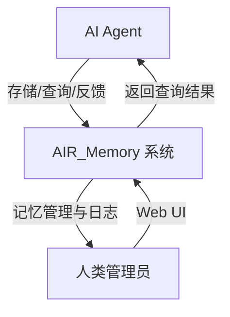

# AIR_Memory 系统需求文档

## 变更记录

| 版本号 | 变更时间 | 变更内容 |
| --- | --- | --- |
| 1.0 | 2026-4-9 | 初稿 |

---

## 1. 概述

### 1.1 文档目的

本文档依据产品定义文档（`/doc/pdd_v1.3.md`）对 AIR_Memory 系统的功能需求和性能需求进行细化，为研发工程师、测试工程师和验证工程师提供可追踪的需求规格基线。

### 1.2 适用范围

本文档适用于 AIR_Memory 系统的所有研发、测试和验证活动。

### 1.3 参考文档

| 文档标识 | 文档名称 | 版本 |
| --- | --- | --- |
| PDD | AIR_Memory 产品定义 | v1.3 |
| SAD | AIR_Memory 系统架构设计说明书 | v1.5 |
| TSR | AIR_Memory 技术路线选型报告 | v1.2 |
| DOC_SPEC | AIR_Memory 项目文档规范 | v1.0 |

### 1.4 术语定义

| 术语 | 说明 |
| --- | --- |
| AI Agent | 使用本系统进行记忆存储/查询的 AI 客户端 |
| Memory | AI Agent 存储的记忆条目，以自然语言文本形式存在 |
| 价值评分（Value Score） | 记忆的综合价值评分（0.0～1.0），由 AI Agent 通过反馈接口影响 |
| 热层（Hot Tier） | 高价值记忆的内存存储层，支持快速查询（≤ 100ms） |
| 冷层（Cold Tier） | 普通记忆的磁盘持久化存储层，支持深度查询（无响应时间保证） |
| 快速查询（Fast Query） | 仅检索热层，`fast_only=true`，响应时间 ≤ 100ms |
| 深度查询（Deep Query） | 同时检索热层和冷层，`fast_only=false`（默认），返回更全面的结果 |
| 磁盘淘汰（Disk Eviction） | 磁盘占用接近上限时，自动删除低价值记忆中创建时间最早的数据 |
| MCP | Model Context Protocol，Anthropic 推出的 AI Agent 工具调用标准协议 |
| REST API | 基于 HTTP/JSON 的通用接口协议 |

### 1.5 需求编号规则

本文档各条需求采用以下编号格式：

- `FR-DEP-NNN`：部署与运行环境功能需求
- `FR-API-NNN`：AI Agent 接口功能需求
- `FR-UI-NNN`：Web 管理界面功能需求
- `FR-DOC-NNN`：文档需求
- `PR-NNN`：性能需求

---

## 2. 系统概述

AIR_Memory 是一个为 AI Agent 设计的本地部署记忆系统。系统接收 AI Agent 的记忆存储请求，通过向量 Embedding 技术将记忆内容持久化，并提供语义相似度检索能力。系统通过分级存储架构（热层/冷层）在资源约束下最大化高价值记忆的快速查询性能，同时向人类提供 Web 管理界面用于记忆管理和日志查看。

---

## 3. 功能需求

### 3.1 部署与运行环境

#### FR-DEP-001：macOS 支持

系统应支持在 macOS 操作系统上部署和运行，且部署过程应通过一键操作完成。

#### FR-DEP-002：Windows 支持

系统应支持在 Windows 操作系统上部署和运行，且部署过程应通过一键操作完成。

#### FR-DEP-003：一键部署

系统提供一键部署脚本或命令，用户执行单条命令（如 `docker-compose up -d`）即可完成所有服务的启动，无需手动配置运行环境。

#### FR-DEP-004：系统自启动

系统在安装完成后，应在操作系统启动时自动运行，无需人工干预。重启操作系统后，所有服务应自动恢复运行状态。

---

### 3.2 AI Agent 接口

#### FR-API-001：MCP 协议接口

系统应通过 MCP（Model Context Protocol）协议向 AI Agent 提供接口，支持 Claude、Cursor 等原生支持 MCP 协议的 AI Agent 调用。

#### FR-API-002：REST API 接口

系统应通过 REST API（HTTP/JSON）向 AI Agent 提供接口，以兼容所有不支持 MCP 协议的 AI Agent。

#### FR-API-003：记忆存储接口

系统应向 AI Agent 提供记忆存储接口，AI Agent 可通过该接口将自然语言文本形式的记忆内容保存到系统中。接口应接受如下输入：

| 参数 | 类型 | 说明 |
| --- | --- | --- |
| `content` | string | 记忆内容，自然语言文本 |

接口应返回如下信息：

| 字段 | 类型 | 说明 |
| --- | --- | --- |
| `memory_id` | string | 记忆的唯一标识符 |

#### FR-API-004：记忆查询接口

系统应向 AI Agent 提供记忆查询接口，AI Agent 可通过该接口以自然语言查询条件检索语义相关的记忆内容。接口应接受如下输入：

| 参数 | 类型 | 必填 | 默认值 | 说明 |
| --- | --- | --- | --- | --- |
| `query` | string | 是 | - | 自然语言查询条件 |
| `top_k` | integer | 否 | 5 | 返回结果的最大数量 |
| `fast_only` | boolean | 否 | false | 查询模式（true：快速查询；false：深度查询） |

接口应返回与查询条件语义相关的记忆列表，每条记忆至少包含：

| 字段 | 类型 | 说明 |
| --- | --- | --- |
| `memory_id` | string | 记忆的唯一标识符 |
| `content` | string | 记忆内容 |
| `value_score` | float | 当前价值评分（0.0～1.0） |

#### FR-API-005：查询模式——快速模式

当查询接口参数 `fast_only=true` 时，系统仅在热层（内存存储层）中检索记忆，响应时间不超过 100ms。

#### FR-API-006：查询模式——深度模式

当查询接口参数 `fast_only=false`（默认值）时，系统同时在热层和冷层中检索记忆，对结果进行合并去重后返回，响应时间不作保证（可超过 100ms）。

#### FR-API-007：记忆价值反馈接口

系统应向 AI Agent 提供记忆价值反馈接口，AI Agent 可通过该接口对查询结果中的每条记忆评价其是否有价值。接口应接受如下输入：

| 参数 | 类型 | 说明 |
| --- | --- | --- |
| `memory_id` | string | 被评价记忆的唯一标识符 |
| `valuable` | boolean | 评价结果：true 表示有价值，false 表示无价值 |

系统应根据反馈结果更新对应记忆的价值评分：

- `valuable=true`：value_score 增加 0.1，上限为 1.0
- `valuable=false`：value_score 减少 0.1，下限为 0.0

#### FR-API-008：价值评分驱动分级迁移

系统应根据记忆的价值评分自动驱动热层/冷层之间的记忆迁移：

- value_score ≥ 0.6 且记忆位于冷层时，将该记忆迁移至热层
- value_score < 0.3 且记忆位于热层时，将该记忆迁移至冷层

---

### 3.3 Web 管理界面

#### FR-UI-001：记忆数据查询

Web 管理界面应提供记忆数据查询功能，允许人类用户通过关键字或语义条件检索系统中存储的记忆内容，查询结果应至少显示记忆 ID、内容、当前价值评分和所在存储层。

#### FR-UI-002：记忆数据删除

Web 管理界面应提供记忆数据删除功能，允许人类用户删除指定的记忆条目。删除操作应同时从存储层（热层/冷层）及关联日志表中移除该记忆的所有数据。

#### FR-UI-003：存储操作日志查看

Web 管理界面应提供存储操作日志查看功能，展示 AI Agent 调用记忆存储接口的历史记录，每条日志至少包含：

| 字段 | 说明 |
| --- | --- |
| 操作时间 | 记忆被保存的时间戳 |
| 原始内容 | AI Agent 提交的记忆原始文本 |

#### FR-UI-004：查询操作日志查看

Web 管理界面应提供查询操作日志查看功能，展示 AI Agent 调用记忆查询接口的历史记录，每条日志至少包含：

| 字段 | 说明 |
| --- | --- |
| 操作时间 | 查询发生的时间戳 |
| 查询条件 | AI Agent 提交的查询文本 |
| 查询模式 | fast_only 参数值（快速/深度） |
| 返回结果 | 本次查询返回的记忆列表 |

#### FR-UI-005：记忆价值反馈记录查看

Web 管理界面应提供每条记忆的价值反馈记录查看功能，展示指定记忆被 AI Agent 历次评价的历史，每条反馈日志至少包含：

| 字段 | 说明 |
| --- | --- |
| 评价时间 | 反馈操作发生的时间戳 |
| 评价结果 | 有价值（true）或无价值（false） |

#### FR-UI-006：记忆综合价值评分查看

Web 管理界面应提供每条记忆当前综合价值评分的查看功能，显示该记忆的 `value_score`（0.0～1.0）及当前所在存储层（热层/冷层）。

---

### 3.4 文档需求

#### FR-DOC-001：部署手册

系统应提供完整的部署手册，内容涵盖运行环境前提条件、部署步骤和启动验证方法，适合人类部署人员在 macOS 和 Windows 操作系统上参考使用。

#### FR-DOC-002：用户手册

系统应提供完整的用户手册，内容涵盖 Web 管理界面的使用说明及 AI Agent 接口的调用说明，适合人类用户和 AI Agent 集成方参考使用。

---

## 4. 性能需求

### 4.1 响应时间

#### PR-001：记忆存储响应时间

AI Agent 调用记忆存储接口时，系统的端到端响应时间（从接收请求到返回 memory_id）不应超过 **100ms**。

#### PR-002：快速查询响应时间

AI Agent 调用记忆查询接口且参数 `fast_only=true` 时，系统的端到端响应时间（从接收请求到返回查询结果）不应超过 **100ms**。

#### PR-003：深度查询响应时间

AI Agent 调用记忆查询接口且参数 `fast_only=false`（默认）时，系统对响应时间不作限制，但应尽力在合理时间内返回结果。

---

### 4.2 资源占用

#### PR-004：内存占用上限

系统整体（包括后端服务进程、向量存储引擎、Embedding 模型、热层 ChromaDB 索引）的内存占用总量不应超过 **8GB**。

#### PR-005：磁盘占用上限

系统整体（包括冷层向量数据库、SQLite 日志数据库、Embedding 模型文件）的磁盘占用总量不应超过 **40GB**。

---

### 4.3 分级存储

#### PR-006：分级存储架构

系统应实现分级存储架构，将记忆分为热层（高速存储，常驻内存）和冷层（普通存储，持久化到磁盘），以在内存约束下最大化高价值记忆的快速查询覆盖。

#### PR-007：热层内存预算

系统应在 8GB 总内存上限约束下，为热层 ChromaDB 索引分配不超过 **6GB** 的内存预算，其余内存供系统其他组件使用。

#### PR-008：热层加载策略

系统启动时，应从持久化存储中读取各记忆的价值评分，按 value_score 从高到低排序，在热层内存预算允许的范围内批量加载高价值记忆。

#### PR-009：热层容量溢出处理

当热层内存占用超出预算时，系统应将热层中价值评分最低的记忆降级迁移至冷层，直到热层内存占用回落至预算以下。

---

### 4.4 磁盘容量管理

#### PR-010：磁盘淘汰触发阈值

当系统磁盘占用达到 **38GB**（安全预警阈值，预留 2GB 安全裕量）时，自动触发磁盘淘汰流程。

#### PR-011：磁盘淘汰策略

磁盘淘汰应按 `value_score ASC, created_at ASC` 的顺序删除冷层记忆（即优先删除价值最低且创建时间最早的记忆），循环执行，直到磁盘占用降至 **35GB**（安全水位）以下。

#### PR-012：新记忆保护规则

创建时间在 **168 小时（7×24 小时）以内**的记忆不得参与磁盘淘汰，以确保在低价值记忆数量极少时系统仍能保留最新数据。

#### PR-013：定期检查频率

磁盘淘汰检查应在系统运行期间**每小时**自动执行一次。

---

## 5. 需求追踪矩阵

以下矩阵展示各条系统需求与产品定义文档（PDD v1.3）中对应条款的追踪关系。

| 需求编号 | 需求简述 | PDD 来源条款 |
| --- | --- | --- |
| FR-DEP-001 | macOS 本地部署 | 功能定义 - 支持 macOS 和 Windows 本地一键部署 |
| FR-DEP-002 | Windows 本地部署 | 功能定义 - 支持 macOS 和 Windows 本地一键部署 |
| FR-DEP-003 | 一键部署 | 功能定义 - 支持 macOS 和 Windows 本地一键部署 |
| FR-DEP-004 | 系统自启动 | 功能定义 - 在默认情况下应自启动 |
| FR-API-001 | MCP 协议接口 | 功能定义 - 向 AI Agent 提供接口 |
| FR-API-002 | REST API 接口 | 功能定义 - 向 AI Agent 提供接口 |
| FR-API-003 | 记忆存储接口 | 功能定义 - AI Agent 可通过接口保存记忆 |
| FR-API-004 | 记忆查询接口 | 功能定义 - AI Agent 可通过接口查询相关记忆 |
| FR-API-005 | 快速查询模式 | 性能需求 - 快速模式（fast_only=true），响应时间 ≤ 100ms |
| FR-API-006 | 深度查询模式 | 性能需求 - 深度模式（fast_only=false，默认），返回更全面的结果 |
| FR-API-007 | 记忆价值反馈接口 | 性能需求 - 向 AI Agent 提供记忆价值反馈接口 |
| FR-API-008 | 价值评分驱动分级迁移 | 性能需求 - 根据记忆价值评分实现分级存储 |
| FR-UI-001 | 记忆数据查询 | 功能定义 - UI 接口：查询记忆数据 |
| FR-UI-002 | 记忆数据删除 | 功能定义 - UI 接口：删除指定的记忆数据 |
| FR-UI-003 | 存储操作日志查看 | 功能定义 - UI 接口：查看 AI 保存记忆的记录 |
| FR-UI-004 | 查询操作日志查看 | 功能定义 - UI 接口：查看 AI 查询记忆的记录 |
| FR-UI-005 | 价值反馈记录查看 | 功能定义 - UI 接口：查看每个记忆的价值反馈记录 |
| FR-UI-006 | 综合价值评分查看 | 功能定义 - UI 接口：查看每个记忆的当前综合价值评分 |
| FR-DOC-001 | 部署手册 | 功能定义 - 提供完整的部署手册 |
| FR-DOC-002 | 用户手册 | 功能定义 - 提供完整的用户手册 |
| PR-001 | 存储响应时间 ≤ 100ms | 功能定义 - 保存记忆时的操作时间不应大于 100ms |
| PR-002 | 快速查询响应时间 ≤ 100ms | 功能定义 - 查询记忆时的操作时间不应大于 100ms（快速查询模式） |
| PR-003 | 深度查询无时间限制 | 性能需求 - 深度模式响应时间可超过 100ms |
| PR-004 | 内存占用 ≤ 8GB | 性能需求 - 系统整体内存占用不应超过 8GB |
| PR-005 | 磁盘占用 ≤ 40GB | 性能需求 - 系统磁盘占用不应超过 40GB |
| PR-006 | 分级存储架构 | 性能需求 - 根据记忆价值评分实现分级存储 |
| PR-007 | 热层内存预算 ≤ 6GB | 性能需求 - 在 8GB 内存上限约束下最大化高速存储层覆盖容量 |
| PR-008 | 热层加载策略 | 性能需求 - 根据记忆价值评分实现分级存储 |
| PR-009 | 热层容量溢出处理 | 性能需求 - 在 8GB 内存上限约束下最大化高速存储层覆盖容量 |
| PR-010 | 淘汰触发阈值 38GB | 性能需求 - 在存储空间触及上限之前，系统应自动删除低价值记忆中最旧的数据 |
| PR-011 | 低价值最旧优先淘汰 | 性能需求 - 系统应自动删除低价值记忆中最旧的数据 |
| PR-012 | 168 小时新记忆保护 | 性能需求 - 创建时间在 168 小时以内的记忆数据不得被淘汰 |
| PR-013 | 每小时定期检查 | 性能需求 - 系统应自动删除低价值记忆中最旧的数据 |
