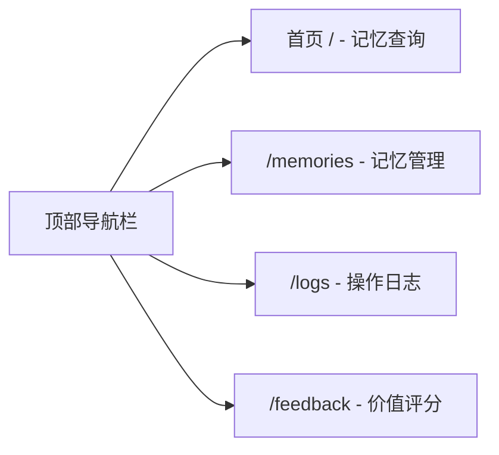
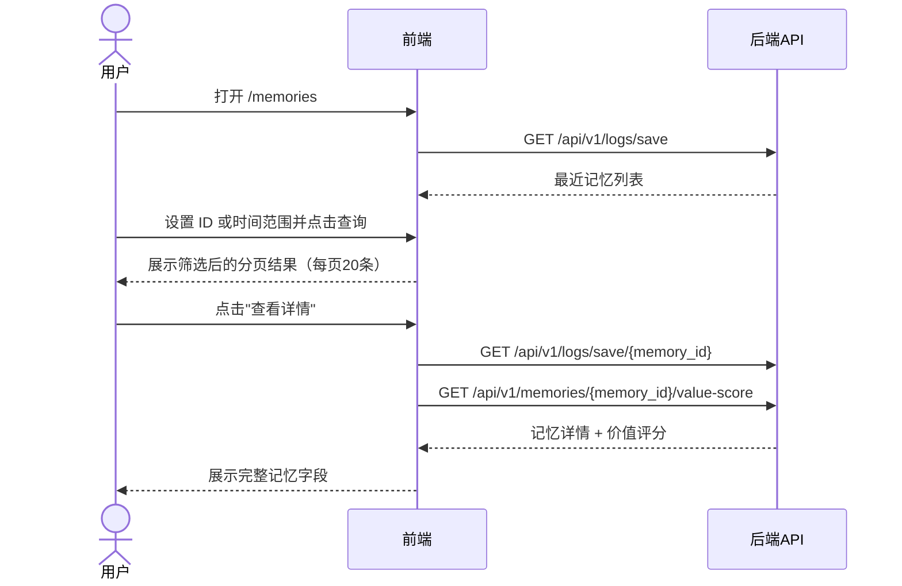
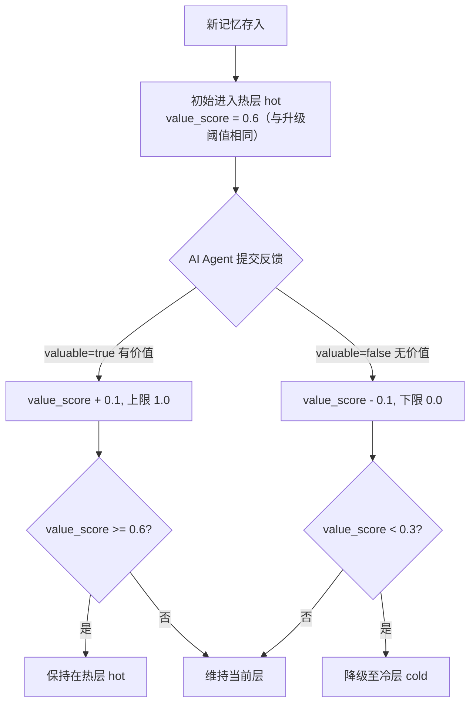
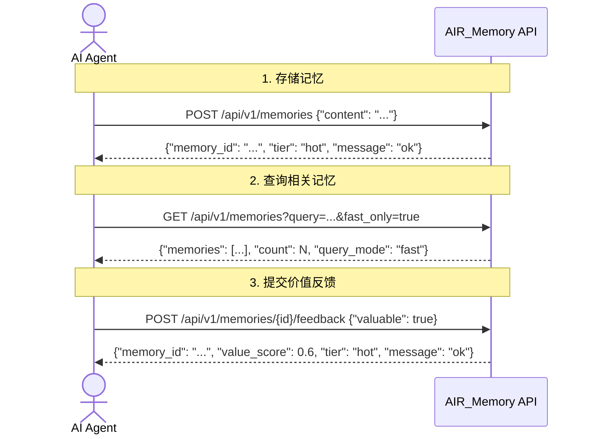

# AIR_Memory 用户手册

## 变更记录

| 版本号 | 变更时间 | 变更内容 |
| --- | --- | --- |
| 1.0 | 2026-4-10 | 初稿，覆盖 Web 管理界面和 AI Agent 接口使用说明 |
| 1.1 | 2026-4-14 | 补充 Header 版本号显示说明；修正 MCP query_memory 返回示例格式（平铺列表 JSON 字符串）|
| 1.2 | 2026-4-14 | 2.4 节补充存储日志乱码徽章说明；重写 2.5 节反馈记录列表（新增时间段查询和分页）；3.2.3 节补充 GET /api/v1/logs/feedback 接口说明 |
| 1.3 | 2026-4-14 | 2.4 节修正乱码徽章说明，补充 v1.2.5 修复信息 |
| 1.4 | 2026-4-15 | 2.4 节补充 v1.2.6 根因修复说明 |
| 1.5 | 2026-4-15 | 3.2 节补充 REST API 编码约束，明确 JSON 请求必须显式指定 `charset=UTF-8` |
| 1.6 | 2026-4-15 | 2.3 节更新记忆管理 UI：默认最近列表、每页 20 条分页、按 ID/时间范围筛选、详情页字段说明；补充本次升级数据影响分析结论（无需迁移本地数据） |
| 1.7 | 2026-4-15 | 2.3 节补充记忆列表操作能力：操作列增加删除按钮、列表过滤已删除数据、新增评价值列展示 |

---

## 1. 概述

本手册面向两类读者：

- **人类用户**：通过 Web 管理界面对记忆数据进行查询、删除、日志查看和价值评分查看。
- **AI Agent 集成方**：通过 MCP 协议或 REST API 将 AIR_Memory 集成至 AI Agent 工作流。

系统部署完成后，Web 管理界面访问地址为 `http://localhost:8080`。

---

## 2. Web 管理界面使用说明

### 2.1 界面总览

Web 管理界面基于 Vue.js 3 构建，提供四个主要页面，通过顶部导航栏切换：



顶部导航栏右侧动态显示当前运行的系统版本号（通过 `GET /api/v1/version` 接口获取），便于快速确认所运行的版本。

### 2.2 记忆查询（首页 `/`）

首页提供记忆的语义相似度查询功能。

**操作步骤**：

1. 在搜索框中输入查询关键词或语义描述。
2. 选择查询模式：
   - **快速查询**（`fast_only=true`）：仅检索热层记忆，响应时间 ≤ 100ms，适合对速度敏感的场景。
   - **深度查询**（`fast_only=false`，默认）：同时检索热层和冷层记忆，返回更完整的结果，响应时间无严格限制。
3. 设置返回条目数（`top_k`，默认 5）。
4. 点击搜索按钮发起查询。

**查询结果说明**：

| 字段 | 说明 |
| --- | --- |
| `content` | 记忆原文内容 |
| `similarity` | 与查询内容的语义相似度（0.0 至 1.0，越高越相关） |
| `value_score` | 当前综合价值评分（0.0 至 1.0） |
| `tier` | 所在层：`hot`（热层）或 `cold`（冷层） |
| `created_at` | 记忆创建时间 |

### 2.3 记忆管理（`/memories`）

记忆管理页面用于浏览和检索已提交的记忆信息，默认按最近提交时间展示，并支持分页、删除和详情查看。

**默认列表与分页**：

1. 进入页面后系统自动加载最近记忆列表。
2. 列表按提交时间倒序展示（最新记录优先）。
3. 列表中会隐藏已删除记忆，仅展示有效记忆。
4. 列表提供评价值列，显示该记忆当前价值评分（保留两位小数）。
5. 分页固定每页 20 条，可通过分页器切换页码。

**按条件查询**：

1. 在"记忆 ID"输入框中输入完整 ID 或 ID 片段（可选）。
2. 在"时间范围"选择器中设置开始和结束时间（可选）。
3. 点击"查询"执行筛选；点击"重置"清空条件并恢复默认列表。

**查看详情页**：

1. 在列表中点击"查看详情"。
2. 系统跳转到详情页 `/memories/{memory_id}`。
3. 详情页展示该记忆的完整信息字段：
   - ID
   - 原始数据
   - 提交时间
   - 价值评分

**删除记忆**：

1. 在列表中点击"删除"。
2. 系统调用删除接口并在成功后自动从列表移除该记忆。



### 2.4 操作日志查看（`/logs`）

操作日志页面分别展示记忆的存储日志和查询日志，用于追溯 AI Agent 的历史操作。

**存储日志**：

显示每次通过 `POST /api/v1/memories` 或 MCP `save_memory` 工具存储的操作记录，包含：

| 字段 | 说明 |
| --- | --- |
| `memory_id` | 被存储记忆的唯一标识 |
| `content` | 存储的记忆内容 |
| `created_at` | 存储操作发生时间 |

> **乱码徽章**：如果某条存储记录的原始内容疑似因历史编码问题损坏（内容中问号比例过高），该记录的"原始内容"列将显示橙色"乱码"徽章，鼠标悬停可查看说明。此为历史遗留数据问题，v1.2.6 已从根本上修复了中文内容在存储前被 CP1252 编码损坏为 `????` 的根因（启动脚本强制覆盖 `PYTHONUTF8=1`，运行时补充 `sys.stdin` UTF-8 重配），v1.2.6 及以后版本新增的记忆不再受影响。历史已损坏数据无法恢复，但"乱码"徽章（v1.2.5 修复）会正确标识这些记录。

**查询日志**：

显示每次通过 `GET /api/v1/memories` 或 MCP `query_memory` 工具发起的查询记录，包含：

| 字段 | 说明 |
| --- | --- |
| `query` | 查询关键词 |
| `fast_only` | 是否为快速查询模式 |
| `result_count` | 返回记忆条目数 |
| `created_at` | 查询操作发生时间 |

### 2.5 反馈记录查询（`/feedback`）

反馈记录页面用于查询 AI Agent 历次提交的价值反馈，支持按记忆 ID 和时间段筛选，并以分页列表展示结果。当指定记忆 ID 时，还会同时显示该记忆的当前综合价值评分。

**查询操作**：

1. 在"记忆 ID"输入框中填入目标记忆的 ID（可选，不填则查询全部反馈记录）。
2. 在"时间范围"选择器中选择开始时间和结束时间（可选）。
3. 点击"查询"按钮发起查询，或点击"重置"清空所有条件恢复初始状态。

**综合价值评分面板**（仅在指定记忆 ID 时显示）：

| 字段 | 说明 |
| --- | --- |
| `value_score` | 当前综合价值评分（0.0 至 1.0） |
| `tier` | 当前所在层：`hot` 或 `cold` |
| `feedback_count` | 累计收到的反馈次数 |

**价值评分规则说明**：



**反馈记录列表**：

列表展示符合查询条件的反馈记录，按时间倒序排列，底部提供分页控件：

| 字段 | 说明 |
| --- | --- |
| `memory_id` | 被评价记忆的唯一标识 |
| `valuable` | 反馈类型：`true`（有价值）或 `false`（无价值） |
| `created_at` | 反馈提交时间 |

每页默认显示 20 条，可通过分页控件切换页码或调整每页条数（10 / 20 / 50 / 100）。

---

## 3. AI Agent 接口调用说明

AIR_Memory 为 AI Agent 提供两种接口协议，可根据使用场景选择：

| 协议 | 适用场景 | 接入端点 |
| --- | --- | --- |
| MCP（Model Context Protocol） | 与支持 MCP 协议的 AI Agent 集成（如 Claude、Cursor 等） | `http://localhost:8080/mcp` |
| REST API | 通用 HTTP 接口，适合所有编程语言和 AI Agent | `http://localhost:8080/api/v1` |

### 3.1 MCP 接口调用说明

#### 3.1.1 MCP Server 配置

MCP Server 基于 Streamable HTTP 传输，接入端点为：

```
http://localhost:8080/mcp
```

在支持 MCP 协议的客户端（如 Claude Desktop、Cursor 等）中，将 AIR_Memory 配置为外部 MCP Server，URL 填入上述地址。

**Claude Desktop 配置示例**（`claude_desktop_config.json`）：

```json
{
  "mcpServers": {
    "air_memory": {
      "url": "http://localhost:8080/mcp"
    }
  }
}
```

#### 3.1.2 MCP 工具列表

AIR_Memory MCP Server 暴露以下三个工具：

| Tool 名称 | 参数 | 说明 |
| --- | --- | --- |
| `save_memory` | `content: str` | 存储一条记忆，返回 `memory_id` |
| `query_memory` | `query: str`, `top_k: int = 5`, `fast_only: bool = False` | 查询语义相关记忆；`fast_only=True` 仅检索热层（≤ 100ms），`fast_only=False` 同时检索热/冷层 |
| `feedback_memory` | `memory_id: str`, `valuable: bool` | 对指定记忆提交价值反馈，影响其价值分及分层 |

#### 3.1.3 MCP 工具调用示例

**存储记忆**（`save_memory`）：

```json
{
  "tool": "save_memory",
  "arguments": {
    "content": "用户偏好使用深色主题，字体大小设置为 16px"
  }
}
```

返回示例：

```
"a1b2c3d4-e5f6-7890-abcd-ef1234567890"
```

**查询记忆**（`query_memory`，快速模式）：

```json
{
  "tool": "query_memory",
  "arguments": {
    "query": "用户的界面偏好设置",
    "top_k": 3,
    "fast_only": true
  }
}
```

返回示例（JSON 字符串，内容为记忆条目平铺列表）：

```json
[
  {
    "id": "a1b2c3d4-e5f6-7890-abcd-ef1234567890",
    "content": "用户偏好使用深色主题，字体大小设置为 16px",
    "similarity": 0.92,
    "value_score": 0.6,
    "tier": "hot",
    "created_at": "2026-04-10T08:00:00Z"
  }
]
```

> **说明**：MCP `query_memory` 直接返回记忆条目的平铺列表（JSON 字符串），与 REST API 响应结构（含 `memories`、`count`、`query_mode` 字段的对象）不同。列表按相似度降序排列，最多返回 `top_k` 条。

**提交价值反馈**（`feedback_memory`）：

```json
{
  "tool": "feedback_memory",
  "arguments": {
    "memory_id": "a1b2c3d4-e5f6-7890-abcd-ef1234567890",
    "valuable": true
  }
}
```

返回示例：

```json
{
  "memory_id": "a1b2c3d4-e5f6-7890-abcd-ef1234567890",
  "value_score": 0.6,
  "tier": "hot",
  "message": "ok"
}
```

### 3.2 REST API 调用说明

#### 3.2.1 基本信息

| 项目 | 说明 |
| --- | --- |
| 基础 URL | `http://localhost:8080/api/v1` |
| 数据格式 | JSON（`Content-Type: application/json; charset=UTF-8`） |
| API 文档 | `http://localhost:8080/api/v1/docs`（Swagger UI） |

> 重要约束: 对所有包含 JSON 请求体的 REST API 调用, 必须显式设置
> `Content-Type: application/json; charset=UTF-8`。不建议省略 `charset`,
> 否则在部分客户端环境中可能出现中文内容乱码。

**通用成功响应格式**：

```json
{
  "data": {},
  "message": "ok"
}
```

**错误响应格式**：

```json
{
  "detail": "错误描述"
}
```

#### 3.2.2 记忆接口

**存储记忆**

```
POST /api/v1/memories
```

请求体：

```json
{
  "content": "用户偏好使用深色主题，字体大小设置为 16px"
}
```

响应（HTTP 201）：

```json
{
  "memory_id": "a1b2c3d4-e5f6-7890-abcd-ef1234567890",
  "tier": "hot",
  "message": "ok"
}
```

curl 示例：

```bash
curl -X POST http://localhost:8080/api/v1/memories \
  -H "Content-Type: application/json; charset=UTF-8" \
  -d '{"content": "用户偏好使用深色主题，字体大小设置为 16px"}'
```

---

**查询记忆**

```
GET /api/v1/memories?query=<查询词>&top_k=5&fast_only=false
```

| 查询参数 | 类型 | 默认值 | 说明 |
| --- | --- | --- | --- |
| `query` | string | 必填 | 语义查询关键词 |
| `top_k` | integer | 5 | 返回最相关的记忆条数 |
| `fast_only` | boolean | false | `true` 仅查热层，`false` 同时查热/冷层 |

响应（HTTP 200）：

```json
{
  "memories": [
    {
      "id": "a1b2c3d4-e5f6-7890-abcd-ef1234567890",
      "content": "用户偏好使用深色主题，字体大小设置为 16px",
      "similarity": 0.92,
      "value_score": 0.6,
      "tier": "hot",
      "created_at": "2026-04-10T08:00:00Z"
    }
  ],
  "count": 1,
  "query_mode": "fast"
}
```

curl 示例：

```bash
curl "http://localhost:8080/api/v1/memories?query=用户界面偏好&top_k=3&fast_only=true"
```

---

**删除记忆**

```
DELETE /api/v1/memories/{memory_id}
```

响应（HTTP 200）：

```json
{
  "message": "ok"
}
```

curl 示例：

```bash
curl -X DELETE http://localhost:8080/api/v1/memories/a1b2c3d4-e5f6-7890-abcd-ef1234567890
```

---

**提交价值反馈**

```
POST /api/v1/memories/{memory_id}/feedback
```

请求体：

```json
{
  "valuable": true
}
```

响应（HTTP 200）：

```json
{
  "memory_id": "a1b2c3d4-e5f6-7890-abcd-ef1234567890",
  "value_score": 0.6,
  "tier": "hot",
  "message": "ok"
}
```

curl 示例：

```bash
curl -X POST http://localhost:8080/api/v1/memories/a1b2c3d4-e5f6-7890-abcd-ef1234567890/feedback \
  -H "Content-Type: application/json; charset=UTF-8" \
  -d '{"valuable": true}'
```

---

**查询反馈历史**

```
GET /api/v1/memories/{memory_id}/feedback/logs?page=1&page_size=20
```

响应（HTTP 200）：

```json
{
  "logs": [
    {
      "id": 1,
      "memory_id": "a1b2c3d4-e5f6-7890-abcd-ef1234567890",
      "valuable": true,
      "created_at": "2026-04-10T08:05:00Z"
    }
  ],
  "count": 1
}
```

---

**查询价值评分**

```
GET /api/v1/memories/{memory_id}/value-score
```

响应（HTTP 200）：

```json
{
  "memory_id": "a1b2c3d4-e5f6-7890-abcd-ef1234567890",
  "value_score": 0.6,
  "tier": "hot",
  "feedback_count": 1
}
```

#### 3.2.3 日志接口

**查询存储操作日志**

```
GET /api/v1/logs/save
```

响应（HTTP 200）：

```json
{
  "logs": [
    {
      "memory_id": "a1b2c3d4-e5f6-7890-abcd-ef1234567890",
      "content": "用户偏好使用深色主题，字体大小设置为 16px",
      "created_at": "2026-04-10T08:00:00Z"
    }
  ],
  "count": 1
}
```

**查询查询操作日志**

```
GET /api/v1/logs/query
```

响应（HTTP 200）：

```json
{
  "logs": [
    {
      "query": "用户界面偏好",
      "fast_only": true,
      "result_count": 1,
      "created_at": "2026-04-10T08:10:00Z"
    }
  ],
  "count": 1
}
```

**查询反馈记录列表**

```
GET /api/v1/logs/feedback
```

| 查询参数 | 类型 | 默认值 | 说明 |
| --- | --- | --- | --- |
| `page` | integer | 1 | 页码（从 1 开始） |
| `page_size` | integer | 20 | 每页条数（1 至 100） |
| `memory_id` | string | - | 按记忆 ID 过滤（可选） |
| `start_time` | string | - | 开始时间，ISO 8601 格式（可选） |
| `end_time` | string | - | 结束时间，ISO 8601 格式（可选） |

响应（HTTP 200）：

```json
{
  "logs": [
    {
      "id": 1,
      "memory_id": "a1b2c3d4-e5f6-7890-abcd-ef1234567890",
      "valuable": true,
      "created_at": "2026-04-10T08:05:00Z"
    }
  ],
  "count": 1,
  "total": 42
}
```

> `total` 为符合过滤条件的总记录数，`count` 为当前页实际返回条数，用于分页计算。

curl 示例：

```bash
curl "http://localhost:8080/api/v1/logs/feedback?page=1&page_size=20&start_time=2026-04-01T00:00:00&end_time=2026-04-14T23:59:59"
```

#### 3.2.4 系统接口

**健康检查**

```
GET /health
```

响应（HTTP 200）：

```json
{"status": "ok"}
```

**分级存储统计**

```
GET /api/v1/admin/tier-stats
```

响应（HTTP 200）：

```json
{
  "hot_count": 42,
  "cold_count": 158,
  "hot_memory_mb": 512,
  "memory_budget_mb": 6144
}
```

**磁盘占用统计**

```
GET /api/v1/admin/disk-stats
```

响应（HTTP 200）：

```json
{
  "disk_used_gb": 12.5,
  "disk_budget_gb": 40,
  "disk_safe_gb": 35
}
```

### 3.3 AI Agent 接口调用流程

以下序列图描述 AI Agent 完整的记忆使用流程（以 REST API 为例，MCP 调用流程相同）：



---

## 4. 分级存储说明

AIR_Memory 采用热层/冷层两级存储架构，AI Agent 无需感知层的细节，系统会根据价值评分自动管理：

| 层级 | 存储介质 | 默认容量上限 | 特点 |
| --- | --- | --- | --- |
| 热层（hot） | ChromaDB 内存（EphemeralClient） | 6 GB | 查询速度快，≤ 100ms |
| 冷层（cold） | ChromaDB 磁盘（PersistentClient） | 40 GB | 持久存储，支持深度查询 |

**升/降层规则**：

- 新记忆存入时默认同时进入热层和冷层，初始价值分为 0.6（与升级阈值相同），确保重启后可被优先恢复至热层。
- 当价值分 ≥ 0.6 时，记忆升级至热层。
- 当价值分 < 0.3 时，记忆从热层降级至冷层。
- 热层内存超出预算时，自动将最低价值记忆降级至冷层。
